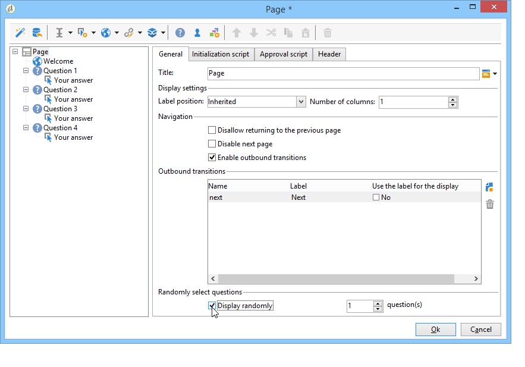

# 设计调查{#building-a-survey}

## 新建调查 {#creating-a-new-survey}

本章详细介绍 **调查** 使用Adobe Campaign键入表单，以及可用的选项和配置。 Adobe Campaign让您可以让用户能够使用此调查，并在数据库中收集和存档答案。

通过以下方式访问Web窗体： **[!UICONTROL Resources > Online > Web applications]** 树节点。 要创建调查，请单击 **[!UICONTROL New]** 按钮进行编辑，或者右键单击列表并选择 **[!UICONTROL New]**.

选择调查模板(**[!UICONTROL newSurvey]** 默认情况下)。

表单页面是使用特殊编辑器创建的，允许您定义和配置（文本）输入字段、选择字段（列表、复选框等） 和静态元素(图像、HTML内容等)之间的关联。 它们可以在“容器”中收集，并根据要求进行布局。 [了解详情](#adding-questions))。

>[!NOTE]
>
>有关如何定义Web表单的内容和创建屏幕布局的更多信息，请参阅 [本文档](../../web/using/about-web-forms.md).

## 添加字段 {#adding-fields}

表单中的字段使用户能够输入信息并选择选项。 对于表单中的每个页面，均可使用工具栏中的第一个按钮创建它们 **[!UICONTROL Add using the wizard]** 菜单。

>[!NOTE]
>
>也可以使用右键单击并插入输入区域。 缺省情况下，区域会插入到所选树的末尾。 使用工具栏中的箭头移动它。

### 字段类型 {#types-of-fields}

将字段添加到调查时，您需要选择其类型。 可以使用以下选项：

1. **[!UICONTROL Answer a question]**：利用此选项可声明新字段（称为“已存档字段”）以存储答案。 在这种情况下，将会保存收集的所有值，即使参与者多次填写表单也是如此。 此存储模式仅在 **调查**. [了解详情](../../surveys/using/managing-answers.md#storing-collected-answers)。
1. **[!UICONTROL Edit a recipient]**：利用此选项可选择数据库中的字段。 在这种情况下，用户答案将存储在此字段中。 对于每个参与者，仅保留最后保存的值，并将其添加到用户档案数据中。
1. **[!UICONTROL Add a variable]**：利用此选项可创建设置，以便信息不会存储在数据库中。 可以上游声明局部变量。 您还可以在创建字段时直接添加它们。
1. **[!UICONTROL Import an existing question]**：利用此选项可导入在其他调查中创建的现有问题。

   >[!NOTE]
   >
   >有关存储模式和字段导入的详细信息，请参见 [本节](../../surveys/using/managing-answers.md#storing-collected-answers).

要添加的字段的性质（下拉列表、文本字段、复选框等） 将适应选定的存储模式。 您可以使用进行更改 **[!UICONTROL Type]** 字段 **[!UICONTROL General]** 选项卡，但请确保保持与数据类型一致。

有关各种可用字段类型的详情，请参见 [本节](../../web/using/about-web-forms.md).

## 特定于调查的元素 {#survey-specific-elements}

在线调查基于Web应用程序功能。 下文详细介绍了调查特定功能。

### 多项选择 {#multiple-choice}

对象 **[!UICONTROL Multiple choice]** 类型控件，您可以定义最小和最大选择数量。 例如，使用此选项可以强制至少进行选择 **2** 值且最多 **4** 可用选项中的值：

如果选择的数量太大或太小，则会显示相应的消息。

>[!NOTE]
>
>在这种情况下，使用复选框选择选项。 如果只有一个选项，则使用单选按钮。

相应的配置如下：

此外，此输入字段的存储位置必须为 **[!UICONTROL Multiple values]** type **已存档字段**：

>[!CAUTION]
>
>* 此功能仅适用于 **调查** 键入表单。
>* 此选项与随机问题显示不兼容。 [了解详情](#adding-questions)。

### 添加问题 {#adding-questions}

有两种类型的容器：标准和问题。 标准容器用于配置页面布局和页面中的条件显示。 [了解详情](../../web/using/about-web-forms.md)。

使用 **问题** 容器，用于将问题添加到页面并在层级中插入以下可能的答案。 用户对此类型容器中的问题的响应可以在报告中分析。

>[!CAUTION]
>
>从不插入 **问题** 另一个容器下的容器 **问题** 层次结构中的容器。

在标签字段中输入问题的标签。 在这种情况下，将应用表单样式表中的样式。 选择 **[!UICONTROL Enter the title in HTML format]** 使其个性化的选项。 这将授予您访问HTML编辑器的权限。

>[!NOTE]
>
>请参阅 [本文档](../../web/using/about-web-forms.md) 有关使用HTML编辑器的更多信息。

例如：

在上述示例中，渲染将如下所示：

>[!NOTE]
>
>每个问题都有一个 **问题** 类型容器。

您可以启用Adobe Campaign随机抽取问题。 然后，可以在配置窗口底部的字段中指定要在页面中显示的问题数。

渲染将如下所示：

刷新页面时，显示的问题不同。

>[!CAUTION]
>
>当您随机显示问题时(**[!UICONTROL Display randomly]** 选项)，注意不要使用一个或多个必须选择的选择问题。
