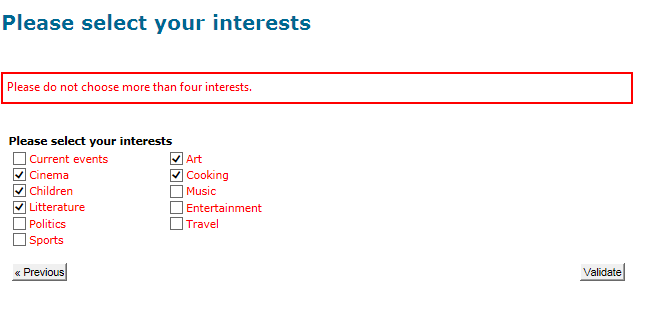
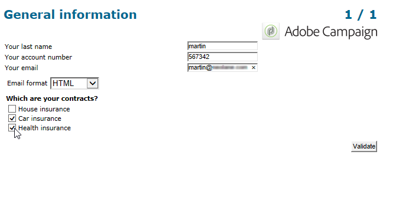

# 设计调查{#building-a-survey}

## 新建调查 {#creating-a-new-survey}

本章详细介绍如何使用Adobe Campaign设计&#x200B;**调查**&#x200B;类型表单，以及可用的选项和配置。 Adobe Campaign让您可以让用户能够使用此调查，并在数据库中收集和存档答案。

Web窗体通过树的&#x200B;**[!UICONTROL Resources > Online > Web applications]**&#x200B;节点访问。 要创建调查，请单击应用程序列表上方的&#x200B;**[!UICONTROL New]**&#x200B;按钮，或者右键单击列表并选择&#x200B;**[!UICONTROL New]**。

选择调查模板（默认为&#x200B;**[!UICONTROL newSurvey]**）。

表单页面是使用特殊编辑器创建的，允许您定义和配置（文本）输入字段、选择字段（列表、复选框等） 和静态元素(图像、HTML内容等)之间的关联。 它们可以在“容器”中收集，并根据要求进行布局。 [了解详情](#adding-questions))。

>[!NOTE]
>
>有关如何为Web窗体定义内容和创建屏幕布局的详细信息，请参阅[本文档](../../web/using/about-web-forms.md)。

## 添加字段 {#adding-fields}

表单中的字段使用户能够输入信息并选择选项。 对于表单中的每个页面，它们是使用&#x200B;**[!UICONTROL Add using the wizard]**&#x200B;菜单通过工具栏中的第一个按钮创建的。

>[!NOTE]
>
>也可以使用右键单击并插入输入区域。 缺省情况下，区域会插入到所选树的末尾。 使用工具栏中的箭头移动它。

### 字段类型 {#types-of-fields}

将字段添加到调查时，您需要选择其类型。 可以使用以下选项：

1. **[!UICONTROL Answer a question]**：利用此选项可声明新字段（称为“已存档字段”）以存储答案。 在这种情况下，将会保存收集的所有值，即使参与者多次填写表单也是如此。 此存储模式仅在&#x200B;**调查**&#x200B;中可用。 [了解详情](../../surveys/using/managing-answers.md#storing-collected-answers)。
1. **[!UICONTROL Edit a recipient]**：此选项允许您选择数据库中的字段。 在这种情况下，用户答案将存储在此字段中。 对于每个参与者，仅保留最后保存的值，并将其添加到用户档案数据中。
1. **[!UICONTROL Add a variable]**：通过此选项可创建设置，使信息不存储在数据库中。 可以上游声明局部变量。 您还可以在创建字段时直接添加它们。
1. **[!UICONTROL Import an existing question]**：利用此选项可导入在其他调查中创建的现有问题。

   >[!NOTE]
   >
   >[此部分](../../surveys/using/managing-answers.md#storing-collected-answers)中详细介绍了存储模式和字段导入。

要添加的字段的性质（下拉列表、文本字段、复选框等） 将适应选定的存储模式。 您可以使用&#x200B;**[!UICONTROL General]**&#x200B;选项卡的&#x200B;**[!UICONTROL Type]**&#x200B;字段更改它，但请确保保持与数据类型一致。

[此部分](../../web/using/about-web-forms.md)中详细介绍了各种类型的可用字段。

## 特定于调查的元素 {#survey-specific-elements}

在线调查基于Web应用程序功能。 下文详细介绍了调查特定功能。

### 多项选择 {#multiple-choice}

对于&#x200B;**[!UICONTROL Multiple choice]**&#x200B;类型控件，您可以定义选择的最小和最大数量。 例如，通过此选项，您可以从可用选项中强制选择至少&#x200B;**2**&#x200B;个值和最多&#x200B;**4**&#x200B;个值：

如果选择的数量太大或太小，则会显示相应的消息。

>[!NOTE]
>
>在这种情况下，使用复选框选择选项。 如果只有一个选项，则使用单选按钮。

相应的配置如下：

此外，此输入字段的存储位置必须是&#x200B;**[!UICONTROL Multiple values]**&#x200B;类型&#x200B;**存档字段**：

>[!CAUTION]
>
>* 此功能仅适用于&#x200B;**调查**&#x200B;类型表单。
>* 此选项与随机问题显示不兼容。 [了解详情](#adding-questions)。

### 添加问题 {#adding-questions}

有两种类型的容器：标准和问题。 标准容器用于配置页面布局和页面中的条件显示。 [了解详情](../../web/using/about-web-forms.md)。

使用&#x200B;**问题**&#x200B;容器向页面添加问题，并在层次结构中插入下面的可能答案。 用户对此类型容器中的问题的响应可以在报告中分析。

>[!CAUTION]
>
>切勿在层次结构中的另一个&#x200B;**问题**&#x200B;容器下插入&#x200B;**问题**&#x200B;容器。

在标签字段中输入问题的标签。 在这种情况下，将应用表单样式表中的样式。 选择&#x200B;**[!UICONTROL Enter the title in HTML format]**&#x200B;选项以对其进行个性化。 这将授予您访问HTML编辑器的权限。

>[!NOTE]
>
>有关使用HTML编辑器的详细信息，请参阅[本文档](../../web/using/about-web-forms.md)。

例如：

在上述示例中，渲染将如下所示：

>[!NOTE]
>
>每个问题都有一个&#x200B;**问题**&#x200B;类型容器。

您可以启用Adobe Campaign随机抽取问题。 然后，可以在配置窗口底部的字段中指定要在页面中显示的问题数。

渲染将如下所示：

刷新页面时，显示的问题不同。

>[!CAUTION]
>
>当随机显示问题（页面上选中了&#x200B;**[!UICONTROL Display randomly]**&#x200B;选项）时，请注意不要使用一个或多个必须选择的多选问题。
