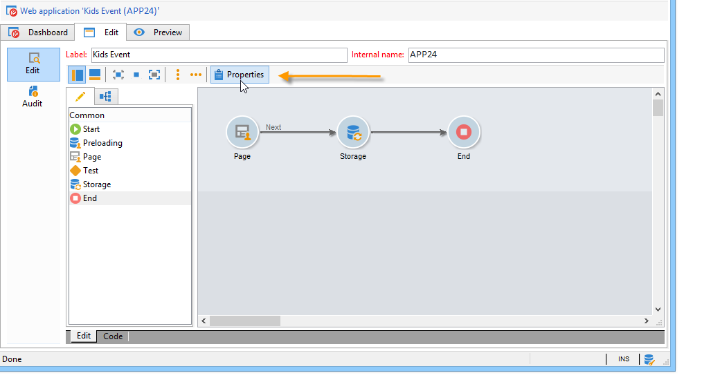

# 配置在线调查{#configuring-surveys}

## 调查属性 {#survey-properties}

在线调查是完全可配置和定制的，可满足您的要求。 必须在属性窗口中输入参数。

可用参数在[此文档](../../web/using/defining-web-forms-properties.md)中有详细说明。

## 调查数据存储 {#survey-data-storage}

默认情况下，Web窗体字段存储在收件人表中。 要使用其他表，请在&#x200B;**[!UICONTROL Document type]**&#x200B;字段中选择它。 **[!UICONTROL Zoom]**&#x200B;图标允许您查看选定表的内容。

由用户提供的调查答案未存储在字段（但存储在局部变量中）中，这些答案存储在&#x200B;**调查答案**&#x200B;表中。 您可以根据&#x200B;**[!UICONTROL Library]**&#x200B;字段更改使用的架构。 此字段仅适用于&#x200B;**调查**。
