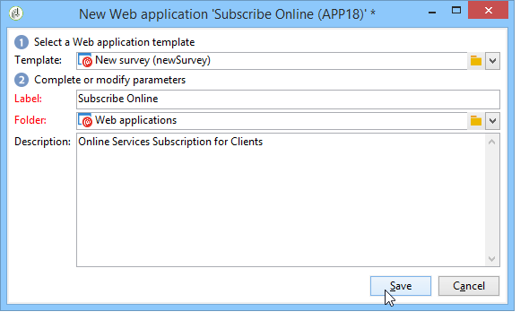

# 创建调查的关键步骤{#getting-started-with-surveys}

以下是使用以下内置模板创建简单调查的主要步骤的快速概述：

这些步骤包括：

1. [步骤1 — 创建调查](#step-1---creating-a-survey),
1. [第2步 — 选择模板](#step-2---selecting-the-template),
1. [步骤3 — 构建调查](#step-3---building-the-survey),
1. [第4步 — 创建页面内容](#step-4---creating-the-page-content),
1. [步骤5 — 存储调查数据](#step-5---storing-the-survey-data-),
1. [第6步 — 发布页面](#step-6---publishing-the-pages),
1. [步骤7 — 共享您的在线调查](#step-7---sharing-your-online-survey).

## 步骤1 — 创建调查 {#step-1---creating-a-survey}

要创建新调查，请转到 **[!UICONTROL Campaigns]** 或 **[!UICONTROL Profiles and targets]** ，然后单击 **[!UICONTROL Web Applications]** 菜单。 单击 **[!UICONTROL Create]** 按钮。

## 第2步 — 选择模板 {#step-2---selecting-the-template}

选择调查模板，然后为调查提供一个名称。 最终用户将看不到此名称，但它允许在Adobe Campaign中识别调查。 单击 **[!UICONTROL Save]** 将调查添加到Web应用程序列表。

## 步骤3 — 构建调查 {#step-3---building-the-survey}

在图表中构建调查，其中放置了以下元素：将创建内容的页面、数据预加载和保存步骤以及测试阶段。 脚本和查询也可以插入。

要构建图表，请单击 **[!UICONTROL Edit]** 调查的形式。

调查必须包含 **至少** 以下三个组件：页面、存储框和结束页面。

* 要创建页面，请选择 **[!UICONTROL Page]** 对象，并将其放入中间部分，如下所示：

   

* 接下来，选择 **[!UICONTROL Storage]** 对象，并将其置于页面的输出过渡中。
* 最后，选择 **[!UICONTROL End]** 对象，并将其放在存储盒的输出过渡的末尾，以获得下图：

   

## 第4步 — 创建页面内容 {#step-4---creating-the-page-content}

在以下示例中，我们使用 **[!UICONTROL Page (v5 compatibility)]** 键入页面。 此类页面可通过 **[!UICONTROL Edit]** 选项卡。

* **添加输入字段**

   要创建页面内容，必须对其进行编辑：为此，请双击 **[!UICONTROL Page]** 对象。 单击工具栏中的第一个图标以打开字段创建向导。 要为要存储在收件人用户档案匹配字段中的用户名创建条目字段，请选择 **[!UICONTROL Edit a recipient]**.

   

   单击 **[!UICONTROL Next]** 按钮，以选择数据库中数据存储的字段。 在本例中，为“姓氏”字段。

   

   单击 **[!UICONTROL Finish]** 确认字段创建。

   默认情况下，当信息存储在数据库中已存在的字段中时，该字段会使用选定字段的名称，即此示例中的“姓氏”。 您可以修改此标签，如下所示：

   

   现在，为用户帐号创建一个条目字段。 重复该操作并选择“帐户否”。 字段。

   应用相同的过程，以添加一个字段供用户输入电子邮件地址。

* **创建问题**

   要创建问题，请右键单击树中的最后一个元素，然后选择 **[!UICONTROL Containers > Question]** ，或单击 **[!UICONTROL Containers]** 图标，选择 **[!UICONTROL Question]**.

   

   输入问题的标签并插入答案字段作为问题的子分支。 为此，在创建答案字段时必须选择链接到问题的节点。 添加 **[!UICONTROL drop-down listx]** 使用 **[!UICONTROL Selection controls]** 图标或通过右键单击来访问Advertising Cloud的帮助，如下所示：

   

   选择存储空间：选择枚举字段以自动检索值（本例中为电子邮件格式）。

   

   在 **[!UICONTROL General]** ，单击 **[!UICONTROL Initialize the list of values from the database]** 链接：将自动输入值表。

   

   单击 **[!UICONTROL OK]** 关闭编辑器，并 **[!UICONTROL Save]** 保存更改。

   >[!NOTE]
   >
   >由于 **[!UICONTROL Advanced]** 选项卡。 有关调查屏幕的布局详情，请参阅 [此部分](../../web/using/about-web-forms.md).

   在详细信息屏幕中，单击 **[!UICONTROL Preview]** 选项卡查看您刚刚创建的调查的呈现。

   

## 步骤5 — 存储调查数据 {#step-5---storing-the-survey-data-}

利用存储框，可在数据库中保存用户响应。 必须选择协调键值以标识数据库中已存在的用户档案。

要实现此目的，请编辑方框并选择在存储数据时用作协调键值的字段。

在以下示例中，在进行保存（确认）时，如果某个用户档案保存在与表单中输入的一个帐号相同的数据库中，则该用户档案将会更新。 如果用户档案不存在，则将创建该用户档案。

单击 **[!UICONTROL OK]** 进行确认，然后单击 **[!UICONTROL Save]** 保存调查

## 第6步 — 发布页面 {#step-6---publishing-the-pages}

要使用户能够访问HTML页面，必须使应用程序可用。 它必须不再处于编辑阶段，而是在生产阶段。 要在生产中放置调查，必须发布该调查。 操作步骤：

* 单击 **[!UICONTROL Publish]** 按钮。
* 单击 **[!UICONTROL Start]** 启动发布并关闭向导。

   

   调查的状态将更改为： **在线**.

   

## 步骤7 — 共享您的在线调查 {#step-7---sharing-your-online-survey}

调查投放到生产环境后，即可在服务器上访问并提交该调查。 用于访问调查的URL显示在功能板上。

要传送调查，您可以发送包含目标群体访问链接的消息，或将调查访问URL放在网页上。

然后，您可以通过报告和日志监控用户响应。 请参阅 [响应跟踪](../../surveys/using/publish--track-and-use-collected-data.md#response-tracking).

>[!CAUTION]
>
>公共URL包含调查的内部名称。 修改内部名称后，URL会自动更新：还必须更新指向调查的所有链接。
>
>如果已发送包含表单链接的投放，则此链接将不再有效。
