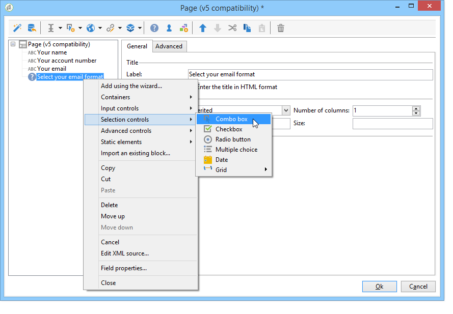

# 创建调查的关键步骤{#getting-started-with-surveys}

以下快速概述了使用以下内置模板创建简单调查的主要步骤：

这些步骤包括：

1. [第1步 — 创建调查](#step-1---creating-a-survey)，
1. [第2步 — 选择模板](#step-2---selecting-the-template)，
1. [第3步 — 构建调查](#step-3---building-the-survey)，
1. [步骤4 — 创建页面内容](#step-4---creating-the-page-content)，
1. [第5步 — 存储调查数据](#step-5---storing-the-survey-data-)，
1. [步骤6 — 发布页面](#step-6---publishing-the-pages)，
1. [步骤7 — 共享您的在线调查](#step-7---sharing-your-online-survey).

## 第1步 — 创建调查 {#step-1---creating-a-survey}

要创建新调查，请转到 **[!UICONTROL Campaigns]** 或 **[!UICONTROL Profiles and targets]** 选项卡，然后单击 **[!UICONTROL Web Applications]** 菜单。 单击 **[!UICONTROL Create]** 按钮时，发送电子邮件给用户。

## 第2步 — 选择模板 {#step-2---selecting-the-template}

选择调查模板，然后为调查命名。 最终用户不会看到此名称，但它允许在Adobe Campaign中标识调查。 单击 **[!UICONTROL Save]** 将调查添加到Web应用程序列表中。

## 第3步 — 构建调查 {#step-3---building-the-survey}

调查构建在定位了以下元素的图中：将在其中创建内容的页面、数据预加载和保存步骤以及测试阶段。 也可以插入脚本和查询。

要构建图表，请单击 **[!UICONTROL Edit]** 调查的形式。

调查必须包含 **至少** 以下三个组件：页面、存储盒和结束页面。

* 要创建页面，请选择 **[!UICONTROL Page]** 对象放入编辑器的左侧部分，并将其放入中间部分，如下所示：

  

* 接下来，选择 **[!UICONTROL Storage]** 对象并将其放置在页面的输出过渡上。
* 最后，选择 **[!UICONTROL End]** 对象并将其放置在存储框的输出转换的末尾，以获得以下图表：

  

## 步骤4 — 创建页面内容 {#step-4---creating-the-page-content}

在以下示例中，我们使用 **[!UICONTROL Page (v5 compatibility)]** 键入page。 通过的高级菜单，可访问此类型的页面。 **[!UICONTROL Edit]** 选项卡。

* **添加输入字段**

  要创建页面的内容，必须对其进行编辑：要执行此操作，请双击 **[!UICONTROL Page]** 对象。 单击工具栏中的第一个图标以打开字段创建向导。 要为要存储在收件人配置文件的匹配字段中的用户名创建输入字段，请选择 **[!UICONTROL Edit a recipient]**.

  

  单击 **[!UICONTROL Next]** 按钮，选择数据库中数据存储对应的字段。 在本例中，为“姓氏”字段。

  

  单击 **[!UICONTROL Finish]** 以确认字段创建。

  默认情况下，当信息存储在数据库中已存在的字段中时，该字段会采用所选字段的名称，即本例中的“姓氏”。 您可以修改此标签，如下所示：

  

  现在，为用户帐户号创建条目字段。 重复操作并选择“帐户编号”。 字段。

  应用相同的过程添加字段以方便用户输入电子邮件地址。

* **创建问题**

  要创建问题，请右键单击树中的最后一个元素，然后选择 **[!UICONTROL Containers > Question]** ，或单击 **[!UICONTROL Containers]** 图标并选择 **[!UICONTROL Question]**.

  

  输入问题的标签并插入回答字段作为问题的子分支。 要实现此目的，在创建答案字段时必须选择链接到问题的节点。 添加 **[!UICONTROL drop-down listx]** 使用 **[!UICONTROL Selection controls]** 图标或右键单击，如下所示：

  

  选择存储空间：选择一个枚举字段以自动检索值（在此例中为电子邮件格式）。

  

  在 **[!UICONTROL General]** 选项卡，单击 **[!UICONTROL Initialize the list of values from the database]** 链接：将自动输入值表。

  

  单击 **[!UICONTROL OK]** 关闭编辑器，并且 **[!UICONTROL Save]** 以保存更改。

  >[!NOTE]
  >
  >对于每个字段或问题，您可以根据 **[!UICONTROL Advanced]** 选项卡。 调查屏幕的布局详见 [本节](../../web/using/about-web-forms.md).

  在详细信息屏幕中，单击 **[!UICONTROL Preview]** 选项卡以查看刚刚创建的调查结果的呈现。

  

## 第5步 — 存储调查数据 {#step-5---storing-the-survey-data-}

利用存储框，可将用户响应保存到数据库中。 必须选择一个协调键值以标识数据库中已存在的用户档案。

为此，请编辑该框并选择在存储数据时用作协调键值的字段。

在下面的示例中，当进行保存（确认）时，如果某个用户档案在数据库中保存的帐号与表单中输入的用户档案相同，则会更新该用户档案。 如果配置文件不存在，则会创建配置文件。

单击 **[!UICONTROL OK]** 进行确认，然后单击 **[!UICONTROL Save]** 保存调查

## 步骤6 — 发布页面 {#step-6---publishing-the-pages}

要使用户能够访问HTML页，应用程序必须可用。 它必须不再处于编辑阶段，而是处于生产阶段。 要将调查置于生产环境中，必须发布它。 操作步骤：

* 单击 **[!UICONTROL Publish]** 按钮的位置。
* 单击 **[!UICONTROL Start]** 以启动发布并关闭向导。

  

  调查的状态将更改为： **在线**.

  

## 步骤7 — 共享您的在线调查 {#step-7---sharing-your-online-survey}

调查投入生产后，即可在服务器上访问并提供。 用于访问调查的URL将显示在仪表板上。

例如，要传送调查，您可以发送包含指向目标群体的访问链接的消息，或将调查访问URL置于网页上。

然后，您可以通过报表和日志监控用户响应。 请参阅 [响应跟踪](../../surveys/using/publish-track-and-use-collected-data.md#response-tracking).

>[!CAUTION]
>
>公共URL包括调查的内部名称。 修改内部名称后，URL会自动更新：指向调查的所有链接也必须更新。
>
>如果已发送包含表单链接的投放，则此链接不再有效。
