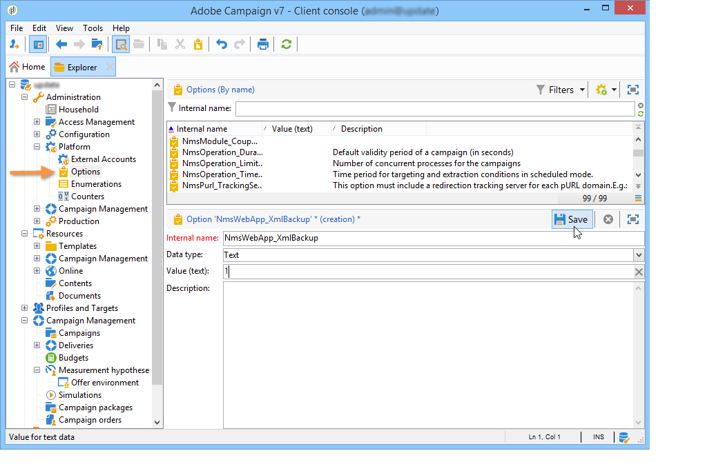

# 管理答案{#managing-answers}


## 存储收集的答案 {#storing-collected-answers}

除了Adobe Campaign中所有Web表单（数据库字段和本地变量）通用的标准存储模式之外，调查还允许使用存档字段动态扩展数据模型。

>[!CAUTION]
>
>此选项适用于 **调查** 仅键入Web应用程序。 它不适用于其他类型的Web窗体。

### 存储在存档字段中 {#storing-in-an-archived-field}

通过添加新的存储空间来保存调查中提供的响应，可以轻松扩展数据模板。 为此，请选择 **[!UICONTROL Store answers to a question]** 选项。 单击 **[!UICONTROL New field...]** 链接并为其指定属性：


输入字段的标签和名称，然后选择字段类型：文本、布尔值、整数或小数、日期等

所选字段类型涉及在用户输入响应时控制数据。 对于 **文本** 字段中，可以添加约束（大小写、格式）或链接到现有枚举以强制进行选择。

要添加约束，请从下拉列表中选择该约束。 约束有两种类型：

1. 字符大小写

   输入的信息可以采用以下格式存储在字段中：全部为大写，全部为小写，或者使用首字母。 此约束不要求用户以所选格式输入数据，但保存时将转换在字段中输入的内容。

1. 数据格式

如果此字段用在列表中，则枚举的值可使用 **[!UICONTROL Initialize the list of values from the database]** 值列表上方的链接。

例如，您可以为用户创建一个下拉列表以选择其母语。 相应的存档字段可以与 **语言** 包含语言列表的枚举：


的 **[!UICONTROL Edit link]** 通过位于字段右侧的图标，可编辑此枚举的内容：


在 **[!UICONTROL General]** 的 **[!UICONTROL Initialize the list of values from the database]** 链接允许您自动输入提供的标签列表。


**示例**:将收件人的合同存储在一个字段中

要在一个字段中存储不同类型的合同，请创建 **[!UICONTROL Text]** 输入字段，然后选择 **[!UICONTROL Store answers to a question]** 选项。

单击 **[!UICONTROL New field...]** 链接，然后输入字段属性。 选择 **[!UICONTROL Multiple values]** 选项来启用要存储的多个值。


为其他合同创建条目字段，并将数据存储在同一存档字段中。


当用户批准调查时，他们的回答将存储在 **[!UICONTROL Contracts]** 字段。

在本例中，请参阅以下答案：


被申请人的资料将包含输入的四份合同。

您可以在 **[!UICONTROL Answers]** 选项卡。


您还可以根据答案筛选收件人，以仅显示您感兴趣的用户。 要实现此目的，请创建定位工作流并使用 **[!UICONTROL Survey responses]** 框中。


根据要恢复的用户档案创建查询。 在以下示例中，通过查询，您可以选择至少具有两份合同（包括A类合同）的用户档案。


对于每个表单，提供的答案可用于字段或标签中。 对存档字段中存储的内容使用以下语法：

```
<%= ctx.webAppLogRcpData.name of the archived field %
```

>[!NOTE]
>
>对于其他类型的字段，其语法详见 [此部分](../../platform/using/about-queries-in-campaign.md).

### 存储设置 {#storage-settings}

您可以以XML格式存档调查的答案。 这样，您就可以保存收集的答案的原始副本，在分项列表中数据过度标准化时，这非常有用。 [了解详情](../../surveys/using/publish--track-and-use-collected-data.md#standardizing-data)

>[!CAUTION]
>
>归档原始响应会影响所需的存储空间。 请谨慎使用此选项。

操作步骤：

* 通过 **[!UICONTROL Properties]** 按钮 **[!UICONTROL Edit]** 选项卡。
* 单击 **[!UICONTROL Advanced parameters]** 链接并检查 **[!UICONTROL Save a copy of raw answers]** 选项。


默认情况下，您可以为所有调查启用此选项（在发布调查时应用此选项）。 为此，请创建 **[!UICONTROL NmsWebApp_XmlBackup]** 选项和赋值 **[!UICONTROL 1]** ，如下所示：



## 分数管理 {#score-management}

您可以为表单页面中提供的选项分配分数。 得分只能与已结束的问题关联：复选框、下拉列表中的值、订阅等。


当确认页面时(即当用户单击 **[!UICONTROL Next]** 或 **[!UICONTROL Finish]** 按钮。

>[!NOTE]
>
>您可以使用正或负、整数或非整数值。

分数可用于测试或脚本。

>[!CAUTION]
>
>得分不能用于同一页面上字段的可见性条件。 但是，它们可在后续页面中使用。

* 要在测试中使用分数，请使用 **[!UICONTROL Score]** 字段，如下所示：

   

* 您可以在脚本中使用分数。

**示例**:计算一个分数，并将其用作显示下一页的条件：

* 在调查中，下一页允许您根据下拉列表中选择的值为用户分配不同的分数：

   

* 您可以根据所选选项将此分数与第二个值组合在一起：

   

* 用户单击 **[!UICONTROL Next]** 按钮，则会将这两个值相加。

   

* 可以根据得分对要显示的页面应用条件。 其配置如下：

   

   
