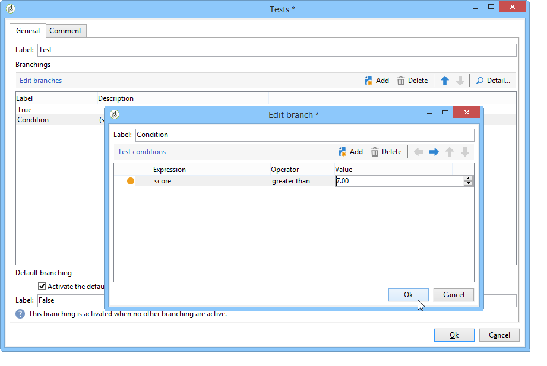
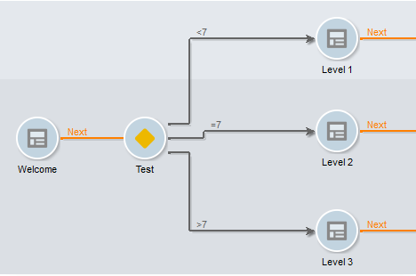

# 管理答案{#managing-answers}


## 存储收集的答案 {#storing-collected-answers}

除了Adobe Campaign中所有Web表单（数据库字段和本地变量）通用的标准存储模式之外，调查还允许使用存档字段动态扩展数据模型。

>[!CAUTION]
>
>此选项仅适用于&#x200B;**Survey**&#x200B;类型的Web应用程序。 它不适用于其他类型的Web窗体。

### 存储在存档字段中 {#storing-in-an-archived-field}

通过添加新的存储空间来保存调查中提供的响应，可以轻松扩展数据模板。 为此，请在创建输入字段时选择&#x200B;**[!UICONTROL Store answers to a question]**&#x200B;选项。 单击&#x200B;**[!UICONTROL New field...]**&#x200B;链接并指定其属性：


输入字段的标签和名称，然后选择字段类型：文本、布尔值、整数或小数、日期等

所选字段类型涉及在用户输入响应时控制数据。 对于&#x200B;**text**&#x200B;字段，可以添加约束（大小写、格式）或指向现有枚举的链接以强制进行选择。

要添加约束，请从下拉列表中选择该约束。 约束有两种类型：

1. 字符大小写

   输入的信息可以采用以下格式存储在字段中：全部为大写，全部为小写，或者使用首字母。 此约束不要求用户以所选格式输入数据，但保存时将转换在字段中输入的内容。

1. 数据格式

如果在列表中使用此字段，则可以使用值列表上方的&#x200B;**[!UICONTROL Initialize the list of values from the database]**&#x200B;链接在值表中自动检索枚举的值。

例如，您可以为用户创建一个下拉列表以选择其母语。 相应的存档字段可以与&#x200B;**language**&#x200B;枚举关联，该枚举包含语言列表：


位于字段右侧的&#x200B;**[!UICONTROL Edit link]**&#x200B;图标允许您编辑此枚举的内容：


在字段的&#x200B;**[!UICONTROL General]**&#x200B;选项卡中， **[!UICONTROL Initialize the list of values from the database]**&#x200B;链接允许您自动输入提供的标签列表。


**示例**:将收件人的合同存储在一个字段中

要在一个字段中存储不同类型的合同，请创建一个&#x200B;**[!UICONTROL Text]**&#x200B;输入字段并选择&#x200B;**[!UICONTROL Store answers to a question]**&#x200B;选项。

单击&#x200B;**[!UICONTROL New field...]**&#x200B;链接并输入字段属性。 选择&#x200B;**[!UICONTROL Multiple values]**&#x200B;选项以启用要存储的多个值。


为其他合同创建条目字段，并将数据存储在同一存档字段中。


当用户批准调查时，他们的回答将存储在&#x200B;**[!UICONTROL Contracts]**&#x200B;字段中。

在本例中，请参阅以下答案：


被申请人的资料将包含输入的四份合同。

可通过显示相关列，在调查的&#x200B;**[!UICONTROL Answers]**&#x200B;选项卡中查看它们。


您还可以根据答案筛选收件人，以仅显示您感兴趣的用户。 要实现此目的，请创建定位工作流并使用&#x200B;**[!UICONTROL Survey responses]**&#x200B;框。


根据要恢复的用户档案创建查询。 在以下示例中，通过查询，您可以选择至少具有两份合同（包括A类合同）的用户档案。


对于每个表单，提供的答案可用于字段或标签中。 对存档字段中存储的内容使用以下语法：

```
<%= ctx.webAppLogRcpData.name of the archived field %
```

>[!NOTE]
>
>对于其他类型的字段，[此部分](../../platform/using/about-queries-in-campaign.md)中详细介绍了语法。

### 存储设置 {#storage-settings}

您可以以XML格式存档调查的答案。 这样，您就可以保存收集的答案的原始副本，在分项列表中数据过度标准化时，这非常有用。 [了解详情](../../surveys/using/publish--track-and-use-collected-data.md#standardizing-data)

>[!CAUTION]
>
>归档原始响应会影响所需的存储空间。 请谨慎使用此选项。

操作步骤：

* 通过&#x200B;**[!UICONTROL Edit]**&#x200B;选项卡的&#x200B;**[!UICONTROL Properties]**&#x200B;按钮编辑调查属性。
* 单击&#x200B;**[!UICONTROL Advanced parameters]**&#x200B;链接并选中&#x200B;**[!UICONTROL Save a copy of raw answers]**&#x200B;选项。


默认情况下，您可以为所有调查启用此选项（在发布调查时应用此选项）。 为此，请创建&#x200B;**[!UICONTROL NmsWebApp_XmlBackup]**&#x200B;选项并为其分配值&#x200B;**[!UICONTROL 1]**，如下所示：


## 分数管理 {#score-management}

您可以为表单页面中提供的选项分配分数。 得分只能与已结束的问题关联：复选框、下拉列表中的值、订阅等。


确认页面后，即当用户单击&#x200B;**[!UICONTROL Next]**&#x200B;或&#x200B;**[!UICONTROL Finish]**&#x200B;按钮时，将在服务器端累积并保存分数。

>[!NOTE]
>
>您可以使用正或负、整数或非整数值。

分数可用于测试或脚本。

>[!CAUTION]
>
>得分不能用于同一页面上字段的可见性条件。 但是，它们可在后续页面中使用。

* 要在测试中使用分数，请使用测试计算公式中的&#x200B;**[!UICONTROL Score]**&#x200B;字段，如下所示：

   

* 您可以在脚本中使用分数。

**示例**:计算一个分数，并将其用作显示下一页的条件：

* 在调查中，下一页允许您根据下拉列表中选择的值为用户分配不同的分数：

   

* 您可以根据所选选项将此分数与第二个值组合在一起：

   

* 当用户单击&#x200B;**[!UICONTROL Next]**&#x200B;按钮时，这两个值相加。

   

* 可以根据得分对要显示的页面应用条件。 其配置如下：

   

   
