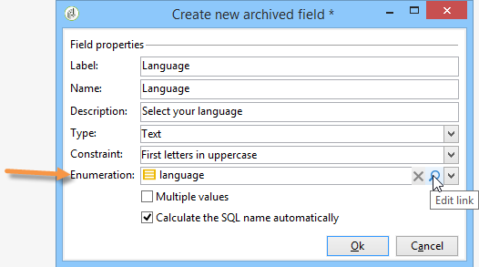
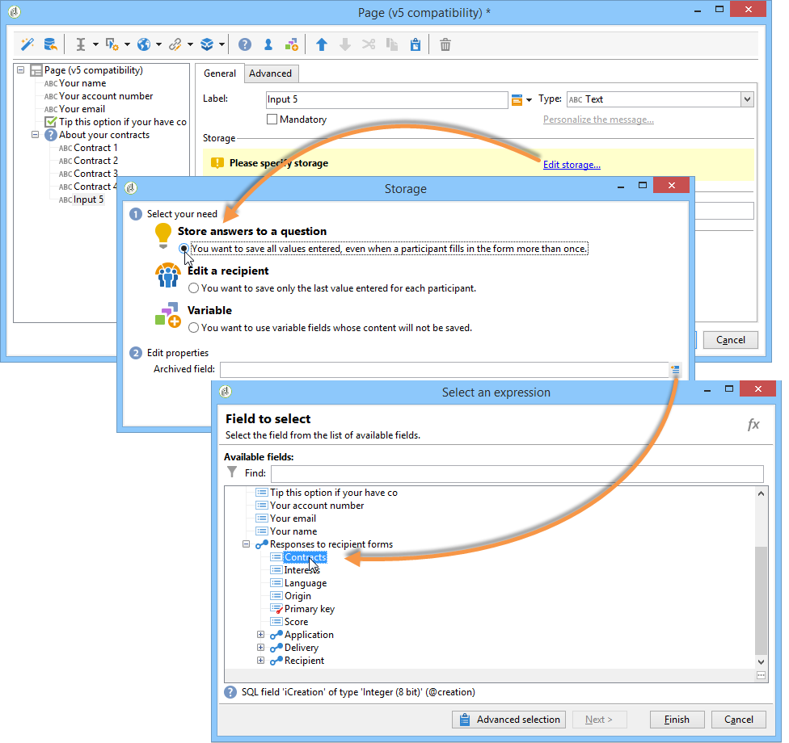
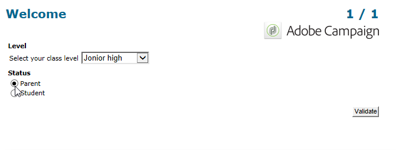

# 管理答案{#managing-answers}


## 存储收集的答案 {#storing-collected-answers}

除了Adobe Campaign中的所有Web窗体通用的标准存储模式（数据库字段和本地变量）之外，调查还支持使用存档字段动态扩展数据模型。

>[!CAUTION]
>
>此选项仅适用于&#x200B;**调查**&#x200B;类型的Web应用程序。 它不适用于其他类型的Web窗体。

### 存储在已存档字段中 {#storing-in-an-archived-field}

通过添加新的存储空间以保存调查中提供的响应，可以轻松扩展数据模板。 为此，请在创建输入字段时选择&#x200B;**[!UICONTROL Store answers to a question]**&#x200B;选项。 单击&#x200B;**[!UICONTROL New field...]**&#x200B;链接并提供其属性：


输入字段的标签和名称，然后选择字段类型：文本、布尔值、整数或小数、日期等。

所选字段类型涉及用户输入响应时的数据控制。 对于&#x200B;**文本**&#x200B;字段，您可以添加约束（大小写、格式）或指向现有枚举的链接以强制选择。

要添加约束条件，请从下拉列表中选择它。 有两种类型的约束：

1. 字符大小写

   输入的信息可以以下列格式存储在字段中：全部大写、全部小写或初始大写。 此约束不要求用户以所选格式输入数据，但在字段中输入的内容在保存时将进行转换。

1. 数据格式

如果在列表中使用此字段，则可以使用值列表上方的&#x200B;**[!UICONTROL Initialize the list of values from the database]**&#x200B;链接在值表中自动检索枚举的值。

例如，您可以创建一个下拉列表，让用户选择其母语。 对应的已存档字段可以与包含语言列表的&#x200B;**语言**&#x200B;枚举关联：



通过位于字段右侧的&#x200B;**[!UICONTROL Edit link]**&#x200B;图标，可以编辑此枚举的内容：


在字段的&#x200B;**[!UICONTROL General]**&#x200B;选项卡中，**[!UICONTROL Initialize the list of values from the database]**&#x200B;链接允许您自动输入提供的标签列表。


**示例**：将收件人的合同存储在一个字段中

若要在一个字段中存储不同类型的约定，请创建一个&#x200B;**[!UICONTROL Text]**&#x200B;输入字段并选择&#x200B;**[!UICONTROL Store answers to a question]**&#x200B;选项。

单击&#x200B;**[!UICONTROL New field...]**&#x200B;链接并输入字段属性。 选择&#x200B;**[!UICONTROL Multiple values]**&#x200B;选项以启用多个要存储的值。


为其它合同创建录入字段，并将数据存储在同一个存档字段中。



当用户批准调查时，其答案将存储在&#x200B;**[!UICONTROL Contracts]**&#x200B;字段中。

在我们的示例中，对于以下答案：


答辩人的简介将包含所输入的四份合同。

可以通过显示相关列在调查的&#x200B;**[!UICONTROL Answers]**&#x200B;选项卡中查看这些项目。


您还可以根据答案过滤收件人，以仅显示您感兴趣的用户。 为此，请创建定位工作流并使用&#x200B;**[!UICONTROL Survey responses]**&#x200B;框。


根据要恢复的用户档案创建查询。 在以下实例中，您可以通过查询选择至少具有两个合同的用户档案，包括A类型合同。


对于每个表单，都可以在字段或标签中使用提供的答案。 对存储在已存档字段中的内容使用以下语法：

```
<%= ctx.webAppLogRcpData.name of the archived field %
```

>[!NOTE]
>
>对于其他类型的字段，语法在[此部分](../../platform/using/about-queries-in-campaign.md)中有详细说明。

### 存储设置 {#storage-settings}

您可以以XML格式存档调查答案。 这使您可以保存所收集答案的原始副本，当逐项列表中的数据过度标准化时，这将很有用。 [了解详情](../../surveys/using/publish-track-and-use-collected-data.md#standardizing-data)

>[!CAUTION]
>
>归档原始响应会影响所需的存储空间。 请谨慎使用此选项。

操作步骤：

* 通过&#x200B;**[!UICONTROL Edit]**&#x200B;选项卡的&#x200B;**[!UICONTROL Properties]**&#x200B;按钮编辑调查属性。
* 单击&#x200B;**[!UICONTROL Advanced parameters]**&#x200B;链接并选中&#x200B;**[!UICONTROL Save a copy of raw answers]**&#x200B;选项。


您可以为所有调查默认启用此选项（发布调查时应用此选项）。 为此，请创建&#x200B;**[!UICONTROL NmsWebApp_XmlBackup]**&#x200B;选项并为其分配值&#x200B;**[!UICONTROL 1]**，如下所示：


## 得分管理 {#score-management}

您可以为表单页面中提供的选项分配一个分数。 得分只能链接到已关闭的问题：复选框、下拉列表中的值、订阅等。


当页面得到确认时，即当用户单击&#x200B;**[!UICONTROL Next]**&#x200B;或&#x200B;**[!UICONTROL Finish]**&#x200B;按钮时，将在服务器端累计并保存得分。

>[!NOTE]
>
>可以使用正或负、整数或非整数值。

分数可用于测试或脚本。

>[!CAUTION]
>
>不能在位于同一页面上的字段的可见性条件中使用分数。 但是，它们可以在后续页面中使用。

* 要在测试中使用得分，请使用测试计算公式中的&#x200B;**[!UICONTROL Score]**&#x200B;字段，如下所示：

  

* 您可以在脚本中使用得分。

**示例**：计算一个分数，并将其用作显示下一页的条件：

* 在调查中，下一页允许您根据在下拉列表中选择的值，为用户分配不同的分数：

  

* 您可以根据所选的选项，将此得分与第二个值组合：

  

* 当用户单击&#x200B;**[!UICONTROL Next]**&#x200B;按钮时，两个值相加。

  

* 可以根据得分为要显示的页面应用条件。 其配置如下：

  

  
