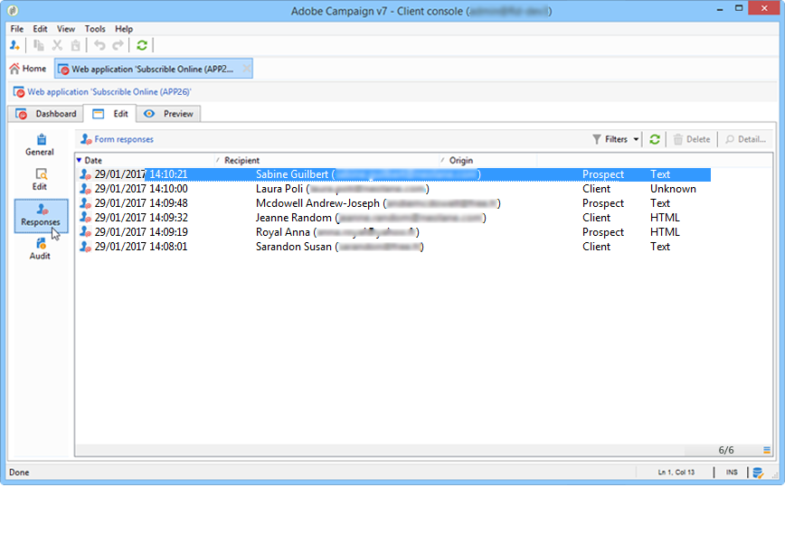
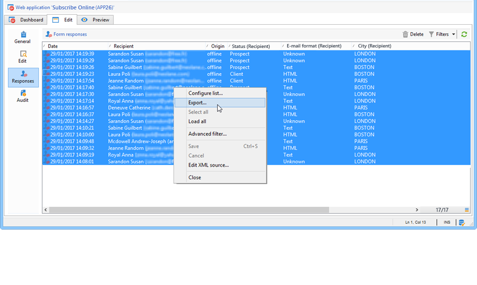

# 发布、跟踪和使用收集的数据{#publish-track-and-use-collected-data}


创建、配置和发布表单后，您可以与受众共享该链接并跟踪响应。

>[!NOTE]
>
>Adobe Campaign中调查的生命周期及其发布和交付模式与Web表单的生命周期类似：详情请参阅 [此部分](../../web/using/about-web-forms.md).

## 调查仪表板 {#survey-dashboard}

每个调查都有其自己的功能板，可让您查看其状态、描述、公共URL和可用性计划。 它还允许您查看可用的报表。 [了解详情](#reports-on-surveys)。

功能板上显示了调查的公共URL:


## 响应跟踪 {#response-tracking}

您可以在日志和报表中跟踪对调查的响应。

### 调查日志 {#survey-logs}

对于提交的每个调查，您可以在 **[!UICONTROL Logs]** 选项卡。 此选项卡显示已完成调查的用户列表及其来源：



双击某行，以显示答复者填写的调查表单。 您可以全面浏览调查并完整访问答案。 这些文件可导出为外部文件。 有关更多信息，请参阅 [导出答案](#exporting-answers).

通过添加以下字符，在调查URL中指示原点：

```
?origin=xxx
```

编辑调查时，其URL包含参数 **[!UICONTROL __uuid]**，表示它处于测试阶段且尚未联机。 当您通过此URL访问调查时，在跟踪（报表）中不会考虑创建的记录。 源被强制设置为值 **[!UICONTROL Adobe Campaign]**.

有关URL参数的更多信息，请参阅 [本页](../../web/using/defining-web-forms-properties.md#form-url-parameters).

### 调查报告 {#reports-on-surveys}

使用功能板选项卡可访问调查报表。 单击报表名称以查看报表名称。


在 **[!UICONTROL Documentation]** 报表。

在 **[!UICONTROL Reports]** 选项卡： **[!UICONTROL General]** 和 **[!UICONTROL Breakdown of responses]**.

* 常规

   此报表包含有关调查的一般信息：响应数随时间的变化情况，以及按来源和语言的分布情况。

   常规报表示例：

   

* 响应的划分

   此报表显示了每个问题的响应细分。 此划分仅适用于针对中存储的字段给出的答案 **[!UICONTROL Question]** 类型容器。 此参数仅适用于选择控件（例如，不会在文本字段中划分）。

   

## 导出答案 {#exporting-answers}

可在外部文件中导出调查的答案，以供稍后处理。 可以通过两种方式来执行此操作：

1. 导出报表数据

   要导出报表数据，请单击 **[!UICONTROL Export]** 按钮，然后选择导出格式。

   有关导出报表数据的更多信息，请参阅 [此部分](../../reporting/using/about-reports-creation-in-campaign.md).

1. 导出答案

   要导出答案，请单击 **[!UICONTROL Responses]** 选项卡，然后右键单击。 选择 **[!UICONTROL Export...]**。

   

   然后，输入要导出的信息和存储文件。

   您可以在导出向导中配置输出文件的内容和格式。

   这样，您就可以：

   * 向输出文件添加列并恢复关于收件人的信息（存储在数据库中），
   * 格式化导出的数据，
   * 为文件中的信息选择编码格式。

   如果要导出的调查包含多个 **[!UICONTROL Multi-line text]** 或 **[!UICONTROL HTML text]** 字段，则必须将其导出到 **[!UICONTROL XML]** 格式。 为此，请在 **[!UICONTROL Output format]** 字段，如下所示：

   

   单击 **[!UICONTROL Start]** 以运行导出。

   >[!NOTE]
   >
   >有关数据导出及其配置的各个阶段的详细信息，请参阅 [此部分](../../platform/using/about-generic-imports-exports.md).

## 使用收集的数据 {#using-the-collected-data}

通过在线调查收集的信息可以在定位工作流的框架内恢复。 为此，请使用 **[!UICONTROL Survey responses]** 框中。

在以下示例中，我们希望为在线调查中至少有两个孩子且得分最高的五个收件人专门提供Web选件。 本调查的答案是：


在定位工作流中， **[!UICONTROL Survey responses]** 将配置如下：


首先选择相关调查，然后在窗口的中央部分提取数据。 在这种情况下，我们需要至少提取分数列，因为它将用在拆分框中以恢复五个最高分数。

通过单击 **[!UICONTROL Edit query...]** 链接。


启动定位工作流。 查询取回了8个收件人。


右键单击收藏集框的输出过渡以查看它们。


然后，在工作流中放置一个拆分框，以取回分数最高的5个收件人。

编辑拆分框以对其进行配置：

* 首先，在 **[!UICONTROL General]** ，然后配置子集：

   

* 转到 **[!UICONTROL Sub-sets]** ，然后选择 **[!UICONTROL Limit the selected records]** 选项，然后单击 **[!UICONTROL Edit...]** 链接。

   

* 选择 **[!UICONTROL Keep only the first records after sorting]** 选项，然后选择排序列。 勾选 **[!UICONTROL Descending sort]** 选项。

   

* 单击 **[!UICONTROL Next]** 按钮，并将记录数限制为5。

   

* 单击 **[!UICONTROL Finish]** 然后，重新启动工作流以批准定位。

## 数据标准化 {#standardizing-data}

可以在Adobe Campaign中为使用别名收集的数据设置标准化流程。 这样，您就可以标准化存储在数据库中的数据：为此，请在包含相关信息的分项列表中定义别名。 [了解详情](../../platform/using/managing-enumerations.md#about-enumerations)
