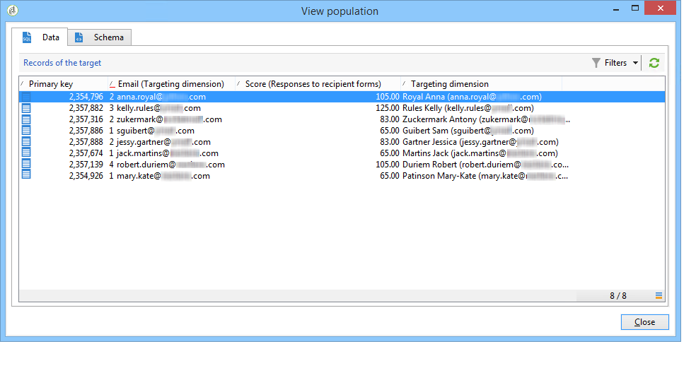

# 发布、跟踪和使用收集的数据{#publish-track-and-use-collected-data}


创建、配置和发布表单后，您可以与受众共享该链接并跟踪响应。

>[!NOTE]
>
>Adobe Campaign中调查的生命周期及其发布和投放模式与Web表单的生命周期相似：详见 [本节](../../web/using/about-web-forms.md).

## 调查仪表板 {#survey-dashboard}

每个调查都有自己的信息板，允许您查看其状态、描述、公共URL和可用性计划。 它还允许您查看可用的报表。 [了解详情](#reports-on-surveys)。

调查的公共URL将显示在仪表板上：


## 响应跟踪 {#response-tracking}

您可以在日志和报告中跟踪对调查的响应。

### 调查日志 {#survey-logs}

对于提供的每项调查，您都可以在以下位置跟踪其响应： **[!UICONTROL Logs]** 选项卡。 此选项卡显示已完成调查的用户及其来源的列表：


双击某行以显示由响应者填写的调查表单。 您可以完全浏览调查并完全访问答案。 这些文件可在外部文件中导出。 有关详细信息，请参见 [导出答案](#exporting-answers).

调查URL中添加以下字符来指示来源：

```
?origin=xxx
```

在编辑调查时，其URL包含参数 **[!UICONTROL __uuid]**，这表示它处于测试阶段且尚未联机。 通过此URL访问调查时，创建的记录不会计入跟踪（报表）中。 原点被强制为值 **[!UICONTROL Adobe Campaign]**.

有关URL参数的更多信息，请参阅 [此页面](../../web/using/defining-web-forms-properties.md#form-url-parameters).

### 调查报告 {#reports-on-surveys}

通过仪表板选项卡，可访问调查报表。 单击报表名称可查看它。


调查的结构可见于 **[!UICONTROL Documentation]** 报告。

关于Web调查的其他两份报告见 **[!UICONTROL Reports]** 调查选项卡： **[!UICONTROL General]** 和 **[!UICONTROL Breakdown of responses]**.

* 常规

  本报告载有调查的一般资料：答复数量如何随时间变化，以及按来源和语言的分布。

  常规报表示例：

  

* 响应的细分

  此报表显示每个问题的回复的细目。 此划分仅适用于对存储在中的字段给出的答案 **[!UICONTROL Question]** 键入容器。 它仅对选择控件有效（例如，不划分文本字段）。

  

## 导出答案 {#exporting-answers}

调查的答案可以导出到外部文件中以供稍后处理。 可通过两种方式来做到这一点：

1. 导出报表数据

   要导出报表数据，请单击 **[!UICONTROL Export]** 按钮并选择导出格式。

   有关导出报表数据的更多信息，请参阅 [本节](../../reporting/using/about-reports-creation-in-campaign.md).

1. 导出答案

   要导出答案，请单击 **[!UICONTROL Responses]** 调查选项卡，然后右键单击。 选择 **[!UICONTROL Export...]**。

   

   然后输入要导出的信息和存储文件。

   您可以在导出向导中配置输出文件的内容和格式。

   这允许您：

   * 向输出文件添加列，并恢复有关收件人（存储在数据库中）的信息，
   * 格式化导出的数据，
   * 选择文件中信息的编码格式。

   如果要导出的调查包含多个 **[!UICONTROL Multi-line text]** 或 **[!UICONTROL HTML text]** 字段，必须将其导出到 **[!UICONTROL XML]** 格式。 要实现此目的，请在 **[!UICONTROL Output format]** 字段，如下所示：

   

   单击 **[!UICONTROL Start]** 以运行导出。

   >[!NOTE]
   >
   >有关数据导出及其配置阶段的详情，请参见 [本节](../../platform/using/about-generic-imports-exports.md).

## 使用收集的数据 {#using-the-collected-data}

通过在线调查收集的信息可在定位工作流的框架内恢复。 要执行此操作，请使用 **[!UICONTROL Survey responses]** 盒子。

在下面的示例中，我们要专门为五个在在线调查中至少有两个孩子且得分最高的收件人提供网络优惠。 本调查的答案是：


在定位工作流中， **[!UICONTROL Survey responses]** 将按如下方式进行配置：


首先，选择相关的调查，然后在窗口的中央部分提取数据。 在这种情况下，我们至少需要提取得分列，因为它将在拆分框中用于取回五个最高分。

通过单击 **[!UICONTROL Edit query...]** 链接。


启动定位工作流。 查询恢复了8个收件人。


右键单击集合框的输出过渡可查看它们。



然后，在工作流中放置一个拆分框，以取回得分最高的5位收件人。

编辑拆分框以进行配置：

* 首先，在 **[!UICONTROL General]** 选项卡，然后配置子集：

  

* 转到 **[!UICONTROL Sub-sets]** 选项卡，然后选择 **[!UICONTROL Limit the selected records]** 选项，然后单击 **[!UICONTROL Edit...]** 链接。

  

* 选择 **[!UICONTROL Keep only the first records after sorting]** 选项并选择排序列。 勾选 **[!UICONTROL Descending sort]** 选项。

  

* 单击 **[!UICONTROL Next]** 按钮并将记录数限制为5。

  

* 单击 **[!UICONTROL Finish]** 然后重新启动工作流以批准定位。

## 标准化数据 {#standardizing-data}

可以在Adobe Campaign中为使用别名收集的数据设置标准化流程。 这使您能够标准化存储在数据库中的数据：为此，请在包含相关信息的明细列表中定义别名。 [了解详情](../../platform/using/managing-enumerations.md#about-enumerations)
