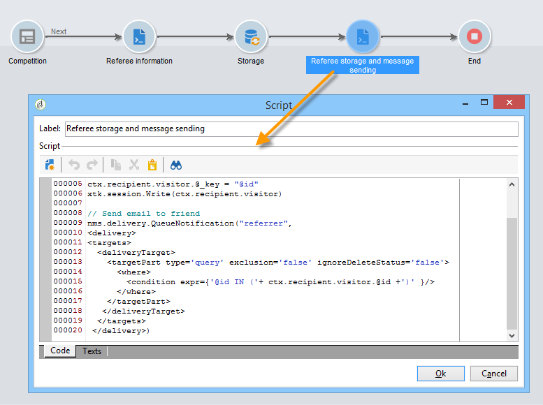

# 用例：创建引用窗体{#use-case-creating-a-refer-a-friend-form}


在本例中，我们希望向数据库中的收件人提供竞争信息。 Web窗体将有一个用于输入答案的部分，另一个用于通过输入朋友的电子邮件地址来引荐朋友。


标识和竞争块是使用先前描述的过程创建的。

要配置和创建反向链接块，请应用以下步骤：

1. 创建包含问题的竞争Web窗体，并提供一个用于输入朋友联系信息的字段，如下所示：

   

   的 **您的消息** 字段中，您可以输入裁判的消息。 反向链接还必须输入 **姓氏**, **名字** 和 **电子邮件**.

   在字段中输入的信息存储在称为访客表的特定表中。

   >[!NOTE]
   >
   >只要收件人未表示同意，您就无法将他们与收件人一起存储到数据库中。 它们将暂时存储在 **访客** 表(**nms:visitor**)专为病毒式营销活动而设计。 由于 **清理** 操作。
   >
   >在本例中，我们希望定位收件人以建议他们参加其反向链接推荐的竞争。 但是，在此消息中，我们还希望向他们订购我们的一项信息服务。 如果订阅了，则可以将其存储在数据库中。

   

   与裁判有关的字段内容将用于个人资料创建脚本和发送给裁判的消息中。

1. 首先创建一个脚本，将反向链接到推荐人。

   它包含以下说明：

   

   ```
   ctx.recipient.visitor.@id = xtk.session.GetNewIds(1)
   ctx.recipient.visitor.@forwardUrl = "APP5"
   ctx.recipient.visitor.@referrerEmail = ctx.recipient.@email
   ctx.recipient.visitor.@referrerFirstName = ctx.recipient.@firstName
   ctx.recipient.visitor.@referrerLastName = ctx.recipient.@lastName
   ```

   在页面标识块中输入的姓氏、名字和电子邮件地址均被标识为反向链接的姓氏、名字和电子邮件地址。 这些字段将重新注入发送给裁判的消息正文中。

   APP5值与Web窗体的内部名称匹配：此信息可让您查明裁判的出身，即将访客链接到基于其创建的Web窗体。

1. 利用存储框，可收集信息并将其存储在数据库中。

   

1. 然后，创建链接到在步骤1中创建的信息服务的投放模板。 该参数将在 **[!UICONTROL Choose scenario]** 信息服务的字段。

   用于创建反向链接选件消息的投放模板包含以下信息：

   

   此模板具有以下特征：

   * 选择访客表作为目标映射。

      

   * 裁判的联系信息以及反向链接信息均取自访客表格。 它将使用个性化按钮插入。

      

   * 此模板包含竞争表单的链接以及裁判订阅新闻通讯的订阅链接。

      订阅链接通过个性化块插入。 默认情况下，它允许您将用户档案订阅到 **新闻稿** 服务。 可以根据您的需要更改此个性化块，例如，为收件人订阅其他服务。

   * 消息投放脚本中将使用内部名称（此处为“referrer”），如下所示。
   >[!NOTE]
   >
   >请参阅 [本页](../../delivery/using/about-templates.md) 以了解有关投放模板的更多信息。

1. 创建用于投放订阅消息的第二个脚本。

   

   ```
   // Updtate visitor to have a link to the referrer recipient
   ctx.recipient.visitor.@referrerId = ctx.recipient.@id
   ctx.recipient.visitor.@xtkschema = "nms:visitor"
   ctx.recipient.visitor.@_operation = "update" 
   ctx.recipient.visitor.@_key = "@id" 
   xtk.session.Write(ctx.recipient.visitor)
   
   // Send email to friend
   nms.delivery.QueueNotification("referrer",
   <delivery>
   <targets>
     <deliveryTarget>
       <targetPart type='query' exclusion='false' ignoreDeleteStatus='false'>
         <where>
           <condition expr={'@id IN ('+ ctx.recipient.visitor.@id +')' }/>
         </where>
       </targetPart>
      </deliveryTarget>
     </targets>
    </delivery>)
   ```

1. 发布竞争表格并向初始目标的收件人发送邀请。 当其中一人邀请朋友时，根据 **推荐选件** 模板。

   

   裁判被添加到 **[!UICONTROL Administration > Visitors node]**:

   

   其用户档案包含其反向链接输入的信息。 它基于在表单脚本中输入的配置进行存储。 如果他们决定订阅新闻稿，则会将其保存在收件人表中。
