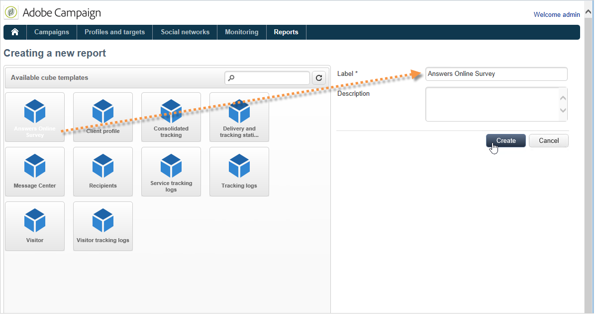

# 用例：显示在线调查的答案报告{#use-case-displaying-report-on-answers-to-an-online-survey}

可使用专门报告收集和分析Adobe Campaign调查的答案。

在以下示例中，我们要收集在线调查的答案并在数据透视表中显示它们

应用以下步骤：

1. 创建工作流以恢复对调查的回答并将其存储在列表中。
1. 使用列表中的数据创建多维数据集。
1. 使用数据透视表创建报告并查看答案的划分。

在开始使用此用例之前，您需要有权访问调查以及可分析的一组答案。

>[!NOTE]
>
>仅当您获得了&#x200B;**调查管理器**&#x200B;选项时，才可实施此用例。 请核实您的许可协议。

## 步骤1 — 创建数据收集和存储工作流 {#step-1---creating-the-data-collection-and-storage-workflow}

要收集调查的答案，请应用以下步骤：

1. 创建工作流并放置&#x200B;**[!UICONTROL Answers to a survey]**&#x200B;活动。 有关使用此活动的更多信息，请参阅[此部分](../../surveys/using/publish--track-and-use-collected-data.md#using-the-collected-data)。
1. 编辑活动并选择要分析其答案的调查。
1. 启用&#x200B;**[!UICONTROL Select all the answer data]**&#x200B;选项以收集所有信息。

   

1. 选择要提取的列(在本例中为：选择：所有存档字段。 这些字段包含答案。

   

1. 配置了答案收集框后，请定位&#x200B;**[!UICONTROL List update]**&#x200B;类型的活动以保存数据。

   

   在此活动中，指定要更新的列表，并取消选中&#x200B;**[!UICONTROL Purge and re-use the list if it exists (otherwise add to the list)]**&#x200B;选项：答案将添加到现有表中。 此选项将允许您引用多维数据集中的列表。 链接到列表的架构将不会针对每次更新重新生成，这将确保使用此列表的多维数据集的完整性。

   

1. 启动工作流以确认其配置。

   

   将创建指定的列表，并包含调查答案的模式。

1. 添加调度程序以自动每天收集答案和更新列表。

   有关&#x200B;**[!UICONTROL List update]**&#x200B;和&#x200B;**[!UICONTROL Scheduler]**&#x200B;活动的详细信息，请参见。

## 第2步 — 创建多维数据集、其度量及其指标 {#step-2---creating-the-cube--its-measures-and-its-indicators}

然后，可以创建多维数据集并配置其度量：这些指标将用于创建将在报告中显示的指标。 有关创建和配置多维数据集的更多信息，请参阅[关于多维数据集](../../reporting/using/about-cubes.md)。

在此示例中，多维数据集基于由之前创建的工作流馈送的列表中的数据。

定义要在报表中显示的维度和度量。 在此，我们希望显示被申请人的合同日期和国家/地区。

使用&#x200B;**[!UICONTROL Preview]**&#x200B;选项卡可以控制报告的呈现。

## 第3步 — 创建报表并在表中配置数据布局 {#step-3---creating-the-report-and-configuring-the-data-layout-within-the-table}

然后，您可以基于此多维数据集创建报告并处理数据和信息。

根据您的需求调整信息以显示。

