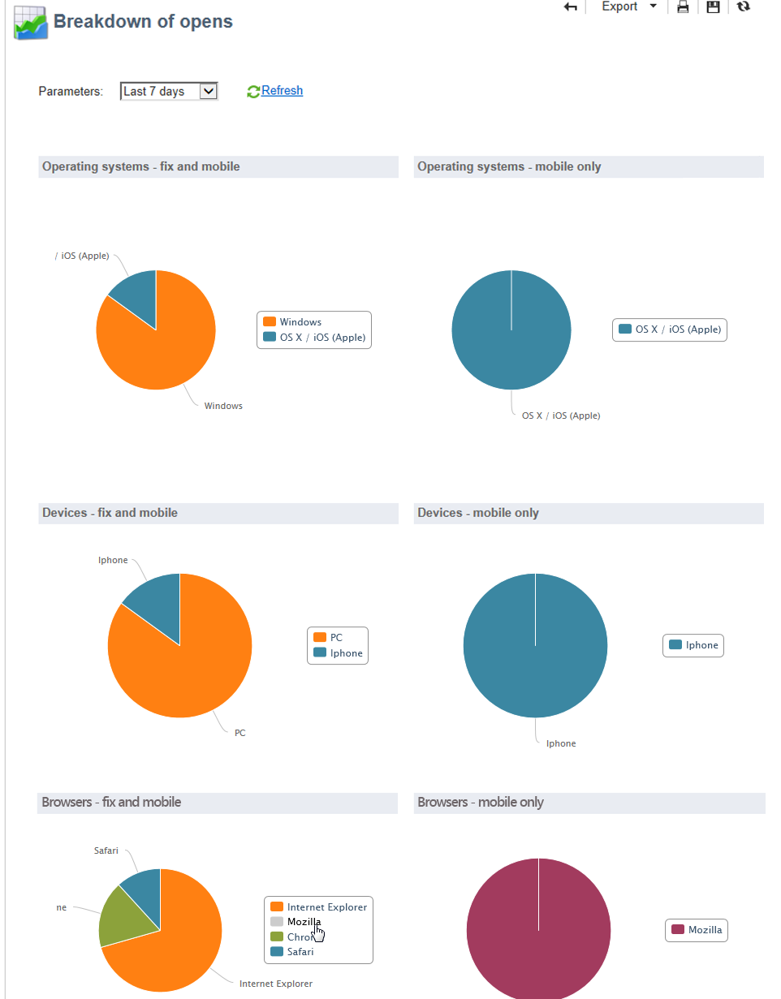
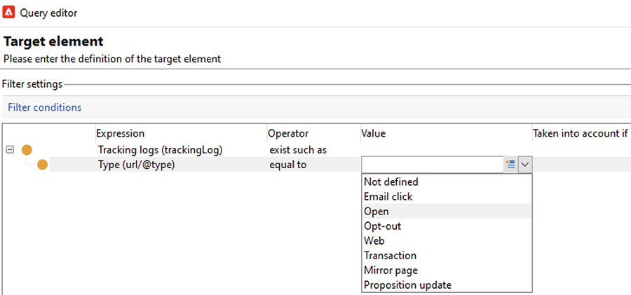
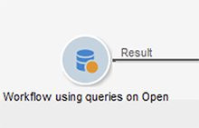
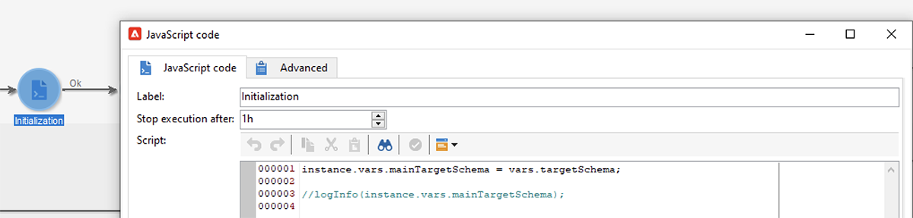

# Apple邮件应用程序中的邮件隐私保护


## 更改了哪些内容？

2021年，Apple为其本机Mail应用程序引入了新的隐私保护功能。 此应用程序现在包含Apple的邮件隐私保护功能。 基本上，发件人不能再使用跟踪像素来收集有关选择启用Apple邮件隐私保护功能的收件人的信息。 [了解更多](https://experienceleague.adobe.com/docs/deliverability-learn/deliverability-best-practice-guide/additional-resources/technotes/apple-mail-privacy-faq.html?lang=zh-Hans){target=&quot;_blank&quot;}。

## 我的营销活动受到什么影响？

Adobe Campaign提供了使用跟踪像素跟踪电子邮件打开次数的功能。 您不仅可以将此功能用于定位和营销活动，还可以用于量度。 例如，您可以使用电子邮件打开率来衡量促销活动的有效性和用户参与度。 简而言之，您的营销活动中可能会受到分段、定位和量度的影响。

## 我应该采取什么行动？

Apple的新功能是在电子邮件隐私保护方面，业内将会有怎样的变化。 我们强烈建议您遵循Adobe的建议。

### 评估对营销活动触发器的影响

评估这些更改对当前促销活动触发器有何影响。 识别打开电子邮件的工作流，以将其作为分段、定位或重定位的标准。 阅读 [提示和技巧](#find-email-open-tracking).

### 保留数据

保留您的数据并整合您当前在设备上的知识。 您可以根据用户代理设定关键绩效指标(KPI)。 例如，您可以针对使用iOS和Apple Mail应用程序的用户档案构建KPI。 阅读 [提示和技巧](#preserve-tracking-data).

### 在保留期之后存档您的跟踪日志

在Adobe Campaign的保留期之后存档您的跟踪日志：

1. 检查营销活动实例中保留期的持续时间。
1. 再次检查活动目标映射。 确定除了现成的用户档案表(`nmsRecipient`)。
1. 从Adobe Campaign导出跟踪日志。 包括包含有关用户代理和操作系统数据的日志。

### 评估开放率的当前趋势

确定在iOS设备上使用Apple Mail应用程序的受众比例。
使用此评估，您可以识别潜在的异常差距及其原因。 您可以确定差距是由于促销活动性能问题还是Apple的隐私保护功能所致。 阅读 [提示和技巧](#measure-ios-footprint).

### 重新评估您的营销活动策略和绩效量度

最重要的是，我们强烈建议您主动重新评估营销活动策略和营销活动效果量度。 您可以重新关注更可靠的量度，例如点进次数、产品查看次数和购买次数。

我们建议您探索当前可用的数据，并评估打开率与其他量度之间的关联。 如果这些量度之间始终存在关联，则您可以满怀信心地改进触发器。

## 提示和技巧

### 衡量整个iOS足迹 {#measure-ios-footprint}

要从Adobe Campaign数据收集分析，您可以使用现成报表：

* **[!UICONTROL Operating Systems]** 报告

   要确定每个操作系统和每个版本的访客比例，请使用此报表。 [阅读更多](../../reporting/using/global-reports.md#operating-systems)。

   您可以查看每个操作系统的访客相对于访客总数的划分。

   

   对于每个操作系统，您可以查看每个操作系统版本的访客划分。

   

* **[!UICONTROL Breakdown of opens]** 报告

   要确定每个操作系统的电子邮件打开次数比例，请使用此报表。 [阅读更多](../../reporting/using/global-reports.md#breakdown-of-opens)。

   

### 确定如何使用电子邮件打开跟踪 {#find-email-open-tracking}

您可以识别打开电子邮件的工作流，以将其作为分段、定位和重定位的标准。

为此，您可以使用 **[!UICONTROL type]** 跟踪链接URL的属性(**[!UICONTROL url/@type]**)。 对于打开的电子邮件，此属性将设置为 **[!UICONTROL Open]**. 此属性可在查询编辑器( **[!UICONTROL Query]** 活动和预定义过滤器。 您可以将此属性用作营销活动的定位标准。



在此示例中，营销人员希望向在过去七天内打开特定投放电子邮件并在过去一个月内购买产品的收件人发送奖励选件。 在工作流查询中，您可以使用以下各种方式打开的电子邮件：

* 您可以在查询中将电子邮件打开次数用作定位条件。

   您可以指定作为筛选条件，将特定投放跟踪日志的URL类型设置为 **[!UICONTROL Open]**.

   

* 您可以使用预定义过滤器。 [了解详情](../../workflow/using/creating-a-filter.md)。

   

   您可以在工作流的查询活动中使用此预定义过滤器。

   

   >[!NOTE]
   >
   >在工作流中，您无法查看预定义过滤器的定位标准。

要检索在其中打开电子邮件作为定位标准的工作流列表，您必须查询 `xtk:workflow` 架构。 工作流的内容存储在 **[!UICONTROL XML memo (data)]** 字段。


您可以指定工作流必须包含以下内容：

`expr="[url/@type] = 2"`

此定位标准意味着必须将跟踪的URL的类型设置为 **[!UICONTROL Open]**.


#### 实施和示例包的示例

您可以使用此实施示例来识别打开电子邮件作为定位标准的工作流，并向您选择的营销活动操作员发送通知。 您可以将此实施用于以下目的：

* 您可以测量在定位工作流中从电子邮件打开次数切换到其他KPI的潜在影响。 如果不使用电子邮件打开，则无需进一步操作。
* 当您重新评估实施时，可以使用此示例来避免跳过工作流。

此示例展示了单个技术工作流中的自定义实施。


>[!IMPORTANT]
>
>该包仅作为示例提供，而Adobe作为产品功能不支持该包。
>
>您可能需要调整示例代码以适应您的促销活动实施。
>
>最终用户是负责安装和使用此示例包的唯一用户。
>
>我们强烈建议您在非生产环境中测试并验证此包。

下载 [示例包](assets/PKG_Search_workflows_using_Opens_in_queries_V1.xml) 然后安装它。 [了解详情](../../platform/using/working-with-data-packages.md#importing-packages)。

安装包后，您可以从包含实例中现成技术工作流的文件夹中访问该工作流：

`/Administration/Production/Technical workflows/nmsTechnicalWorkflow`

从用户界面中，选择 **[!UICONTROL Administration]** > **[!UICONTROL Production]** > **[!UICONTROL Technical workflows]**.


工作流包含以下主要步骤：

1. 列出打开电子邮件作为定位标准的工作流。
1. 列出打开电子邮件作为定位标准的预定义过滤器。
1. 列出使用这些预定义过滤器的工作流。
1. 将两个工作流列表合并到一个列表中。
1. 向指定的操作员发送电子邮件通知。

工作流包含以下详细步骤：

1. 初始活动是 `xtk:workflow` 架构。 此活动用于在相应的实例中查找包含电子邮件的明确工作流查询，以作为定位条件打开。

   

   

   

   因此，将返回工作流的列表。

   

   由于此信息被重复使用，因此工作表的名称将存储在全局工作流实例变量中。

   

1. 第二个查询用于查找包含电子邮件打开次数的预定义过滤器。

   

   

   

   因此，将返回预定义过滤器的列表。

   

1. 此预定义过滤器列表用于查找使用这些过滤器的工作流。
1. 两个工作流列表都合并到一个列表中。

   为此，使用JavaScript代码。

   

   ```javascript
   const queryPredFilter = xtk.queryDef.create(
     <queryDef schema={vars.targetSchema} operation="select">
        <select>
          <node alias="@id" expr="@id" />
          <node alias="@name" expr="@name"  />
        </select>
        <where/>
     </queryDef>
       ).ExecuteQuery()
   
   var qDef =
     <queryDef schema="xtk:workflow" operation="select">
       <select>
         <node expr="@id"/>
         <node expr="@internalName"/>
         <node expr="@label"/>
       </select>
       <where>
         <condition boolOperator="OR" expr={"data like '%expr=[url/@type] = 2%'" }/>
       </where>
     </queryDef>
   
   for each (var filter in queryPredFilter) {       
   
      //logInfo (filter.@name);
      var condition;
      condition =<condition boolOperator="OR" expr={"data like '%" + filter.@name + "%'" }/>
      qDef.where.appendChild(condition);   
   
   }
   
   var queryWorkflowList = xtk.queryDef.create(qDef);
   var workflowList = queryWorkflowList.ExecuteQuery();
   
   var sWorkflowList = "";
   var iCount = 0
   for each (var workflow in workflowList) {       
   
      //logInfo ("Workflow ID: " + workflow.@id + " in " + instance.vars.mainTargetSchema);
   
      iWorkflowId = workflow.@id;
      iWorkflowName = workflow.@internaName;
      iWorkflowLabel = workflow.@label;
   
       xtk.session.Write(
             <{instance.vars.mainTargetSchema.split(':')[1]}
               _operation="insertOrUpdate"       
               _key="@id"
               xtkschema={instance.vars.mainTargetSchema}
               id={iWorkflowId}
               internaName={iWorkflowName}
               label={iWorkflowLabel}
             />
       )
   }
   ```

1. 复制的工作流将从合并的列表中删除。

   

1. 将执行测试以检查列表是否不为空。

   

   如果列表不为空，则会将其插入到电子邮件通知的HTML表中。

   

   ```js
   const queryWorkflow = xtk.queryDef.create(
       <queryDef schema={vars.targetSchema} operation="select">
           <select>
               <node alias="@id" expr="@id" />
               <node alias="@internalName" expr="@internalName"  />
               <node alias="@label" expr="@label"  />
           </select>
           <where/>
       </queryDef>
   ).ExecuteQuery()
   
   var sWorkflowList = '<table border="0" >';
   
   sWorkflowList = sWorkflowList + "<tr><th>Worklow Id</th><th>Name</th><th>Label</th></tr>";
   
   for each (var workflow in queryWorkflow) {       
   
      sWorkflowList = sWorkflowList + "<tr>" +
                       "<td>" + workflow.@id + "</td>" +
                       "<td>" + workflow.@internalName + "</td>" +
                       "<td>" + workflow.@label + "</td>" +
                       "</tr>";
   
   }
   
   sWorkflowList = sWorkflowList + "</table>";
   
   instance.vars.workflowList = sWorkflowList;
   ```

1. HTML表将添加到通知模板。

   ```js
   <%= instance.vars.workflowLIst%>
   ```

   

   电子邮件通知包含作为查询中的定位条件而打开的包含电子邮件的工作流列表。

   

### 保留当前跟踪数据 {#preserve-tracking-data}

#### 哪些数据会受到影响？

用户档案数据通过电子邮件打开和点进等操作的跟踪数据进行扩充。 当有此信息可用时，跟踪还通过用户代理提供有关用户设备的关键信息。

简而言之，Adobe Campaign跟踪数据提供了以下信息：

* 与通过特定电子邮件打开或单击的人员关联的用户档案
* 打开日期
* 使用的设备，例如iPhone或Mac
* 操作系统和版本，例如iOS 15、macOS 12或Windows 10
* 应用程序（如邮件应用程序或Web浏览器）和版本（如Outlook 2019）

#### 为何应保留跟踪数据？

我们强烈建议您出于多种原因保留此数据：

* 此数据由Adobe Campaign保留有限期限。 保留期会因实例的配置而异。

   检查实例的设置。 [阅读更多](../../platform/using/privacy-management.md#data-retention)。

* 除了Apple的近期更改之外，您还可以使用跟踪数据来增加巨大的价值来提升受众的参与度。
* Apple可能会对其本机邮件应用程序及其邮件隐私保护功能进行进一步更改。

出于所有这些原因，我们强烈建议您尽快导出此数据。 否则，您部分受众的跟踪数据可能会受到负面影响。

#### 如何保留跟踪数据？

要保留跟踪数据，必须将其从Adobe Campaign导出到您的信息系统。 [阅读更多](../../platform/using/get-started-data-import-export.md)。

>[!IMPORTANT]
>
>以下示例重点介绍现成的 `nms:Recipient` 架构，默认配置文件架构为。 如果您使用附加到自定义用户档案的其他自定义目标映射，我们建议您将此导出策略扩展到所有自定义日志表。 [阅读更多](../../configuration/using/target-mapping.md)。

##### 原则

默认情况下， `nms:Recipient` 架构链接到必须导出的三个架构：

| 架构 | 内容 |
| --- | --- |
| nms:trackingLogRcp | 跟踪数据、用户、时间和相关消息 |
| nms:trackingUrl | 有关链接的详细信息，包括其性质，例如打开的电子邮件或点进 |
| nms:userAgent | 有关设备的信息 |

这些表在数据模型中链接。


使用这些关系创建单个导出查询。


您可以使用链接的架构中的有用信息扩充此数据：

| 架构 | 内容 |
| --- | --- |
| nms：收件人 | 与用户档案相关的详细信息 |
| nms：交付 | 有关用户反应的消息的信息 |

您可以将结果导出到Adobe Campaign支持的外部存储解决方案：

* SFTP
* S3
* Azure Blob

##### 实施

此示例显示如何从Adobe Campaign导出跟踪数据。

1. 创建以查询开头的工作流。

   初始查询用于检索最近三个月的跟踪日志。
您可以使用增量查询仅提取尚未导出的记录。

   从 **[!UICONTROL Additional data]** 节点。

   

1. 添加 **[!UICONTROL Data extraction (file)]** 活动。 将查询中的所有数据映射到提取文件格式。

   

   选择文件格式，例如TXT或CSV。

   

1. 添加第三个和最后一个活动以将文件上传到受支持的存储解决方案。


##### 高级实施：按iOS设备划分

您可以使用工作流确定收件人是否使用Apple的Mail应用程序。 您可以按设备拆分跟踪日志。 例如，您可以使用查询过滤器按iOS设备划分记录：

| 应用程序 | 操作系统或设备  | 查询过滤器 |
| --- | --- | --- |
| Apple Mail | iOS 15 | `operating System (Browser) contains 'iOS 15' and browser (Browser) contains 'ApplewebKit'` |
| Apple Mail | iOS14或iOS13 | `browser contains 'AppleWebKit' and operating System of browser contains 'iOS 14' or operating System of browser contains 'iOS 13'` |
| Apple Mail | iOS移动设备：iPad、iPod和iPhone | `device (Browser) contains iPhone or device (Browser) equal to iPod or device (Browser) equal to iPad and browser (Browser) equal to 'AppleWebKit'` |
| Apple Mail | iPhone 、 iPad或iPod | `browser (Browser) equal to 'AppleWebKit' and device (Browser) equal to iPhone or device (Browser) equal to iPod or device (Browser) equal to iPad` |
| Apple Mail | Mac | `browser (Browser) equal to 'AppleWebKit' and operating System (Browser) contains 'Mac'` |
| Safari | macOS | `browser (Browser) equal to 'Safari' and device (Browser) equal to PC and operating System (Browser) contains 'Mac'` |
| Safari | 移动设备 | `browser (Browser) equal to 'Safari' and device (Browser) equal to iPad or device (Browser) equal to iPod or device (Browser) equal to iPhone` |


您可以将这些规则用于各种目的：

* 将数据导出并存档到外部存储解决方案
* 计算要附加到用户档案的KPI
* 创建隐藏列表
* 报告

以下示例显示如何使用工作流按iOS设备划分记录：

* 第一个示例工作流包含以下活动：

   1. 初始 **[!UICONTROL Query]** 活动用于选择过去三个月内打开的所有电子邮件。
   1. A **[!UICONTROL Split]** 活动用于按电子邮件应用程序、浏览器、操作系统和设备拆分所做的选择。

   1. A **[!UICONTROL Deduplication]** 活动按每个活动进行 **[!UICONTROL Split]** 活动。 的 **[!UICONTROL Deduplication]** 活动用于删除重复的电子邮件地址。

      的 **[!UICONTROL Deduplication]** 活动位于 **[!UICONTROL Split]** 活动，以避免丢失有关使用各种设备的收件人的信息。

   1. 安 **[!UICONTROL End]** 活动按每个活动进行 **[!UICONTROL Deduplication]** 活动。

   如果您将收件人仅存储在现成的收件人表中以进行定位，则此类型的工作流将非常有用。

   

* 第二个示例工作流包含以下活动：

   1. 初始 **[!UICONTROL Query]** 活动用于选择过去三个月内打开的所有电子邮件。
   1. A **[!UICONTROL Deduplication]** 活动用于删除重复的电子邮件地址。
   1. A **[!UICONTROL Fork]** 活动：

      * 在一个过渡中， **[!UICONTROL Change dimension]** 活动用于查找跟踪日志所引荐的收件人。
      * 在另一个过渡中， **[!UICONTROL Split]** 活动用于按电子邮件应用程序、浏览器、操作系统和设备拆分所做的选择。
   1. 安 **[!UICONTROL End]** 活动会跟踪 **[!UICONTROL Split]** 活动。

   如果将收件人存储在非现成收件人表的表格中，则此类型的工作流将非常有用。

   
