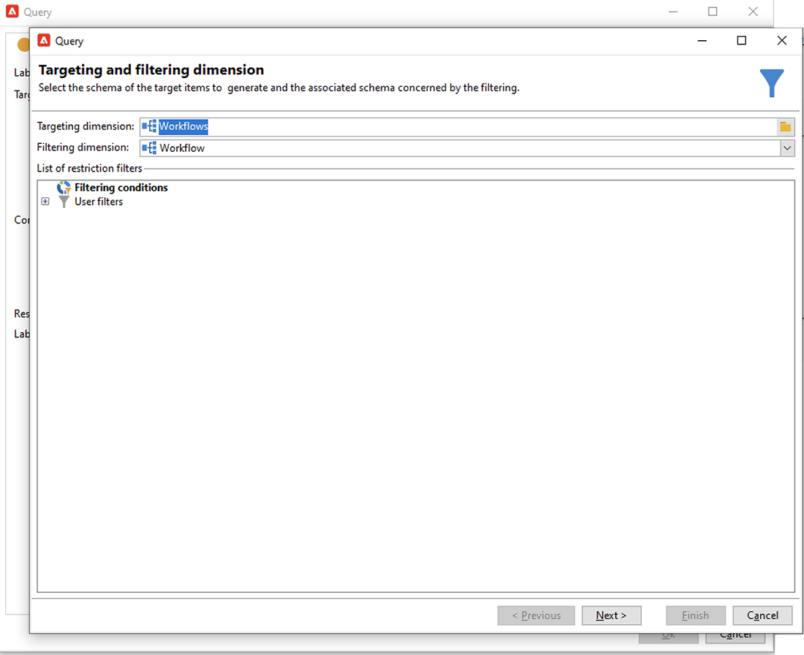
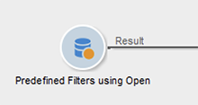
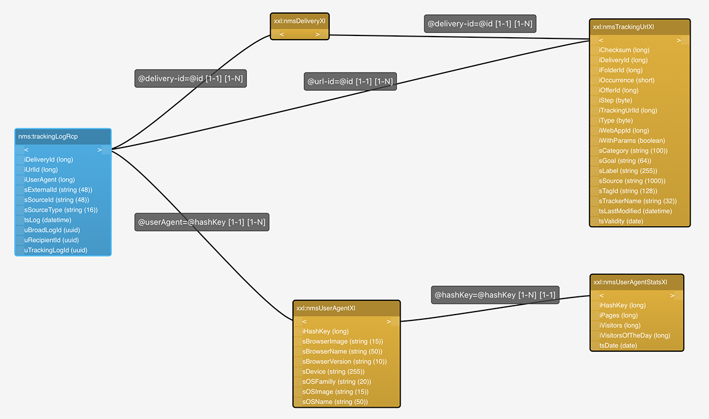

# Apple邮件应用程序中的邮件隐私保护


## 更改了哪些内容？

2021年，Apple为其本机Mail应用程序引入了新的隐私保护功能。 此应用程序现在包括Apple的邮件隐私保护功能。 基本上，发件人无法再使用跟踪像素来收集有关已选择启用Apple邮件隐私保护功能的收件人的信息。

## 我的营销活动会受到什么影响？

Adobe Campaign提供使用跟踪像素来跟踪电子邮件打开次数的功能。 此功能不仅可用于定位和营销活动，还可用于量度。 例如，您可以使用电子邮件打开率来衡量促销活动效果和用户参与度。 总之，您的营销活动中可能会影响分段、定位和量度。

## 我该采取什么行动？

Apple的新功能是行业中未来在电子邮件隐私保护方面的发展趋势。 我们强烈建议您遵循Adobe的建议。

### 评估对您的Campaign触发器的影响

评估这些更改如何影响您当前的Campaign触发器。 确定电子邮件打开数用作分段、定位或重新定位标准的工作流。 阅读 [提示和技巧](#find-email-open-tracking).

### 保留您的数据

保留您的数据并整合您当前的设备知识。 您可以将关键绩效指标(KPI)基于用户代理。 例如，您可以根据使用iOS和Apple邮件应用程序的用户配置文件构建KPI。 阅读 [提示和技巧](#preserve-tracking-data).

### 在保留期后存档您的跟踪日志

在Adobe Campaign的保留期过后存档您的跟踪日志：

1. 检查活动实例中的保留期的持续时间。
1. 仔细检查活动目标映射。 确定除了现成的用户档案表之外，是否还使用自定义用户档案表(`nmsRecipient`)。
1. 从Adobe Campaign导出跟踪日志。 包括包含有关用户代理和操作系统的数据的日志。

### 评估公开利率的当前趋势

确定在iOS设备上使用Apple邮件应用程序的受众比例。
使用此评估，您可以确定潜在的异常差距及其原因。 您可以确定缺口是由于Campaign性能问题还是Apple的隐私保护功能所致。 阅读 [提示和技巧](#measure-ios-footprint).

### 重新评估您的营销活动策略和绩效指标

最重要的是，我们强烈建议您主动重新评估营销活动策略和营销活动绩效指标。 您可以重新关注更可靠的指标，例如点进次数、产品查看和购买。

我们建议您探索当前可用的数据，并评估开放率与其他指标之间的相关性。 如果这些指标始终相关，那么您可以高度自信地改进触发器。

## 提示和技巧

### 衡量iOS的总体占用空间 {#measure-ios-footprint}

要从Adobe Campaign数据收集见解，您可以使用现成的报表：

* **[!UICONTROL Operating Systems]** 报告

   要确定每个操作系统和每个版本的访客比例，请使用此报表。 [阅读更多](../../reporting/using/global-reports.md#operating-systems)。

   您可以查看每个操作系统的访客数相对于访客总数的细分。

   

   对于每个操作系统，您可以查看每个操作系统版本的访客细分。

   

* **[!UICONTROL Breakdown of opens]** 报告

   要确定每个操作系统的电子邮件打开比例，请使用此报表。 [阅读更多](../../reporting/using/global-reports.md#breakdown-of-opens)。

   

### 确定如何使用电子邮件打开跟踪 {#find-email-open-tracking}

您可以确定工作流，其中电子邮件打开次数用作分段、定位和重新定位的标准。

为此，您可以使用 **[!UICONTROL type]** 跟踪的链接URL的属性(**[!UICONTROL url/@type]**)。 对于电子邮件打开，此属性设置为 **[!UICONTROL Open]**. 此属性可从查询编辑器、 **[!UICONTROL Query]** 活动以及预定义过滤器。 您可以将此属性用作营销活动的定位标准。


在本例中，营销人员希望向过去七天内打开了特定投放电子邮件并在上个月购买了产品的收件人发送奖励优惠。 在工作流查询中，您可以通过各种方式使用电子邮件打开：

* 可在查询中使用电子邮件打开次数作为定位条件。

   您可以指定将特定投放的跟踪日志的URL类型设置为作为筛选条件 **[!UICONTROL Open]**.

   

* 您可以使用预定义过滤器。 [了解详情](../../workflow/using/creating-a-filter.md)。

   

   您可以在工作流中的查询活动中使用此预定义过滤器。

   

   >[!NOTE]
   >
   >在工作流中，您无法查看预定义过滤器的定位标准。

要检索电子邮件打开次数用作定位条件的工作流列表，您必须查询 `xtk:workflow` 架构。 工作流的内容存储在中 **[!UICONTROL XML memo (data)]** XML格式的字段。


您可以指定工作流必须包含以下内容：

`expr="[url/@type] = 2"`

此定位标准意味着跟踪的URL的类型必须设置为 **[!UICONTROL Open]**.


#### 实施示例和示例包

您可以使用此实施示例来确定工作流，其中电子邮件打开次数用作定位标准，并向您选择的营销活动操作员发送通知。 您可以将此实施用于以下目的：

* 您可以衡量从电子邮件打开切换到定位工作流中的其他KPI的潜在影响。 如果不使用电子邮件打开次数，则无需执行进一步操作。
* 在重新评估实施时，您可以使用此示例来避免跳过工作流。

此示例展示了单个技术工作流中的自定义实施。


>[!IMPORTANT]
>
>该软件包仅作为示例提供，而Adobe不支持它作为产品功能。
>
>您可能需要根据促销活动实施调整示例代码。
>
>最终用户是唯一负责安装和使用此示例软件包的用户。
>
>我们强烈建议您在非生产环境中测试和验证此包。

下载 [示例包](assets/PKG_Search_workflows_using_Opens_in_queries_V1.xml) 并安装。 [了解详情](../../platform/using/working-with-data-packages.md#importing-packages)。

安装资源包后，您可以从实例中包含现成技术工作流的文件夹访问工作流：

`/Administration/Production/Technical workflows/nmsTechnicalWorkflow`

从用户界面中选择 **[!UICONTROL Administration]** > **[!UICONTROL Production]** > **[!UICONTROL Technical workflows]**.


工作流包含以下主要步骤：

1. 列出将电子邮件打开用作定位条件的工作流。
1. 列出预定义的过滤器，其中电子邮件打开次数用作定位条件。
1. 列出在其中使用这些预定义过滤器的工作流。
1. 将两个工作流列表合并到一个列表中。
1. 向指定的操作员发送电子邮件通知。

工作流包含以下详细步骤：

1. 初始活动是 `xtk:workflow` 架构。 此活动用于在相应实例中查找包含电子邮件打开作为定位条件的显式工作流查询。

   

   

   

   作为结果，将返回一个工作流列表。

   

   由于此信息被重复使用，因此工作表的名称存储在全局工作流实例变量中。

   

1. 第二个查询用于查找包含电子邮件打开数的预定义过滤器。

   

   

   

   结果将返回预定义过滤器的列表。

   

1. 此预定义过滤器列表用于查找使用这些过滤器的工作流。
1. 两个工作流列表合并到一个列表中。

   为此，使用JavaScript代码。

   

   ```javascript
   const queryPredFilter = xtk.queryDef.create(
     <queryDef schema={vars.targetSchema} operation="select">
        <select>
          <node alias="@id" expr="@id" />
          <node alias="@name" expr="@name"  />
        </select>
        <where/>
     </queryDef>
       ).ExecuteQuery()
   
   var qDef =
     <queryDef schema="xtk:workflow" operation="select">
       <select>
         <node expr="@id"/>
         <node expr="@internalName"/>
         <node expr="@label"/>
       </select>
       <where>
         <condition boolOperator="OR" expr={"data like '%expr=[url/@type] = 2%'" }/>
       </where>
     </queryDef>
   
   for each (var filter in queryPredFilter) {       
   
      //logInfo (filter.@name);
      var condition;
      condition =<condition boolOperator="OR" expr={"data like '%" + filter.@name + "%'" }/>
      qDef.where.appendChild(condition);   
   
   }
   
   var queryWorkflowList = xtk.queryDef.create(qDef);
   var workflowList = queryWorkflowList.ExecuteQuery();
   
   var sWorkflowList = "";
   var iCount = 0
   for each (var workflow in workflowList) {       
   
      //logInfo ("Workflow ID: " + workflow.@id + " in " + instance.vars.mainTargetSchema);
   
      iWorkflowId = workflow.@id;
      iWorkflowName = workflow.@internaName;
      iWorkflowLabel = workflow.@label;
   
       xtk.session.Write(
             <{instance.vars.mainTargetSchema.split(':')[1]}
               _operation="insertOrUpdate"       
               _key="@id"
               xtkschema={instance.vars.mainTargetSchema}
               id={iWorkflowId}
               internaName={iWorkflowName}
               label={iWorkflowLabel}
             />
       )
   }
   ```

1. 将从合并列表中删除重复的工作流。

   

1. 执行测试以检查列表是否不为空。

   

   如果列表不为空，则会将其插入电子邮件通知的HTML表中。

   

   ```js
   const queryWorkflow = xtk.queryDef.create(
       <queryDef schema={vars.targetSchema} operation="select">
           <select>
               <node alias="@id" expr="@id" />
               <node alias="@internalName" expr="@internalName"  />
               <node alias="@label" expr="@label"  />
           </select>
           <where/>
       </queryDef>
   ).ExecuteQuery()
   
   var sWorkflowList = '<table border="0" >';
   
   sWorkflowList = sWorkflowList + "<tr><th>Worklow Id</th><th>Name</th><th>Label</th></tr>";
   
   for each (var workflow in queryWorkflow) {       
   
      sWorkflowList = sWorkflowList + "<tr>" +
                       "<td>" + workflow.@id + "</td>" +
                       "<td>" + workflow.@internalName + "</td>" +
                       "<td>" + workflow.@label + "</td>" +
                       "</tr>";
   
   }
   
   sWorkflowList = sWorkflowList + "</table>";
   
   instance.vars.workflowList = sWorkflowList;
   ```

1. HTML表即添加到通知模板中。

   ```js
   <%= instance.vars.workflowLIst%>
   ```

   

   电子邮件通知包含工作流列表，其中包含作为查询中定位条件的电子邮件打开。

   

### 保留您当前的跟踪数据 {#preserve-tracking-data}

#### 哪些数据会受到影响？

用户档案数据通过来自操作（如电子邮件打开和点进次数）的跟踪数据进行了扩充。 当此信息可用时，跟踪还通过用户代理提供有关用户设备的关键信息。

简而言之，Adobe Campaign跟踪数据提供了以下信息：

* 与通过特定电子邮件打开或单击的用户相关联的配置文件
* 打开日期
* 使用的设备，例如iPhone或Mac
* 操作系统和版本，例如iOS 15、macOS 12或Windows 10
* 应用程序（如邮件应用程序或Web浏览器）及其版本，例如Outlook 2019

#### 为何要保留跟踪数据？

我们强烈建议您保留此数据，原因有多种：

* 此数据会由Adobe Campaign保留一段有限的时间。 保留期会因实例配置而异。

   检查实例的设置。 [阅读更多](../../platform/using/privacy-management.md#data-retention)。

* 除了Apple最近的更改之外，您还可以使用跟踪数据来添加巨大的价值，从而促进受众的参与。
* Apple可能会对其本机Mail应用程序和Mail隐私保护功能进行进一步更改。

出于所有这些原因，我们强烈建议您尽快导出此数据。 否则，您对部分受众的跟踪数据可能会受到负面影响。

#### 如何保留跟踪数据？

要保留跟踪数据，必须将其从Adobe Campaign导出到您的信息系统。 [阅读更多](../../platform/using/get-started-data-import-export.md)。

>[!IMPORTANT]
>
>以下示例侧重于现成的 `nms:Recipient` 架构，这是默认的配置文件架构。 如果您使用附加到自定义用户档案的其他自定义目标映射，我们建议您将此导出策略扩展到所有自定义日志表。 [阅读更多](../../configuration/using/target-mapping.md)。

##### 原则

默认情况下， `nms:Recipient` 架构已链接到三个必须导出的架构：

| 架构 | 内容 |
| --- | --- |
| nms：trackingLogRcp | 跟踪数据、用户、时间和相关消息 |
| nms：trackingUrl | 有关链接的详细信息，包括性质，例如电子邮件打开或点进 |
| nms：userAgent | 有关设备的信息 |

这些表在数据模型中链接。



使用这些关系可创建单个导出查询。


您可以使用链接架构中的有用信息扩充此数据：

| 架构 | 内容 |
| --- | --- |
| nms：Recipient | 与用户档案相关的详细信息 |
| nms：交付 | 有关用户响应的消息的信息 |

您可以将结果导出到Adobe Campaign支持的外部存储解决方案：

* SFTP
* S3
* Azure Blob

##### 实施

此示例说明如何从Adobe Campaign导出跟踪数据。

1. 创建以查询开头的工作流。

   初始查询用于检索过去三个月的跟踪日志。
您可以使用增量查询仅提取尚未导出的记录。

   从添加所有必需的信息 **[!UICONTROL Additional data]** 节点。

   

1. 添加 **[!UICONTROL Data extraction (file)]** 活动。 将查询中的所有数据映射到提取文件格式。

   

   选择文件格式，例如TXT或CSV。

   

1. 添加第三个也是最后一个活动，将文件上传到支持的存储解决方案。


##### 高级实施：按iOS设备细分

您可以使用工作流确定收件人是否使用Apple的邮件应用程序。 您可以按设备拆分跟踪日志。 例如，您可以使用查询筛选器按iOS设备划分记录：

| 应用程序 | 操作系统或设备  | 查询筛选器 |
| --- | --- | --- |
| Apple Mail | iOS 15 | `operating System (Browser) contains 'iOS 15' and browser (Browser) contains 'ApplewebKit'` |
| Apple Mail | iOS 14或iOS 13 | `browser contains 'AppleWebKit' and operating System of browser contains 'iOS 14' or operating System of browser contains 'iOS 13'` |
| Apple Mail | iOS移动设备：iPad、iPod和iPhone | `device (Browser) contains iPhone or device (Browser) equal to iPod or device (Browser) equal to iPad and browser (Browser) equal to 'AppleWebKit'` |
| Apple Mail | iPhone 、 iPad或iPod | `browser (Browser) equal to 'AppleWebKit' and device (Browser) equal to iPhone or device (Browser) equal to iPod or device (Browser) equal to iPad` |
| Apple Mail | Mac | `browser (Browser) equal to 'AppleWebKit' and operating System (Browser) contains 'Mac'` |
| Safari | macOS | `browser (Browser) equal to 'Safari' and device (Browser) equal to PC and operating System (Browser) contains 'Mac'` |
| Safari | 移动设备 | `browser (Browser) equal to 'Safari' and device (Browser) equal to iPad or device (Browser) equal to iPod or device (Browser) equal to iPhone` |


您可以将这些规则用于各种目的：

* 将数据导出并存档到外部存储解决方案
* 计算要附加到配置文件的KPI
* 创建禁止列表
* 报告

以下示例显示如何使用工作流按iOS设备划分记录：

* 第一个示例工作流包含以下活动：

   1. 初始 **[!UICONTROL Query]** 活动用于选择过去三个月打开的所有电子邮件。
   1. A **[!UICONTROL Split]** 活动用于按电子邮件应用程序、浏览器、操作系统和设备拆分选择。

   1. A **[!UICONTROL Deduplication]** 活动遵循每个 **[!UICONTROL Split]** 活动。 此 **[!UICONTROL Deduplication]** 活动用于删除重复的电子邮件地址。

      此 **[!UICONTROL Deduplication]** 活动位于 **[!UICONTROL Split]** 活动，以避免丢失有关使用各种设备的收件人的信息。

   1. An **[!UICONTROL End]** 活动遵循每个 **[!UICONTROL Deduplication]** 活动。

   如果仅将收件人存储在现成的收件人表中以进行定位，则此类型的工作流非常有用。

   

* 第二个示例工作流包含以下活动：

   1. 初始 **[!UICONTROL Query]** 活动用于选择过去三个月打开的所有电子邮件。
   1. A **[!UICONTROL Deduplication]** 活动用于删除重复的电子邮件地址。
   1. A **[!UICONTROL Fork]** 活动用于：

      * 在一个过渡中， **[!UICONTROL Change dimension]** 活动用于查找跟踪日志引用的收件人。
      * 在另一个过渡中， **[!UICONTROL Split]** 活动用于按电子邮件应用程序、浏览器、操作系统和设备拆分选择。
   1. An **[!UICONTROL End]** 活动跟随 **[!UICONTROL Split]** 活动。

   如果您将收件人存储在现成可用的收件人表以外的表中，则此类型的工作流非常有用。

   
