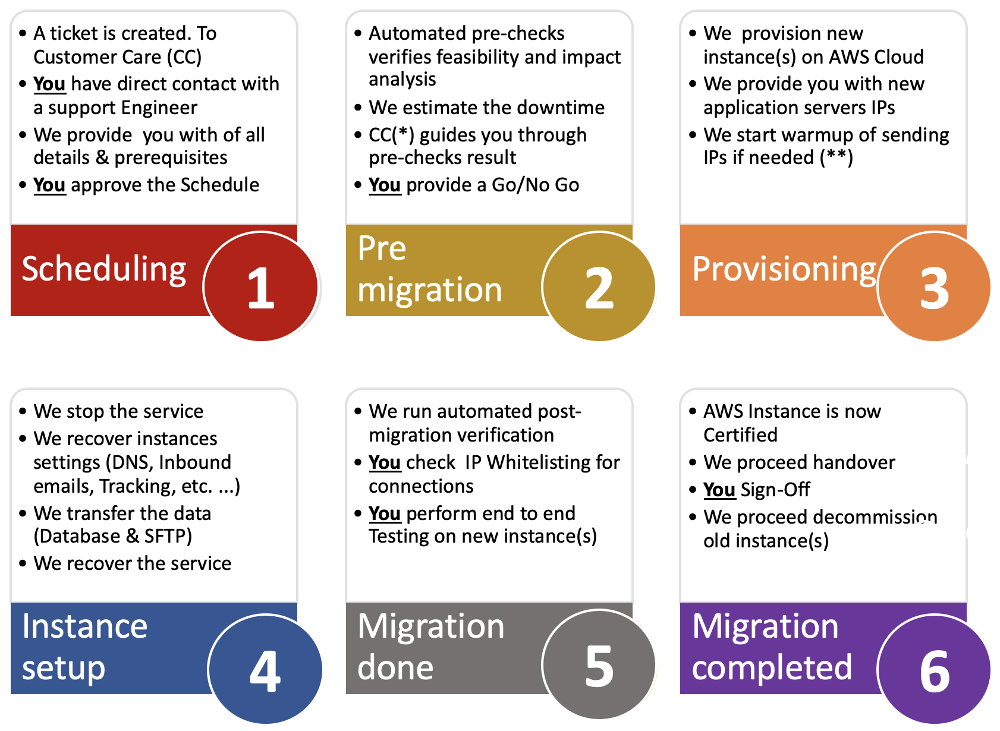

# 概述{#dc-ovv}

## 上下文

作为Adobe Campaign Classic的重要客户，我们致力于为您提供最佳体验和价值。 多年来，我们已经认识到在云中托管客户的价值和可靠性。  作为[Gold Standard Initiative](../../rn/using/gold-standard.md)的一部分，我们将所有客户转移到Adobe Managed Services（AWS上的Public Cloud），以提供更好、更可靠的服务。

该计划有三个主要目标：

* 通过将基础设施移至安全且现代的环境(AWS)，解决已识别的安全漏洞。
* 消除可能繁琐的扩展过程，提供对我们[增强型MTA](../../delivery/using//sending-with-enhanced-mta.md)的访问，并改进所有维护服务级别。
* 为您的实例做好准备，以迎接Adobe Campaign Classic的未来，包括更自动化、更定期的升级，无需太多的资源，也无需花费太多时间。

### 词汇表

* **内部版本升级**  — 将Adobe Campaign Classic软件更新为最新的安全内部版本号，但保持同一主/次内部版本级别时。例如：Campaign v7 20.2.3内部版本9182到Campaign v7 21.2.5内部版本9188。 [了解详情](../../platform/using/faq-build-upgrade.md)。
* **MID/RT**  — 托管在Adobe Cloud上的消息执行服务器（批量促销活动为MID，实时单一消息为RT）
* **Gold Standard升级**  — 此计划提供了改进的安全性、改进的支持、增强的维护和稳定性。它还可以简化将来的升级过程，并允许访问Campaign中的新功能。  [了解详情](../../rn/using/gs-overview.md)。
* **AWS**  - Amazon Web Services(Amazon Public Cloud)
* **SFTP**  — 安全文件传输协议。[了解详情](../../platform/using/sftp-server-usage.md)。

>[!NOTE]
>Campaign Classicv7迁移到Public Cloud仅会影响使用&#x200B;**Adobe Managed Services**&#x200B;的客户。

## 好处

**安全性**

* 最新安全修复
* 静态数据加密
* 改进了身份验证(IMS)

**基础设施**

* 灵活的硬件可扩展性
* 更快的恢复
* 提高的可靠性和稳定性
* 统一的业务程序

**性能**

* 改进了电子邮件容量
* 更大的数据库
* Sposed Campaign版本 — Gold Standard

**为Adobe Campaign Classic客户提供可靠而可靠的解决方案**

1. 更好的生产程序，提高可靠性，在出现问题时更快的反应性，在发生重大事件时更快地恢复。
1. 电子邮件发送容量更高。 在新数据中心托管的实例将能够从电子邮件投放的专用基础架构中受益。 这可能会提高电子邮件发送速度，或者减少发送IP的使用。
1. 更好的硬件可扩展性。 增加硬件资源可以更快地完成。 从技术上讲，这个数量级是1小时，而不是几天。

**Gold Standard可简化未来升级**

1. 贵组织等待升级的时间越长，升级的复杂程度就越高，面临漏洞的可能性也会增加（尤其是从旧版本迁移时）。
1. 通过Gold Standard升级，您的实例将实现现代化，并准备好以更少的手动干预和更少的资源接收更多自动化和定期更新。

## 关于迁移

对于受影响的帐户，将在2020/2021年内迁移到Adobe Managed Services(Public Cloud)。 Adobe将引导和指导您的组织完成此历程。

要开始这项工作，需要此迁移的帐户将收到来自Adobe的电子邮件通信，其中提供了时间表和文档访问权限。 这将是您关于您的帐户计划迁移的通知。

[打开新的客户关怀支持票证](https://experienceleague.adobe.com/?support-solution=Campaign#support)可启动迁移。 使用主题行“迁移到AWS”。

### 此迁移是否是强制性的？

迁移到云的这一步骤是&#x200B;**迁移到Adobe Campaign实例的[Gold Standard认证](../../rn/using/gs-overview.md)**&#x200B;的第一步。 如果您托管在非公共云(AWS)的数据中心，则必须进行此迁移。

Amazon Web Services(AWS)是一个现代、安全且优化的环境，Adobe Managed Services云托管在Adobe Web Services(AWS)上。 [进一步了解AWS](https://aws.amazon.com/application-hosting/benefits/)。

Adobe计划解除旧版数据中心，在那里运行的Adobe Campaign实例必须传输到新的参考数据中心AWS。

这是前进的关键路径，因为您当前的位置可能会暴露在&#x200B;**安全和性能漏洞**&#x200B;中。

此外，此迁移现在是&#x200B;**将来升级您的Adobe Campaign的任何版本的先决条件。**&#x200B;旧版数据中心不再可能进行内部版本升级。

Adobe致力于保护您的数据，并使您能够跟踪Adobe Campaign的未来。 我们需要你的合作，使它取得共同的成功！

**我们组织了一** 个专门的客户关怀代表、客户成功经理、产品经理、工程师、技术运营专家和产品顾问团队，以协助并确保体验顺畅无缝。我们致力于确保您拥有相关项目和联系信息。

我们投入了巨大的精力来开发技术，这些技术将使迁移快速、无缝和安全。

### 约束

* 迁移过程将伴随不可避免的平台停机。 此计划旨在指导最大限度地减少此停机。
* 用于数据集成的IP更改。
* 新发送IP的可投放性提升。 但是，计划是让这项业务对业务透明，而不像最初在上线期间那样。

在将Campaign迁移到[公共云常见问题解答](dc-migration-faq.md)中了解更多信息。

## 历程到Gold Standard认证

我们将协助您完成每个里程碑之间的验证步骤。

## 迁移到公共云的路径

Adobe可处理大多数操作。 我们需要您进行验证和注销。

## 迁移准则

### 全球方法

**数据库**

数据库将从旧版数据中心转储，并在Public Cloud(AWS)中恢复。 在新数据中心重新启动后，应用程序将从关闭前的完全状态恢复。 用户将看不到任何差异，只是某些计划任务将被延迟。

**电子邮件发送IP**

迁移完成后，Campaign实例的发送IP将完全不同。 为了确保顺利过渡，Adobe将通过预先将流量从旧IP切换到新IP来实施新发送IP的升级。

**数据集成IP**

客户端的数据集成可能会受数据集成IP更改的影响。 根据Campaign是充当服务器还是客户端，更改可能会影响两个方向。
典型案例：

* SFTP，可能是双向的
* HTTP，可能是双向
* SMPP（与短信提供商的连接）、 Campaign作为客户端，更改源IP

通常，这意味着客户端应检查其防火墙上设置的可能IP限制，并相应地对其进行调整。*

**Campaign服务器**

现有的Campaign服务器（实际上是容器）将以“提升和转移”方式移动到Public Cloud(AWS)。 也就是说，无需安装新的服务器，但整个服务器都将传输到新数据中心。 这项操作只需要低级技术重新配置。

**服务器名称**

在用于营销通信的子域下：将保持不变。 但是，根据具体的实施，可能需要在客户端执行以下操作：

* 在子域委派（正常情况）中，Adobe将处理所有更改并确保无缝过渡
* 如果设置CNAME（异常），将请求客户端实施更改。 需要与Adobe协调。

对于用户访问和数据集成，neolane.net下的名称将保持不变。

这意味着，如果服务器名称未被硬编码的IP替换，则对于用户和数据集成实施，所做的更改将是透明的。

### 准备

**电子邮件发送IP**

首先，Adobe可投放性将评估平台的可投放性状态，并建议将计划切换到新IP。

Adobe将在新数据中心配置相同数量的IP。

一旦配置了新IP，新IP的升级就会开始。

**应用程序清理**
数据中心之间的数据传输处于停机的关键路径上。

数据以两种方式存储：

1. 最重要的是数据库
1. 应用程序服务器上的文件（数据导入和导出）

缩小数据库大小对于加快数据传输至关重要。

建议：

* 缩短历史数据（投放日志、跟踪日志等）的保留期
* 删除其他表（投放、收件人、自定义表）上无用的记录

### 执行

**暂停执行**

我们建议您减慢速度，最好在旧版数据中心应用程序关闭之前暂停所有执行：投放和工作流。 这将简化Public Cloud(AWS)上的重新启动，因为流程将有时间“优雅”地暂停并保存任何正在进行的执行状态。

**迁移期间**

虽然迁移已完成，但只有一项服务仍可正常运行：电子邮件链接重定向。 换言之，收件人在单击电子邮件后将能够访问登陆页面。 但是，这些点击量将不会被记录，因此在迁移前不久开始的投放的点击率将低于正常水平。

**重新启动**

迁移到新环境后，应用程序将逐步重新启动：

* 首次访问控制台，以便用户可以检查状态，而无需任何活动运行的内容
* 然后，使用工作流和投放

### 迁移后

**删除旧版数据中心上的实例**

应用程序迁移完成后，将没有计划在旧版数据中心再次运行任何进程。 我们希望，除临时备份之外，旧版数据中心上的所有数据都可以擦除，直到计划备份进程在Public Cloud(AWS)上运行为止。

**DNS委派**

通常，用于从Campaign发送电子邮件的域（错误地址@符号右侧的一部分）已委派给Adobe。 可以更改委派并实施到AWS DNS服务器。

## 支持以及其他有用链接{#support}

* [迁移到Adobe Managed Services(Public Cloud)常见问题解答](dc-migration-faq.md)
* [Gold Standard升级](../../rn/using/gs-overview.md)
* [内部版本升级常见问题解答](../../platform/using/faq-build-upgrade.md)
