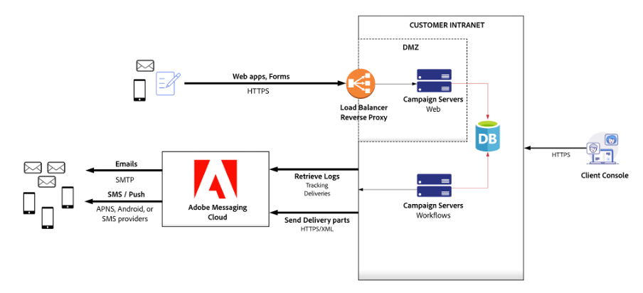

# 硬件大小调整建议{#hardware-sizing-reco}

## 概述

>[!CAUTION]
>
>本文仅作为一般示例指南提供。 在开始Campaign项目之前，您必须与Adobe Campaign客户成功经理接洽，以测量部署的确切大小。 **不要** 获取或部署任何基础架构或硬件，直到完成此操作。

本文档提供了在内部部署数据中心或虚拟化云环境部署Adobe Campaign Classic v7的一般建议。 这种类型的部署，称为 **混合** 或 **中间源**，将Campaign营销实例和营销数据库置于您的操作控制之下，同时使用AdobeCloud Messaging服务发送电子邮件、短信或SMPP消息，并收集电子邮件打开、退回和点击跟踪数据。

营销实例是Adobe Campaign架构的一部分，它驱动着所有营销活动，并存储着营销活动返回的所有收件人数据和分析数据。 营销实例是一组运行Adobe Campaign服务的内部部署服务器和关系数据库。

>[!CAUTION]
>
>如果您使用完全托管的Adobe Campaign实例(在AdobeCloud Services中部署)，本文档中的信息不适用。

有关软件兼容性的详情，请参见 [兼容性矩阵](../../rn/using/compatibility-matrix.md).

### 方案

为三种典型方案提供了部署图表和硬件大小调整建议：

1. [中等 — 大小](#scenario-1)  — 系统中有500万活跃收件人
1. [大尺寸](#scenario-2) - 2000万系统活跃收件人
1. [企业](#scenario-3) - 5000万活动收件人，带有事务性消息传递

### 假设

本文档还假定所有三种方案都使用以下使用类型：

* 大型电子邮件营销活动每周发送两次，大约发送给活跃收件人的50%
* 每月为系统中的每个收件人生成一次直接邮件
* 短信消息每月发送给大约10%的活动收件人
* 定义每个收件人的数据库模式已扩展为一个额外的表，每个收件人包含约200字节的数据
* Adobe Campaign Interaction模块用于将优惠添加到传出电子邮件
* 电子邮件跟踪数据会在Campaign系统中保留90天

## 一般准则

Campaign是一个以数据库为中心的应用程序，数据库服务器性能至关重要。 运行工作流、分段、跟踪数据上传、入站交互、分析和其他活动都会生成数据库活动。 通常，这些操作的大小和频率决定了数据库服务器的大小。

营销实例中的应用程序服务器需要足够的CPU和内存来运行工作流并响应SOAP API调用，包括来自Campaign控制台用户的请求。 对于使用具有复杂选件规则的出站交互的工作流、执行自定义Javascript的工作流以及具有高流量级别的Web应用程序，CPU要求可能非常重要。

Campaign Web应用程序还可以部署在营销实例应用程序服务器上，或部署在单独的Web服务器系统上。 由于Web应用程序工作负载与关键工作流和Campaign Console用户发生冲突，因此Web应用程序和入站交互可以部署到单独的服务器，以确保核心Campaign功能以良好的性能可靠运行。

为了安全性和可用性，Adobe建议将Internet流量与商业用户产生的流量分开。 因此，图中包含两组服务器：Web服务器（面向Internet的Web1和Web2）和应用程序服务器（业务流程App1和App2）。

对于商业电子邮件发件人，法律规定必须具备功能性的选择退出网页。 对于故障转移方案，Adobe建议在每台组服务器中配置冗余计算机。 如果Adobe Campaign托管选择退出页面，情况尤其如此。

### 反向代理

Campaign架构通过使用SSL over HTTP (HTTPS)在营销实例和Adobe云消息传递之间进行通信来实施高安全性。 通过在“非军事区”(DMZ)子网中使用反向代理来隔离营销实例服务器和数据库，确保安全性、可靠性和可用性。

### 负载平衡器

应用程序服务器的负载平衡器以主/从配置设置，HTTPS在代理终止。 Web服务器的负载平衡器以主动/主动配置设置，HTTPS在代理处终止。

Adobe为您提供可在部署环境中中继到Adobe Campaign服务器的URL路径的排他列表。

### 架构

无论卷如何，一般体系结构几乎完全相同。 安全性和高可用性要求要求至少有四台服务器；如果没有使用WebApps，则有两台服务器。 配置差异主要取决于硬件配置，如CPU核心和内存。

## 场景1：中等规模部署{#scenario-1}

预计数量：

| 渠道 | 容量 |
| ----------------------- | ----------------- |
| 活动收件人 | 5百万 |
| 电子邮件 | 420万/月 |
| 直邮 | 100万/月 |
| 手机短信 | 100,000/月 |
| 每日电子邮件峰值量 | 500 |

对于这些卷，一对Adobe Campaign应用程序服务器系统为Adobe Campaign客户端用户和工作流执行提供了所有功能。 对于500万活跃收件人和此电子邮件卷，应用程序服务器的工作负载并不是CPU或I/O密集型的；大部分压力都集中在数据库上。

Adobe Campaign Web服务器显示在安全区域中。

### Web和应用程序服务器

此方案建议在四台计算机上使用以下规范安装Adobe Campaign：

**3Ghz+四核CPU、8 GB RAM、RAID 1或10、2个80 GB固态硬盘**

这些系统会创建营销实例应用程序服务器，该服务器直接支持您的Campaign Console用户并执行营销活动工作流。

在DMZ中反向代理，以平衡流向Adobe Campaign Web服务器的流量。 无需在代理计算机上安装Adobe Campaign软件栈栈；可以使用任何反向代理软件或网络设备。

Campaign或您自己的网站可以提供订阅选择启用/选择禁用和首选项中心功能。 如果选择在网站上实施此功能，则必须确保首选项和订阅信息已传播到Campaign营销数据库。 通常通过创建由活动工作流自动上传的提取文件来完成此操作。

应用程序服务器的磁盘空间消耗取决于与第三方服务提供商（例如，直接邮件的打印供应商）交换的文件的保留期，以及导入的平面文件的大小和保留，例如网站中的订阅或首选项更新，或者从您自己的CRM或营销系统提取。

### 数据库

数据库服务器的硬件建议如下：

**3Ghz+ 4核CPU，16 GB RAM，RAID 1或10，最低128 GB固态硬盘**

内存估计假定大型活动启动可以完全缓存约500,000个收件人，以及用于执行工作流、导入跟踪数据和其他并发活动的RDBMS缓冲区空间。

据估计，在保留期为三个月的情况下，数据库存储所有Adobe Campaign技术数据（营销活动、跟踪、工作表等）所需的磁盘空间约为35 GB。 如果选择将跟踪数据保留6个月，则数据库大小将增加到大约40 GB，12个月的保留会将数据库大小增加到大约45 GB。 对于此环境，收件人数据大约占用5 GB。

>[!CAUTION]
>
>此估计不包括任何其他客户数据。 如果您计划将客户数据的其他列或表复制到Adobe Campaign数据库中，则必须估计所需的额外磁盘空间。 上传的区段/列表还需要更多存储，具体取决于其大小、频率和保留期。

另外还要考虑到，由于每天处理的信息量很大，数据库服务器的IOPS非常关键。 例如，在峰值日，您可以部署针对总计500,000位收件人的营销活动。 为了执行每个营销活动，Adobe Campaign会将500,000条记录插入到包含约1,200万条记录的表中（投放日志表）。 为了在营销活动部署期间提供可接受的性能，Adobe建议此方案至少为60,000 4-KB随机读/写IOPS。

## 场景2：大规模部署{#scenario-2}

预计数量：

| 渠道 | 容量 |
| ----------------------- | ----------------- |
| 活动收件人 | 2000万 |
| 电子邮件 | 4200万/月 |
| 直邮 | 1000万/月 |
| 手机短信 | 1,000,000/月 |
| 每日电子邮件峰值量 | 5,000,000 |

### Web和应用程序服务器

在此方案中，Adobe建议在四台计算机、两台应用程序服务器和两台Web服务器上安装Adobe Campaign，并遵循以下规范：

**3Ghz+四核CPU、8 GB RAM、RAID 1或10、80 GB固态硬盘**

应用程序服务器直接支持Campaign Console用户和执行活动工作流。 此功能部署在两个相同的服务器上，以实现高可用性，共享网络连接存储(NAS)文件系统以启用故障切换。

Web服务器托管Campaign Web应用程序，支持系统中的1000万活动收件人。

请参阅 [场景1：中等规模部署](#scenario-1) 有关代理、首选项中心/订阅处理和磁盘空间使用的更多注释。

### 数据库

数据库服务器的硬件建议如下：

**3Ghz+ 8核CPU，64 GB RAM，RAID 1或10,2个320 GB固态硬盘或RAID 10，最低640 GB固态硬盘**

内存估计假定大型活动启动时完全缓存约500万个收件人，以及用于执行工作流、导入跟踪数据和其他并发活动的RDBMS缓冲区空间。

据估计，在保留期3个月的基础上，数据库上存储所有Adobe Campaign技术数据（营销活动、跟踪、工作表等）所需的磁盘空间约为280 GB。 如果选择将跟踪数据保留6个月，则数据库大小将增加到大约450 GB，12个月的保留会将数据库大小增加到大约900 GB。 此环境的收件人数据大约占用15 GB。

## 场景3：具有消息中心的企业部署{#scenario-3}

预计数量：

| 渠道 | 容量 |
| ----------------------- | ----------------- |
| 活动收件人 | 5千万 |
| 电子邮件 | 1.08亿/月 |
| 直邮 | 2500万/月 |
| 手机短信 | 250万/月 |
| 事务性消息 | 250万/月 |
| 每日电子邮件峰值量 | 250万 |

支持5000万收件人的部署基本上与中所示相同 [场景2](#scenario-2)：Campaign Web应用程序流量将被路由到Campaign Web服务器，因此启动大型活动后出现的Web流量突发不会影响Campaign工作流和客户端控制台用户。

此部署还包括从您自己的网站和应用程序发出的消息中心调用。

### Web和应用程序服务器

在此方案中，Adobe建议在四台计算机上安装Adobe Campaign，如下所示：

* 应用程序服务器
  **两个系统，3Ghz+四核CPU，8 GB RAM，RAID 1或10,80 GB固态硬盘**

* Web 服务器
  **两个系统，3Ghz+四核CPU，16-GB RAM，RAID 1或10,80-GB固态硬盘**

应用程序服务器直接支持Campaign Console用户和执行活动工作流。 此功能部署在两个相同的服务器上，以实现高可用性，共享网络连接存储(NAS)文件系统以启用故障切换。

Web服务器托管Campaign Web应用程序，支持系统中的1000万活动收件人。

请参阅 [场景1：中等规模部署](#scenario-1) 有关代理、首选项中心/订阅处理和磁盘空间使用的更多注释。

### 数据库

数据库服务器的硬件建议如下：

**3Ghz+ 8核CPU，96 GB RAM，RAID 1或10，最低1.5TB固态硬盘**

内存估计假定大型活动启动时完全缓存了大约12,500,000个收件人，以及用于执行工作流、导入跟踪数据和其他并发活动的RDBMS缓冲区空间。

据估计，在保留期为3个月的情况下，数据库上存储所有Adobe Campaign技术数据（营销活动、跟踪、工作表等）所需的磁盘空间约为700 GB。 如果选择将跟踪数据保留6个月，则数据库大小将增加到大约1.2TB，12个月的保留会将数据库大小增加到大约2TB。 此环境的收件人数据大约占用50 GB。

## 更改假设的准则

针对这些方案所做的假设都会对硬件建议和部署架构产生重大影响。 本节将讨论有关不同假设的准则。 请联系Adobe Campaign咨询团队，获取满足您要求的特定建议。

* **收件人数量**
活动收件人需要存储空间和数据库缓冲区空间，因此更多的收件人通常需要数据库服务器上的更多内存和CPU容量。 收件人本身的存储增加相对较小，但对于为电子邮件促销活动保留的事件跟踪数据而言，可能会具有重要意义。

* **电子邮件营销活动大小**
活动启动的频率会影响数据库服务器CPU要求。 与直接邮寄、入站交互和其他工作流相结合，电子邮件营销活动的分段操作给数据库服务器带来了相当大的负载。

* **直邮频率**
直接邮寄的频率会影响数据库服务器CPU要求。 与促销活动启动和其他工作流相结合，直接邮件的分段操作会给数据库服务器带来大量负载。

* **SMS消息量**
与电子邮件促销活动大小一样，SMS消息量不会将大量负载置于本地的Campaign服务器上；负载主要位于云端上的Adobe云消息服务器上。 短信营销活动（如电子邮件和直邮）的分段可能会给营销数据库带来大量负载。 因此，短信促销活动启动频率和分段的复杂性比短信消息量更相关。

* **数据库模式复杂性**
每个活动收件人的数据量既需要存储空间，也需要数据库缓冲区空间，因此，通常情况下，更多的收件人需要在数据库服务器上拥有更多的内存和CPU。 复杂架构还需要连接更多表才能进行分段，因此分段操作运行速度会慢得多，并且在数据分布在多个表上时需要更多数据库CPU和内存。

  数据库服务器内存的估计方法是：确保数据库缓冲池足够大，可以包含所有收件人数据，再加上用于正在运行的工作流的临时表，再加上用于其他数据库操作的利润。

* **出站交互使用情况**
在将所有计算复杂性移交给数据库的工作流中，评估批处理模式下的交互规则。 数据库工作的主要因素是在一个引擎调用期间计算的合格优惠总数（目标大小X每个收件人保留N个最佳优惠前的平均优惠数）。 数据库服务器CPU速度是性能的第一个因素。

* **入站交互或SOAP API使用情况**
入站交互规则和选件在营销数据库中评估，需要大量数据库服务器资源，特别是CPU。 大量使用入站交互或SOAP API需要单独的Web服务器来将工作负载与运行的活动工作流分开。

* **跟踪数据保留期**
将跟踪数据的保留时间延长到90天以上需要更多的数据库存储，而且会因为将新的跟踪数据插入大型表格而降低系统速度。 由于跟踪数据在90天后对营销活动分段没有用处，因此建议缩短保留期。

  如果您需要长期分析收件人的营销体验，应将跟踪数据移入Adobe Analytics或其他Analytics系统。

## 虚拟化

所有Campaign服务器都是理想的虚拟化候选服务器。 为了确保适当的可用性和性能，必须解决几个问题。

* **故障转移配置**
群集服务器（例如，负载均衡代理下的冗余应用程序服务器）必须部署在单独的硬件上，以确保在出现硬件故障时，两个虚拟机都不会停机。

* **I/O配置**
为了数据库安全，必须维护任何建议的RAID配置，以确保存储设备丢失不会导致数据丢失。

* **I/O性能**
必须遵循数据库存储的建议的IOPS等级。 Amazon EC2等云服务可能无法提供所需的性能，必须仔细评估。 例如，Amazon EC2预配的SSD卷当前评级为每卷20,000 IOPS。 了解详情，请参阅 [Amazon文档](https://docs.aws.amazon.com/AWSEC2/latest/UserGuide/ebs-volume-types.html))，因此4卷RAID配置的额定为80,000 IOPS，这可能不够。

Adobe建议在将系统投入生产之前，对Adobe Campaign的任何虚拟化部署进行性能测试。

## 相关主题

* [Campaign监控流程](../../production/using/monitoring-processes.md)
* [Campaign一般架构](../../installation/using/general-architecture.md)
* [性能和吞吐量问题](../../production/using/performance-and-throughput-issues.md)
* [安全和隐私检查清单](../../installation/using/get-started-security-privacy.md)
