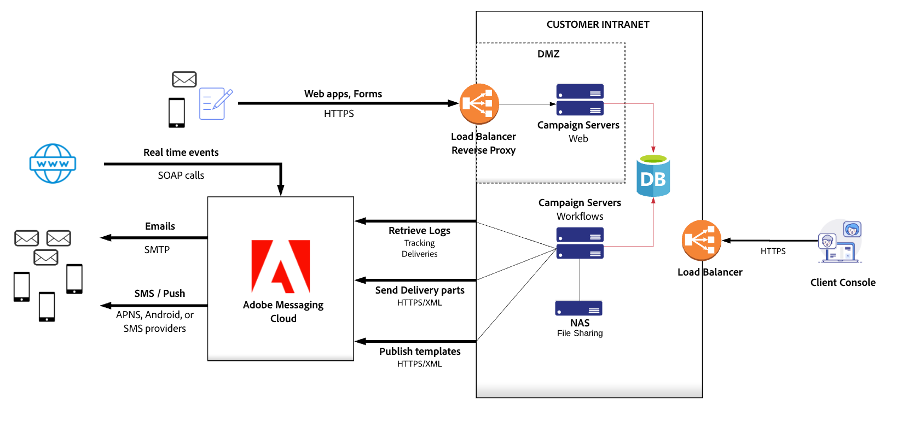

# 硬件大小调整建议{#hardware-sizing-reco}

## 概述

>[!CAUTION]
>
>本文仅作为一般示例指南提供。 在启动Campaign项目之前，您必须联系Adobe Campaign客户成功经理来测量部署的确切大小。 **不要** 获取或部署任何基础架构或硬件，直到完成此操作。

本文档为您的内部部署数据中心或虚拟化云环境中的Adobe Campaign Classic v7部署提供了一般建议。 此类部署，称为 **混合** 或 **中间源**，则会将Campaign营销实例和营销数据库置于您的操作控制下，同时使用Adobe云消息传送服务发送电子邮件、短信或SMPP消息，以及收集打开、退回和点击跟踪数据的电子邮件。

营销实例是Adobe Campaign架构的一部分，用于驱动所有营销活动，并存储由营销活动返回的所有收件人数据和分析数据。 营销实例是一组运行Adobe Campaign服务的内部部署服务器和一个关系数据库。

>[!CAUTION]
>
>如果您使用完全托管的Adobe Campaign实例(部署在AdobeCloud Services中)，则本文档中的信息不适用。

软件兼容性详见 [兼容性矩阵](../../rn/using/compatibility-matrix.md).

### 方案

针对以下三种代表性情景提供了部署图和硬件大小调整建议：

1. [中等大小](#scenario-1)  — 系统中500万活跃收件人
1. [大尺寸](#scenario-2) - 2 000万在职受援者
1. [企业](#scenario-3) - 5,000万活跃收件人，带有事务型消息传递

### 假设

本文档还假定所有三种情景的使用类型如下：

* 大型电子邮件促销活动每周发送两次，发送给大约50%的活动收件人
* 系统中每个收件人每月生成一次直邮
* 每月向大约10%的活跃收件人发送短信消息
* 定义每个收件人的数据库模式已扩展为一个额外的表，其中包含每个收件人大约200字节的数据
* Adobe Campaign交互模块用于向外发电子邮件添加选件
* 电子邮件跟踪数据会在Campaign系统中保留90天

## 一般准则

Campaign是以数据库为中心的应用程序，而数据库服务器性能至关重要。 运行工作流、分段、跟踪数据上传、入站交互、分析和其他活动都会生成数据库活动。 通常，这些操作的大小和频率决定了数据库服务器的大小。

营销实例中的应用程序服务器需要足够的CPU和内存来运行工作流并响应SOAP API调用，包括来自Campaign Console用户的请求。 对于使用与复杂选件规则进行出站交互的工作流、执行自定义Javascript的工作流以及流量级别较高的Web应用程序而言，CPU要求可能非常重要。

Campaign Web应用程序也可以部署在营销实例应用程序服务器上，或部署在单独的Web服务器系统上。 由于Web应用程序工作负载与关键工作流和Campaign Console用户冲突，因此可以将Web应用程序和集客交互部署到单独的服务器，以确保核心Campaign功能可靠运行且性能良好。

为了安全性和可用性，Adobe建议将Internet流量与业务用户生成的流量分开。 因此，图表包含两组服务器：Web服务器（面向Web1和Web2的Internet）和应用程序服务器（业务流程App1和App2）。

商业电子邮件发件人拥有功能性的选择退出网页是一项法律要求。 Adobe建议在每个组服务器中安装冗余计算机，以备故障切换情况。 如果Adobe Campaign托管选择退出页面，则情况尤其如此。

### 反向代理

Campaign架构通过HTTP(HTTPS)使用SSL在营销实例和Adobe云消息传送之间进行通信，从而强制实施高安全性。 通过在“隔离区”(DMZ)子网中使用反向代理来隔离和保护营销实例服务器和数据库，从而强制执行安全性、可靠性和可用性。

### 负载平衡器

应用程序服务器的负载平衡器是在主/被动配置中设置的，代理上HTTPS已终止。 在活动/活动配置中设置Web服务器的负载平衡器，并在代理处终止HTTPS。

Adobe为您提供了可在部署环境中中继到Adobe Campaign服务器的URL路径的独占列表。

### 架构

无论卷是什么，一般架构都几乎完全相同。 安全性和高可用性要求要求至少4台服务器；两个服务器（如果未使用WebApps）。 配置的差异主要在硬件配置（如CPU核心和内存）中。

## 场景1:中等规模部署{#scenario-1}

估计数量：

| 渠道 | 容量 |
| ----------------------- | ----------------- |
| 活动收件人 | 500万 |
| 电子邮件 | 420万/月 |
| 直邮 | 100万/月 |
| 移动短信 | 10万/月 |
| 每日电子邮件流量达到峰值 | 500 |

对于这些卷，一对Adobe Campaign应用程序服务器系统为Adobe Campaign客户端用户和工作流执行提供了所有功能。 对于500万活动收件人和此电子邮件卷，应用程序服务器工作负载不是CPU或I/O密集型工作；大部分压力都在数据库上。

Adobe Campaign Web服务器显示在安全区域中。

### Web和应用程序服务器

此方案建议在四台计算机上安装Adobe Campaign，并遵循以下规范：

**3Ghz+四核CPU，8GB RAM，RAID 1或10,2个80GB固态硬盘**

这些系统会创建营销实例Application Server，它直接支持您的Campaign Console用户并执行营销活动工作流。

在DMZ负载平衡流量中反向代理到Adobe Campaign Web服务器。 无需在代理计算机上安装Adobe Campaign软件堆栈；任何反向代理软件或网络设备均可使用。

订阅选择启用/选择禁用和首选项中心功能可由Campaign或您自己的网站提供。 如果您选择在网站上实施此功能，则必须确保首选项和订阅信息被传播到Campaign营销数据库。 它通常通过创建提取文件来完成，提取文件会由Campaign工作流自动上传。

应用程序服务器的磁盘空间消耗取决于与第三方服务提供商交换的文件的保留期（例如，直邮的打印供应商），以及导入的平面文件的大小和保留期（如您网站中的订阅或首选项更新，或从您自己的CRM或营销系统中提取）。

### 数据库

数据库服务器的硬件建议如下：

**3Ghz+ 4核CPU，16GB RAM，RAID 1或10，最小128GB SSD**

内存估计假定大型营销活动启动时大约有500,000个收件人的完全缓存，以及用于执行工作流、导入跟踪数据和其他并发活动的RDBMS缓冲空间。

据估计，存储所有Adobe Campaign技术数据（促销活动、跟踪、工作表等）所需的数据库磁盘空间约为35 GB，保留期为三个月。 如果选择将跟踪数据保留6个月，则数据库大小将增加到大约40 GB，而12个月的保留将数据库大小增加到大约45 GB。 此环境使用大约5 GB的收件人数据。

>[!CAUTION]
>
>此估计不包括任何其他客户数据。 如果您计划将客户数据的额外列或表复制到Adobe Campaign数据库，则必须估计其额外的磁盘空间需求。 上传的区段/列表还需要更多的存储，具体取决于其大小、频率和保留期限。

另外，考虑到每天处理的信息量，数据库服务器的IOPS至关重要。 例如，在高峰日，您可以部署针对总共500,000位收件人的营销活动。 为了执行每个营销活动，Adobe Campaign将500,000条记录插入包含约1200万条记录的表（投放日志表）中。 为了在营销活动部署期间提供可接受的性能，Adobe建议在此方案中至少为60,000 4-KB的随机读/写IOPS。

## 场景2:大规模部署{#scenario-2}

估计数量：

| 渠道 | 容量 |
| ----------------------- | ----------------- |
| 活动收件人 | 两千万 |
| 电子邮件 | 4200万/月 |
| 直邮 | 每月1000万 |
| 移动短信 | 100万/月 |
| 每日电子邮件流量达到峰值 | 5,000,000 |

### Web和应用程序服务器

在此方案中，Adobe建议在四台计算机、两台应用程序服务器和两台Web服务器上安装Adobe Campaign，并遵循以下规范：

**3Ghz+四核CPU，8GB RAM，RAID 1或10,80GB SSD**

应用程序服务器直接支持Campaign Console用户和执行营销活动工作流。 此功能部署在两台相同的服务器上，以实现高可用性，共享网络连接存储(NAS)文件系统以实现故障切换。

Web服务器托管Campaign Web应用程序，支持系统中1000万活动收件人。

请参阅 [场景1:中等规模部署](#scenario-1) 有关代理、首选项中心/订阅处理和磁盘空间使用情况的更多评论。

### 数据库

数据库服务器的硬件建议如下：

**3Ghz+ 8核CPU、64GB RAM、RAID 1或10、2个320GB SSD或RAID 10、640GB SSD**

内存估计假定大型营销活动启动时大约有5,000,000个收件人的完全缓存，以及用于执行工作流、导入跟踪数据和其他并发活动的RDBMS缓冲空间。

根据3个月的保留期估计，存储所有Adobe Campaign技术数据（促销活动、跟踪、工作表等）所需的数据库磁盘空间约为280 GB。 如果选择将跟踪数据保留6个月，则数据库大小将增加到大约450 GB，而12个月的保留将数据库大小增加到大约900 GB。 此环境使用大约15 GB的收件人数据。

## 情景3:使用消息中心进行企业部署{#scenario-3}

估计数量：

| 渠道 | 容量 |
| ----------------------- | ----------------- |
| 活动收件人 | 5千万 |
| 电子邮件 | 1.08亿/月 |
| 直邮 | 每月2500万 |
| 移动短信 | 2,500万/月 |
| 事务性消息 | 2,500万/月 |
| 每日电子邮件流量达到峰值 | 250万 |

支持5000万收件人的部署与 [场景2](#scenario-2):Campaign Web应用程序流量会路由到Campaign Web服务器，因此在大型促销活动启动后出现的Web流量激增不会影响Campaign工作流和客户端控制台用户。

此部署还包括从您自己的网站和应用程序驱动的消息中心调用。

### Web和应用程序服务器

在此方案中，Adobe建议在四台计算机上安装Adobe Campaign，如下所示：

* 应用程序服务器
   **两个系统，3Ghz+四核CPU，8GB RAM，RAID 1或10,80GB SSD**

* Web 服务器
   **两个系统，3Ghz+四核CPU，16GB RAM，RAID 1或10,80GB SSD**

应用程序服务器直接支持Campaign Console用户和执行营销活动工作流。 此功能部署在两台相同的服务器上，以实现高可用性，共享网络连接存储(NAS)文件系统以实现故障切换。

Web服务器托管Campaign Web应用程序，支持系统中1000万活动收件人。

请参阅 [场景1:中等规模部署](#scenario-1) 有关代理、首选项中心/订阅处理和磁盘空间使用情况的更多评论。

### 数据库

数据库服务器的硬件建议如下：

**3Ghz+8核CPU、96GB RAM、RAID 1或10、最低1.5TB固态硬盘**

内存估计假定大型营销活动启动的大约12,500,000个收件人具有完全缓存，此外还假定RDBMS缓冲空间用于执行工作流、导入跟踪数据和其他并发活动。

根据3个月的保留期估计，存储所有Adobe Campaign技术数据（促销活动、跟踪、工作表等）所需的数据库磁盘空间约为700 GB。 如果选择将跟踪数据保留6个月，则数据库大小将增加到大约1.2 TB，而12个月的保留将数据库大小增加到大约2 TB。 此环境使用大约50 GB的收件人数据。

## 更改假设的准则

这些情景的假设都对硬件建议和部署架构产生了重大影响。 本节讨论有关不同假设的准则。 请联系Adobe Campaign咨询团队，以获取满足您要求的具体建议。

* **收件人数量**
活动收件人既需要存储空间，又需要数据库缓冲区空间，因此，通常更多的收件人需要数据库服务器上更多的内存和CPU容量。 对于收件人本身而言，存储增加量相对较小，但对于为电子邮件促销活动保留的事件跟踪数据而言，存储增加量可能会很大。

* **电子邮件促销活动大小**
促销活动启动频率对数据库服务器CPU要求有影响。 与直邮、集客交互和其他工作流相结合，电子邮件促销活动的分段操作会给数据库服务器带来巨大负载。

* **直邮频度**
直接邮件的频率可能影响数据库服务器的CPU要求。 与营销活动启动和其他工作流相结合，对直接邮件的分段操作给数据库服务器带来了很大的负载。

* **短信消息量**
与电子邮件促销活动大小一样，短信消息量不会在位于内部部署的促销活动服务器上产生较大负载；负载主要在云上的Adobe云消息服务器上。 短信促销活动（如电子邮件和直邮）的分段会给营销数据库带来很大的负载。 因此，短信促销活动启动频率和分段复杂性与短信消息量更相关。

* **数据库模式复杂性**
每个活动收件人的数据量需要存储空间和数据库缓冲区空间，因此，通常更多收件人需要数据库服务器上的更多内存和CPU。 复杂的架构还需要连接更多表才能进行分段，因此分段操作运行速度会慢得多，而且当数据跨多个表分布时，需要更多的数据库CPU和内存。

   数据库服务器内存的估算方法是：确保数据库缓冲池可以足够大以包含所有收件人数据，以及运行工作流的临时表，以及其他数据库操作的边距。

* **叫客互动使用情况**
批量模式下的交互规则在将所有计算复杂性移交给数据库的工作流中进行评估。 数据库的主要工作因素是在一次引擎调用期间计算的合格选件总数（目标大小X每个收件人的平均选件数，然后再保留N个最佳选件）。 数据库服务器的CPU速度是性能的第一个因素。

* **入站交互或SOAP API使用情况**
集客交互规则和选件将在营销数据库中进行评估，这需要大量数据库服务器资源，特别是CPU。 大量使用集客交互或SOAP API需要单独的Web服务器来将工作负载与运行Campaign工作流分开。

* **跟踪数据保留期**
将跟踪数据保留时间延长到90天以上需要更多的数据库存储，并且由于将新跟踪数据插入到大型表中，因此可能会减慢系统运行速度。 跟踪数据对90天后的促销活动分段没有用处，因此建议缩短保留期。

   如果您需要对收件人营销体验进行长期分析，则应将跟踪数据移入Adobe Analytics或其他分析系统。

## 虚拟化

所有Campaign服务器都是虚拟化的好候选者。 必须解决若干问题以确保适当的可用性和性能。

* **故障转移配置**
群集服务器（例如，负载平衡代理下的冗余应用程序服务器）必须部署在单独的硬件上，以确保在出现硬件故障时，两个虚拟机不会停机。

* **I/O配置**
为了数据库安全，必须维护任何建议的RAID配置，以确保存储设备丢失不会导致数据丢失。

* **I/O性能**
必须遵循数据库存储的建议IOPS等级。 诸如Amazon EC2之类的云服务可能无法提供所需的性能，必须仔细评估。 例如，Amazon EC2预配置SSD卷当前每卷的IOPS为20,000。 在 [Amazon文档](https://docs.aws.amazon.com/AWSEC2/latest/UserGuide/ebs-volume-types.html))，则4卷RAID配置的额定值为80,000 IOPS，这可能不够。

Adobe建议在将系统投入生产之前，对Adobe Campaign的任何虚拟化部署进行性能测试。

## 相关主题

* [营销活动监控流程](../../production/using/monitoring-processes.md)
* [Campaign一般架构](../../installation/using/general-architecture.md)
* [性能和吞吐量问题](../../production/using/performance-and-throughput-issues.md)
* [安全和隐私检查清单](../../installation/using/get-started-security-privacy.md)
