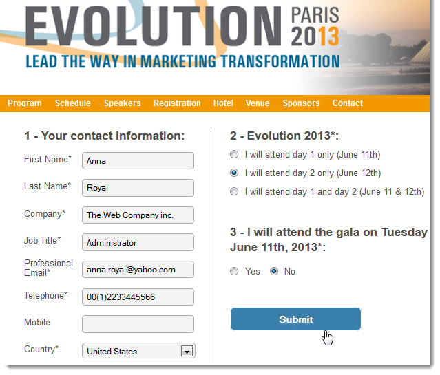

# Web 应用程序入门{#about-web-applications}

Adobe Campaign允许您创建和发布动态的交互式Web应用程序，其中包含来自数据库的数据以及适合已连接用户权限的内容。

您可以创建页面，例如外部网上的编辑表单，或者创建通知表单，其中包含来自具有表、图表、输入表单等数据库的数据。 此功能允许您设计和发布网页，用户可以在其中查找或输入信息。

这可以是订阅表单，其中包含已使用Adobe Campaign数据库中所包含的信息预加载的数据，如下所示：

本章概述了如何管理Web应用程序。

>[!NOTE]
>
>请参阅[安全和隐私核对清单](https://helpx.adobe.com/cn/campaign/kb/acc-security.html)，了解如何优化Web应用程序的安全性。

>[!CAUTION]
>
>出于隐私原因，我们建议对所有外部资源使用HTTPS。

## Web应用程序范围 {#web-application-scope}

Adobe Campaign中的Web应用程序提供对以下功能的访问：

* 创建多页表单。 有关详细信息，请参见此 [ 页面](about-web-forms.md)。
* 使用集成翻译工具进行多语言调查管理。 有关详细信息，请参见此 [ 页面](translating-a-web-application.md)。
* 图形化页面管理界面，多列页面布局。 有关详细信息，请参见此 [ 页面](designing-a-web-application.md)。
* 呈现个性化和字段位置。 有关详细信息，请参见此 [ 页面](editing-content.md#adding-personalization-content)。
* 根据答案有条件地显示调查字段。 有关详细信息，请参见此 [ 页面](form-rendering.md#defining-fields-conditional-display)。
* 随机显示问题。 有关详细信息，请参见此 [ 页面](../../surveys/using/building-a-survey.md#adding-questions)。
* 条件性页面显示。 有关详细信息，请参见此 [ 页面](defining-web-forms-page-sequencing.md#conditional-page-display)。
* 根据预期的数据类型（编号、电子邮件地址、日期等），在验证之前检查信息 和必填字段。 有关详细信息，请参见此 [ 页面](form-rendering.md#defining-control-settings)。
* 电子邮件邀请或通知。 有关详细信息，请参见此 [ 页面](publishing-a-web-form.md#delivering-a-form-via-email)。
* 包含错误和结束消息的Personalization。 有关详细信息，请参见此 [ 页面](defining-web-forms-properties.md#setting-up-an-error-page)。
* 使用图像、视频、超文本链接、验证码等。 有关详细信息，请参见此 [ 页面](editing-content.md)。
* 实时监控响应。 有关详细信息，请参见此 [ 页面](../../surveys/using/publish-track-and-use-collected-data.md#response-tracking)。

可选的&#x200B;**调查**&#x200B;创建模块提供了以下附加功能：

* 数据库的动态扩展：创建未包含在初始数据模板中的响应。 有关详细信息，请参见此 [ 页面](../../surveys/using/managing-answers.md#storing-collected-answers)。
* 生成专用报告。 有关详细信息，请参见此 [ 页面](../../surveys/using/publish-track-and-use-collected-data.md#reports-on-surveys)。

与Web应用程序相比，调查具有简化的图形界面，而且编辑控制数量减少。

>[!NOTE]
>
>[此部分](../../surveys/using/about-surveys.md)中详细介绍了调查。
>
>在[此部分](about-web-forms.md)中详细介绍了Adobe Campaign中Web窗体的总体功能。

## Web应用程序实施 {#web-application-implementation}

要创建并发布Web应用程序，您必须：

1. 创建内容（字段、列表、表格、图形等）。

   您还可以查看详细说明表单可用字段的部分：所有这些字段也可用于Web应用程序。 此信息在[此页面](adding-fields-to-a-web-form.md)中可用。

1. 根据需要，您可以添加预加载、测试和保存步骤，并配置访问控制系统（主要在外联网发布的框架内）。
1. 发布Web应用程序以使其在外联网或Adobe Campaign中可用。

## Web应用程序初始配置 {#web-application-initial-configuration}

Web应用程序是通过&#x200B;**[!UICONTROL Campaigns]**&#x200B;和&#x200B;**[!UICONTROL Profiles and targets]**&#x200B;选项卡中的&#x200B;**[!UICONTROL Web Applications]**&#x200B;链接创建的。

Web应用程序存储在Adobe Campaign树的&#x200B;**[!UICONTROL Resources > Online > Web Applications]**&#x200B;节点中。 配置在以下文件夹中细分：

* **[!UICONTROL Administration > Configuration > Form renderings]**：包含Web窗体演示的渲染模板（应用程序和调查）。 使用该模板可以生成表单。 它还使用CSS样式表。 可在模板级别重载此样式表。 有关详细信息，请参见[此页面](form-rendering.md#selecting-the-form-rendering-template)。
* **[!UICONTROL Resources > Templates > Web application templates]**：包含表单模板。 要创建表单或Web应用程序，必须从模板开始。

## Web 应用程序模板 {#web-application-templates}

默认情况下，Adobe Campaign为每个可用的Web应用程序提供一个模板。

>[!NOTE]
>
>您可以将现有Web应用程序转换为模板。 要执行此操作，请选择表单并右键单击。 选择 **[!UICONTROL Actions > Save as template...]**。

您可以通过Adobe Campaign树的&#x200B;**[!UICONTROL Resources > Templates > Web Application templates]**&#x200B;节点创建新模板。

创建助手允许您选择要启用的选项，如下所示。

>[!CAUTION]
>
>可用的应用程序取决于您的选项和模块。 请核实您的许可协议。
