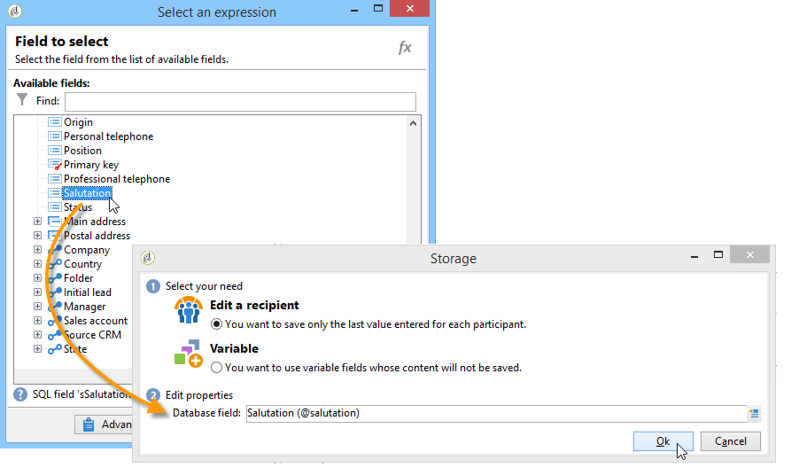

# Web 窗体入门{#about-web-forms}

Adobe Campaign集成了一个图形模块，用于定义和发布Web窗体，以创建包含输入和选择字段的页面，这些字段可能包括数据库中的数据。 这样，您就可以设计并发布用户可访问的网页，以便查看或输入信息。

本章详细介绍如何创建和管理Web窗体，如何管理字段和页面，以及存储和保存模式。

>[!CAUTION]
>
>出于隐私原因，我们建议对所有外部资源使用HTTPS。

## 创建Web窗体的步骤 {#steps-for-creating-a-web-form}

本章详细介绍在Adobe Campaign中设计&#x200B;**webForm**&#x200B;类型表单所需的步骤，以及可用的选项和配置。 通过Adobe Campaign，您可以让此Web表单可供用户使用，以及在数据库中收集和存档答案。

>[!CAUTION]
>
>配置Web应用程序和Web窗体时，最低垂直分辨率需要900像素（例如：1600x900）。

可通过&#x200B;**促销活动**&#x200B;选项卡的“Web应用程序”菜单访问Web窗体。 在Adobe Campaign树中，它们分组在&#x200B;**[!UICONTROL Resources > Online > Web Applications]**&#x200B;节点下。

要创建Web窗体，请单击Web应用程序列表上方的&#x200B;**[!UICONTROL Create]**&#x200B;按钮。

选择Web窗体模板（默认为&#x200B;**[!UICONTROL newWebForm]**）。

这会将您引导至表单仪表板。

**[!UICONTROL Edit]**&#x200B;选项卡允许您创建内容。

要定义Web窗体的配置和内容，请应用以下步骤：

* 首先，创建所需的页面和控件：输入字段、下拉列表、HTML内容等。

  此步骤详见下文。

* 定义页面顺序并设置显示条件。

  此步骤在[定义Web窗体页面排序](defining-web-forms-page-sequencing.md)中详述。

* 如有必要，请翻译内容。

  [翻译Web窗体](translating-a-web-form.md)中详细介绍了此步骤。

## 关于Web窗体设计 {#about-web-forms-designing}

表单的页面通过特定编辑器创建，该编辑器允许您定义和配置输入区域（文本）、选择字段（列表、复选框等） 和静态元素（图像、HTLM内容等）之间的关联。 可以将它们分组到容器中，并根据您的需要更改其布局（有关更多信息，请参阅[创建容器](defining-web-forms-layout.md#creating-containers)）。

以下部分详细介绍如何定义表单屏幕的内容和布局：

* [向Web窗体添加字段](adding-fields-to-a-web-form.md)，
* [正在插入HTML内容](static-elements-in-a-web-form.md#inserting-html-content)，
* [Web窗体中的静态元素](static-elements-in-a-web-form.md)，
* [正在定义Web窗体布局](defining-web-forms-layout.md)。

>[!NOTE]
>
>* 在页面设计期间，您可以在&#x200B;**[!UICONTROL Preview]**&#x200B;选项卡中查看最终渲染。 要查看更改，请先保存表单。 任何错误都显示在&#x200B;**[!UICONTROL Log]**&#x200B;选项卡中。
>* 要确保页面显示和信息存储的顺序正确，请在Web窗体中启用调试模式。 为此，请转到&#x200B;**[!UICONTROL Preview]**&#x200B;子选项卡并选中&#x200B;**[!UICONTROL Enable debug mode]**&#x200B;框：所有收集的信息和可能的执行错误将显示在每个页面的底部。
>

### 使用工具栏中的图标 {#using-the-icons-in-the-toolbar}

也可以使用工具栏中的图标或右键单击来插入输入区域。

在本例中，首先选择要添加的字段类型和应答存储模式。

单击&#x200B;**[!UICONTROL Ok]**&#x200B;批准选择。

