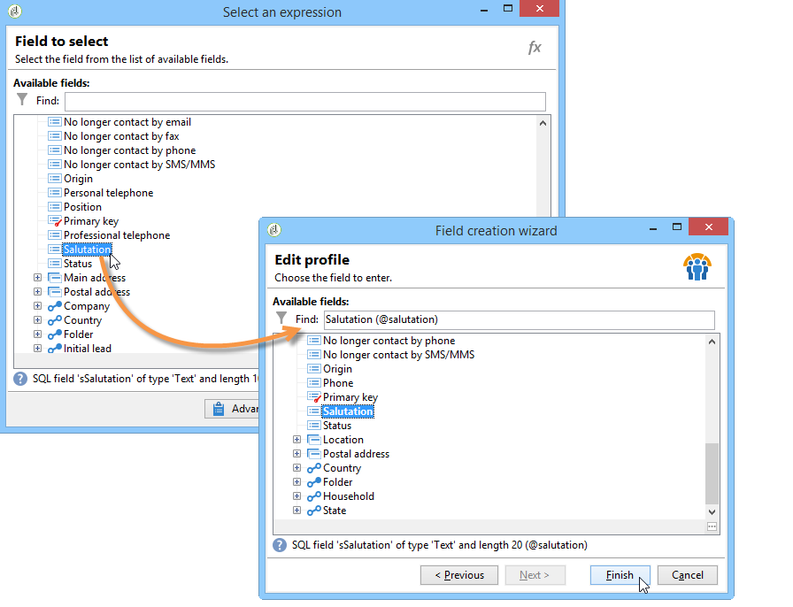

# 向 Web 窗体添加字段{#adding-fields-to-a-web-form}

在Web表单中，字段使用户能够输入信息并选择选项。 Web 窗体可以优惠输入字段、选择字段、静态和高级内容(captcha、订阅等)。

使用向导添加字段时，会根据所选字段或存储变量自动检测字段类型。 您可以使用选项卡 **[!UICONTROL Type]** 中的下拉框编辑 **[!UICONTROL General]** 它。

使用工具栏中的按钮时，选择要添加的字段类型。

有以下类型的字段可用：

* 文本／数字输入。 请参 [阅添加输入字段](#adding-input-fields)。
* 下拉列表选择。 请 [参阅添加下拉列表](#adding-drop-down-lists)。
* 通过复选框进行多项选择。 请参阅 [添加复选框](#adding-checkboxes)。
* 通过单选按钮进行排他性选择。 请参阅 [添加单选按钮](#adding-radio-buttons)。
* 在选项网格中投票。 请参 [阅添加网格](#adding-grids)。
* 数字和日期。 请参 [阅添加日期和数字](#adding-dates-and-numbers)。
* 订阅/退订至信息服务。 请参阅 [订阅复选框](#subscription-checkboxes)。
* Captcha验证。 请参 [阅插入验证码](#inserting-a-captcha)。
* 下载按钮。 [上传文件](#uploading-a-file)。
* 隐藏常数。 请参 [阅插入隐藏常数](#inserting-a-hidden-constant)。

请指定响应存储模式：更新数据库中的字段（仅存储保存的最后一个值）或存储在变量中（不存储答案）。 有关此问题的详细信息，请参 [阅响应存储字段](../../web/using/web-forms-answers.md#response-storage-fields)。

>[!NOTE]
>
>默认情况下，该字段插入当前树的底部。 使用工具栏中的箭头向上或向下移动它。

## 字段创建向导 {#field-creation-wizard}

对于表单的每个页面，您可以通过工具栏中的第一个按钮添加字段。 为此，请转到菜 **[!UICONTROL Add using the wizard]** 单。

选择要创建的字段类型：您可以选择在容器库中添加字段、变量或导入在其他表单中创建并在数据中收集的一组字段。

单 **[!UICONTROL Next]** 击并选择存储字段或变量，或要导入的容器。

单 **[!UICONTROL Finish]** 击将选定字段插入页面。

## 添加输入字段 {#adding-input-fields}

要添加输入字段，请单 **[!UICONTROL Input control]** 击按钮，然后选择要添加的字段类型。

### 输入字段的类型 {#types-of-input-fields}

可以在表单页面中插入五种不同类型的文本字段：

* **文本**:允许用户在一行上输入文本。

   

* **数字**:允许用户在一行中输入数字。 for more on this, refer to [Adding numbers](#adding-numbers).

   批准页面后，将检查字段内容以确保输入的值与字段兼容。 For more on this, refer to [Defining control settings](../../web/using/form-rendering.md#defining-control-settings).

* **密码**:允许用户在单行上输入文本。 在文本输入过程中，字符会替换为句点：

   

   >[!CAUTION]
   >
   >口令在数据库中存储为未加密。

* **多行文本**:允许用户在几行上输入文本。

   

   >[!CAUTION]
   >
   >多行文本字段是可包含回车符的特定字段。 其存储空间必须与映射到XML元素的字段（而非XML属性）关联。 有关模式中数据类型的详细信息，请参阅本节中的“模式参考” [一章](../../configuration/using/about-schema-reference.md)。
   >   
   >如果您使用调查 **模块** ，则可以将此类型的字段存储在归档字段中，该字段将自动适应格式。 如需详细信息，请参阅[此部分](../../web/using/about-surveys.md)。

* **丰富的多行文本**:允许用户输入将以HTML格式存储的布局的文本。

   

   您可以选择提供给用户的编辑器类型。 为此，请使用选项卡中字段 **[!UICONTROL HTML editor]** 的下拉 **[!UICONTROL Advanced]** 框。

   

   显示的图标数量因编辑器类型而异。 对于编 **[!UICONTROL Advanced]** 辑器，渲染将如下所示：

   

### 配置输入字段 {#configure-input-fields}

输入字段均根据相同的模式使用以下选项进行配置：

在选 **[!UICONTROL General]** 项卡中，您可以输入字段的名称，并根据需要为字段添加默认值。

答案存储模式可以通过链接进行 **[!UICONTROL Edit storage...]** 更改。 值可以存储在数据库的现有字段中；或者，您可以选择不在数据库中保存信息（使用本地变量）。

>[!NOTE]
>
>存储模式在响应 [存储字段中详细介绍](../../web/using/web-forms-answers.md#response-storage-fields)

使用 **[!UICONTROL Advanced]** 选项卡可以定义字段的显示参数（标签的位置、对齐方式等）。 See [Defining web forms layout](../../web/using/defining-web-forms-layout.md).

## 添加下拉列表 {#adding-drop-down-lists}

您可以将下拉列表插入调查页。 这样，用户就可以从下拉菜单中的优惠值中选择一个值。

要向表单页面添加下拉框，请单击页 **[!UICONTROL Selection controls > Drop-down list]** 面编辑器工具栏中的按钮。

选择答案存储模式并确认您的选择。

在选项卡的下半部分定义列表的标签和 **[!UICONTROL General]** 值。 如果信息存储在明细列表库的现有字段中，并且该字段是字段，则可以通过单击自动填写这些值，如 **[!UICONTROL Initialize the list of values from the database]** 下所示：

>[!NOTE]
>
>使用值列表右侧的箭头更改其顺序。

如果数据存储在链接的表中，则可以选择保存列表中建议的值的字段。 例如，如果选择国家／地区表，则单击并 **[!UICONTROL Initialize the list of values from the database...]** 选择所需的字段。

接下来，单击 **[!UICONTROL Load]** 链接以检索值：

>[!CAUTION]
>
>只要更新列表以刷新优惠值，请重复此操作。

## 添加复选框 {#adding-checkboxes}

要使用户选择某个选项，您需要使用复选框。

要向表单添加复选框，请单 **[!UICONTROL Selection controls > Checkbox...]** 击页面编辑器工具栏中的图标。

选择答案存储模式并确认您的选择。

在选项卡的字段中输入 **[!UICONTROL Label]** 框的标 **[!UICONTROL General]** 签。

通过复选框，您可以根据是否选中该框，为存储字段（或值）分配值。 该 **[!UICONTROL Values]** 部分允许您输入选中框时要分配的值(在字 **[!UICONTROL Value]** 段中)，如果未选中则要分配的值(在字段中 **[!UICONTROL Empty value]** )。 这些值取决于数据存储格式。

如果存储字段（或变量）是布尔值，则将自动推断在未选中该框时要指定的值。 在这种情况下，只 **[!UICONTROL Value if checked]** 提供字段，如下所示：

## 示例：如果选中框，则为字段指定值 {#example--assign-a-value-to-a-field-if-a-box-is-checked}

我们希望在表单中插入一个复选框以发送维护请求，如下所示：

该信息将上传到数据库和现有字段(在本例中为字 **[!UICONTROL Comment]** 段):

如果选中“Maintenance required”（需要维护）框， **[!UICONTROL Comment]** 则列将包含“Maintenance required”（需要维护）。 如果未选中该框，则列将显示“Maintenance not required”（不需要维护）。 要获得此结果，请将以下配置应用到表单页面上的复选框：

## 添加单选按钮 {#adding-radio-buttons}

单选按钮可让您优惠用户一系列独家选项供您选择。 这是同一字段的不同值。

您可以单独（单位按钮）或通过多选列表创建单选按钮，但是，由于单选按钮的要点是选择一个或另一个选项，因此我们始终会创建至少一对单选按钮，而不仅仅是单个按钮。

>[!CAUTION]
>
>要强制选择，您需要创建多选列表。

### 添加单个按钮 {#add-single-buttons}

要向表单页面添加单选按钮，请转 **[!UICONTROL Selection controls > Radio button]** 到页面编辑器工具栏中的菜单，然后选择存储模式。

单选按钮的配置方式与复选框类似(请参 [阅添加复选](#adding-checkboxes)框)。 但是，如果未选择该选项，则不会分配任何值。 要使多个按钮相互依赖，即选择一个按钮自动取消选择其他按钮，它们必须存储在同一字段中。 如果它们未存储在存储库中，则必须使用相同的本地变量进行临时存储。 请参阅 [响应存储字段](../../web/using/web-forms-answers.md#response-storage-fields)。

### 添加一列表按钮 {#add-a-list-of-buttons}

要通过列表添加单选按钮，请转 **[!UICONTROL Selection controls>Multiple choice]** 到页面编辑器工具栏中的菜单。

添加任意数量的单选按钮（标签数）。 此功能的优点是您可以从现有字段（如果是逐项字段）导入值，并让用户选择一个选项。 但是，按钮的布局不那么灵活。

>[!NOTE]
>
>Web 窗体不授权选择多个值。 只能为调查类型表单激 **活** 多个选择。 如需详细信息，请参阅[此部分](../../web/using/about-surveys.md)。\
>但是，可以在Web 应用程序中 **[!UICONTROL Multiple choice]** 插入类型字段；但是，不授权选择以下几个值：可以使用单选按钮选择提供的选项。

## 添加网格 {#adding-grids}

网格用于设计Web 应用程序中的投票页面。 这样，您就可以优惠列表单选按钮，以回答调查或评估类型Web 窗体，如下所示：

要在表单中使用此类型的元素，请创建一个简单的网格，并为要评估的每个元素添加一行。

网格每行中的单选按钮数与在简单网格中定义的值数匹配。

每个网格线只能选择一个选项。

>[!NOTE]
>
>在我们的示例中，网格的标签是隐藏的。 为此，请转到选 **[!UICONTROL Advanced]** 项卡，显 **[!UICONTROL Label position]** 示定义为 **[!UICONTROL Hidden]** 。 请参 [阅定义标签的位置](../../web/using/defining-web-forms-layout.md#defining-the-position-of-labels)。

## 添加日期和数字 {#adding-dates-and-numbers}

表单字段的内容可以格式化以匹配存储在数据库中的数据或满足特定要求。 您可以创建适合输入数字和日期的字段。

### 添加日期 {#adding-dates}

要允许用户在表单页面中输入日期，请在工具栏 **[!UICONTROL Add input field > Date...]** 或页面编辑器中选择。

输入字段标签并配置数据存储模式。

窗口的下半部分允许您为此字段中存储的值选择日期和时间格式。

您还可以选择不显示日期（或时间）。

日期可以通过日历或下拉框进行选择。 您也可以直接在字段中输入它们，但它们需要与上面屏幕中指定的格式匹配。

>[!NOTE]
>
>默认情况下，表单中使用的日期通过日历输入。 对于多语言表单，请查看日历是否提供所有语言版本。 See [Translating a web form](../../web/using/translating-a-web-form.md).

但是，在某些情况下（例如，输入出生日期），使用下拉列表可能更容易。

为此，请单击选项卡， **[!UICONTROL Advanced]** 然后使用“”(Input)模式选择输 **[!UICONTROL Drop-down lists]**&#x200B;入。

然后，您可以设置对列表中提供的值的限制。

### 添加数字 {#adding-numbers}

您可以创建适合输入数字的字段。

在数字字段中，用户只能输入数字。 批准页面后，将自动应用输入控件。

根据数据库中存储数据的字段，可能会应用特殊格式或某些限制。 您还可以指定最大值和最小值。 此类型的字段配置如下：

默认值是发布表单时在字段中显示的值。 用户可以更正。

您可以通过选项卡向数字字段添加前缀和／或后 **[!UICONTROL Advanced]** 缀，如下所示：

在表单中，渲染将如下所示：

## 订阅复选框 {#subscription-checkboxes}

您可以添加控件，以允许用户订阅或取消订阅一个或多个信息服务（新闻稿、警告、实时通知等）。 要订阅，用户检查相应的服务。

要创建订阅复选框，请单击 **[!UICONTROL Advanced controls>Subscription]**。

指示复选框的标签，并使用下拉框选 **[!UICONTROL Service]** 择相关信息服务。

>[!NOTE]
>
>信息服务详 [细信息](../../delivery/using/managing-subscriptions.md)。

用户通过检查相关选项来订阅服务。

>[!CAUTION]
>
>如果用户已订阅信息服务，并且在批准表单时未选中链接到此服务的框，则他们将取消订阅。

本节提供订阅和推荐 [示例](../../web/using/about-surveys.md)。

## 插入验证码 {#inserting-a-captcha}

验证码测 **试的目** 的是防止Web 窗体的欺骗性使用。

>[!CAUTION]
>
>如果您的表单包含多个页面，则必须始终将Captcha放在最后一页(就在存储框之前)，以防止规避安全措施。

要将Captcha插入表单，请单击工具栏上的第一个按钮并选择 **[!UICONTROL Advanced controls>Captcha]**。

输入字段的标签。 此标签将显示在Captcha显示区域前面。 您可以更改此标签在选项卡中的 **[!UICONTROL Advanced]** 位置。

>[!NOTE]
>
>对于 **[!UICONTROL captcha]** 类型控件，无需指示存储字段或变量。

Captcha将插入页面，并且输入字段位于可视下方。 这两个元素是不可分的，在页面布局时被视为单个项（它们占用单个单元格）。

确认页面后，如果Captcha内容输入不正确，则输入字段将以红色显示。

您可以创建要显示的错误消息。 为此，请使用选 **[!UICONTROL Personalize the message]** 项卡中的链 **[!UICONTROL General]** 接。

>[!NOTE]
>
>Captchas总是8个字符长。 您不能修改此值。

## 上传文件 {#uploading-a-file}

您可以向页面添加上传字段。 例如，此功能对于Intranet文件共享可能很有用。

要向表单页面插入上传字段，请在页 **[!UICONTROL Advanced controls > File...]** 面编辑器的工具栏中选择菜单。

默认情况下，上传的文件存储在可通过菜单访问的资源文 **[!UICONTROL Resources > Online > Public resources]** 件中。 您可以使用脚本更改此行为。 此脚本可以使用活动JSAPI文档中 [定义的函数](https://docs.adobe.com/content/help/en/campaign-classic/technicalresources/api/index.html)，包括那些涉及文件处理的函数。

您可以将指向这些文件的链接存储在本地变量或数据库字段中。 例如，您可以扩展收件人模式，以添加指向基于文件的资源的链接。

>[!CAUTION]
>
>* 此类型的文件必须保留给具有安全访问（使用凭据）的表单。
>* Adobe Campaign不控制上传的资源的大小或类型：因此，我们强烈建议仅对安全类型的内部网站点使用上传字段。
>* 如果多个服务器链接到该实例（负载平衡架构），则需要确保对Web表单的调用到达同一台服务器。
>* 这些实施需要Adobe Campaign咨询团队的协助。

>

## 插入隐藏常数 {#inserting-a-hidden-constant}

用户在表单的其中一个页面上传递时，可以高亮显示字段。 为此，请在页面中放置一个常量并指定值和存储位置。

此字段对用户不可见，但可用于丰富用户用户档案中的数据。

在以下示例中，每当 **用户** 批准此页面时，来源用户档案的收件人文件会自动填写。 该常数不显示在页面上。

