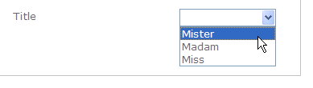
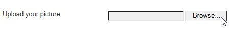

# 向 Web 窗体添加字段{#adding-fields-to-a-web-form}

在Web窗体中，字段允许用户输入信息并选择选项。 Web窗体可以提供输入字段、选择字段、静态和高级内容（捕获、订阅等）。

使用向导添加字段时，会根据所选字段或存储变量自动检测字段类型。 您可以使用&#x200B;**[!UICONTROL General]**&#x200B;选项卡中的&#x200B;**[!UICONTROL Type]**&#x200B;下拉框对其进行编辑。

使用工具栏中的按钮时，选择要添加的字段类型。

提供以下类型的字段：

* 文本/数字输入。 请参阅[添加输入字段](#adding-input-fields)。
* 下拉列表选择。 请参阅[添加下拉列表](#adding-drop-down-lists)。
* 通过复选框进行多个选择。 请参阅[添加复选框](#adding-checkboxes)。
* 通过单选按钮进行排他性选择。 请参阅[添加单选按钮](#adding-radio-buttons)。
* 在选项网格中投票。 请参阅[添加网格](#adding-grids)。
* 数字和日期。 请参阅[添加日期和数字](#adding-dates-and-numbers)。
* 订阅/退订信息服务。 请参阅[订阅复选框](#subscription-checkboxes)。
* 验证码。 请参阅[插入验证码](#inserting-a-captcha)。
* “下载”按钮。 [上传文件](#uploading-a-file)。
* 隐藏常量。 请参阅[插入隐藏常量](#inserting-a-hidden-constant)。

请指定响应存储模式：更新数据库中的字段（仅存储最后保存的值）或存储在变量中（不存储答案）。 有关更多信息，请参阅[响应存储字段](web-forms-answers.md#response-storage-fields)。

>[!NOTE]
>
>默认情况下，该字段会插入到当前树的底部。 使用工具栏中的箭头将其上移或下移。

## 字段创建向导 {#field-creation-wizard}

对于表单的每个页面，您可以通过工具栏中的第一个按钮添加字段。 为此，请转到&#x200B;**[!UICONTROL Add using the wizard]**&#x200B;菜单。

选择要创建的字段类型：您可以选择在数据库中添加字段、变量，或导入在其他表单中创建并在容器中收集的一组字段。

单击&#x200B;**[!UICONTROL Next]**&#x200B;并选择存储字段或变量，或选择要导入的容器。

单击&#x200B;**[!UICONTROL Finish]**&#x200B;将所选字段插入页面。

## 添加输入字段 {#adding-input-fields}

要添加输入字段，请单击&#x200B;**[!UICONTROL Input control]**&#x200B;按钮，然后选择要添加的字段类型。

### 输入字段的类型 {#types-of-input-fields}

可在表单页面中插入五种不同类型的文本字段：

* **文本**:允许用户在一行上输入文本。

   

* **数字**:允许用户在一行中输入数字。有关更多信息，请参阅[添加数字](#adding-numbers)。

   页面获得批准后，将检查字段内容以确保输入的值与字段兼容。 有关更多信息，请参阅[定义控制设置](form-rendering.md#defining-control-settings)。

* **密码**:允许用户在一行上输入文本。在文本输入期间，字符会被替换为句点：

   

   >[!CAUTION]
   >
   >密码在数据库中存储时未加密。

* **多行文本**:允许用户在几行上输入文本。

   

   >[!CAUTION]
   >
   >多行文本字段是可包含回车符的特定字段。 其存储空间必须与映射到XML元素的字段关联，而不是与XML属性关联。

* **扩充了多行文本**:允许用户输入布局为HTML格式存储的文本。

   

   您可以选择提供给用户的编辑器类型。 要实现此目的，请使用&#x200B;**[!UICONTROL Advanced]**&#x200B;选项卡中&#x200B;**[!UICONTROL HTML editor]**&#x200B;字段的下拉框。

   

   显示的图标数量因编辑器类型而异。 对于&#x200B;**[!UICONTROL Advanced]**&#x200B;编辑器，渲染将如下所示：

   

### 配置输入字段 {#configure-input-fields}

所有输入字段都基于同一模式使用以下选项进行配置：

使用&#x200B;**[!UICONTROL General]**&#x200B;选项卡可输入字段名称，并根据需要为其添加默认值。

可通过&#x200B;**[!UICONTROL Edit storage...]**&#x200B;链接更改答案存储模式。 值可以存储在数据库的现有字段中；或者，您可以选择不在数据库中保存信息（使用本地变量）。

>[!NOTE]
>
>[响应存储字段](web-forms-answers.md#response-storage-fields)中详细介绍了存储模式

**[!UICONTROL Advanced]**&#x200B;选项卡允许您为字段定义显示参数（标签位置、对齐方式等）。 请参阅[定义Web窗体布局](defining-web-forms-layout.md)。

## 添加下拉列表 {#adding-drop-down-lists}

您可以在调查页面中插入下拉列表。 这允许用户从下拉菜单中的选件值中选择一个值。

要向表单页面添加下拉框，请单击页面编辑器工具栏中的&#x200B;**[!UICONTROL Selection controls > Drop-down list]**&#x200B;按钮。

选择答案存储模式并确认您的选择。

在&#x200B;**[!UICONTROL General]**&#x200B;选项卡的下部定义列表的标签和值。 如果信息存储在数据库的现有字段中，并且该字段是枚举字段，则可以通过单击&#x200B;**[!UICONTROL Initialize the list of values from the database]**&#x200B;自动填写值，如下所示：

>[!NOTE]
>
>使用值列表右侧的箭头可更改其顺序。

如果数据存储在链接的表中，则可以选择保存列表中建议值的字段。 例如，如果选择国家/地区表，请单击&#x200B;**[!UICONTROL Initialize the list of values from the database...]**&#x200B;并选择所需的字段。

接下来，单击&#x200B;**[!UICONTROL Load]**&#x200B;链接以检索值：

>[!CAUTION]
>
>每当更新列表以刷新选件的值时，请重复此操作。

## 添加复选框 {#adding-checkboxes}

要使用户选择选项，您需要使用复选框。

要向表单中添加复选框，请单击页面编辑器工具栏中的&#x200B;**[!UICONTROL Selection controls > Checkbox...]**&#x200B;图标。

选择答案存储模式并确认您的选择。

在&#x200B;**[!UICONTROL General]**&#x200B;选项卡的&#x200B;**[!UICONTROL Label]**&#x200B;字段中输入该框的标签。

通过复选框，您可以根据是否选中了该框，为存储字段（或值）分配值。 通过&#x200B;**[!UICONTROL Values]**&#x200B;部分，可输入选中复选框时要分配的值（在&#x200B;**[!UICONTROL Value]**&#x200B;字段中），如果未选中该框，则要分配的值（在&#x200B;**[!UICONTROL Empty value]**&#x200B;字段中）。 这些值取决于数据存储格式。

如果存储字段（或变量）是布尔值，则将自动推断未选中该框时要分配的值。 在这种情况下，仅提供&#x200B;**[!UICONTROL Value if checked]**&#x200B;字段，如下所示：

## 示例：如果选中框，则为字段分配值 {#example--assign-a-value-to-a-field-if-a-box-is-checked}

我们希望在表单中插入一个复选框以发送维护请求，如下所示：

该信息将上传到数据库和现有字段（在本例中为&#x200B;**[!UICONTROL Comment]**&#x200B;字段）：

如果选中“Maintenance required”框，则&#x200B;**[!UICONTROL Comment]**&#x200B;列将包含“Maintenance required”。 如果未勾选该框，则列将显示“不需要维护”。 要获取此结果，请将以下配置应用到表单页面上的复选框：

## 添加单选按钮 {#adding-radio-buttons}

利用单选按钮，可为用户提供一系列可供选择的专用选项。 同一字段的值不同。

您可以单独创建单选按钮（单一按钮）或通过多选项列表创建单选按钮，但由于单选按钮的要点是选择一个或另一个选项，因此我们将始终创建至少一对单选按钮，而不仅仅是单个按钮。

>[!CAUTION]
>
>要强制选择，您需要创建一个多选项列表。

### 添加单个按钮 {#add-single-buttons}

要向表单页面添加单选按钮，请转到页面编辑器工具栏中的&#x200B;**[!UICONTROL Selection controls > Radio button]**&#x200B;菜单，然后选择存储模式。

单选按钮的配置方式与复选框类似（请参阅[添加复选框](#adding-checkboxes)）。 但是，如果未选择选项，则不会分配任何值。 为了使多个按钮相互依赖，即选择一个按钮会自动取消选择其他按钮，这些按钮必须存储在同一字段中。 如果它们未存储在数据库中，则临时存储必须使用相同的本地变量。 请参阅[响应存储字段](web-forms-answers.md#response-storage-fields)。

### 添加按钮列表 {#add-a-list-of-buttons}

要通过列表添加单选按钮，请转到页面编辑器工具栏中的&#x200B;**[!UICONTROL Selection controls>Multiple choice]**&#x200B;菜单。

添加任意数量的单选按钮以添加标签。 此功能的优势在于，您可以从现有字段（对于分项字段）中导入值，并使其允许用户选择一个选项。 但是，按钮的布局不那么灵活。

>[!NOTE]
>
>无法在Web应用程序中启用多选。
>但是，可以将&#x200B;**[!UICONTROL Multiple choice]**&#x200B;类型字段插入Web应用程序，但这样不允许用户选择多个值。

## 添加网格 {#adding-grids}

网格用于在Web应用程序中设计投票页面。 这样，您就可以为回答调查或评估类型Web表单提供单选按钮列表，如下所示：

要在表单中使用此类元素，请创建一个简单的网格，并为要评估的每个元素添加一行。

网格每行中的单选按钮数与简单网格中定义的值数匹配。

每个网格行只能选择一个选项。

>[!NOTE]
>
>在本例中，网格的标签处于隐藏状态。 为此，请转到&#x200B;**[!UICONTROL Advanced]**&#x200B;选项卡，**[!UICONTROL Label position]**&#x200B;显示被定义为&#x200B;**[!UICONTROL Hidden]** 。 请参阅[定义标签的位置](defining-web-forms-layout.md#defining-the-position-of-labels)。

## 添加日期和数字 {#adding-dates-and-numbers}

表单字段的内容可以格式化以匹配存储在数据库中的数据或满足特定要求。 您可以创建用于输入数字和日期的合适字段。

### 添加日期 {#adding-dates}

要允许用户在表单页面中输入日期，请添加输入字段并选择类型&#x200B;**[!UICONTROL Date...]**。

输入字段的标签并配置数据存储模式。

利用窗口的下部分，可为存储在此字段中的值选择日期和时间格式。

您还可以选择不显示日期（或时间）。

日期可通过日历或下拉框选择。 您也可以直接在字段中输入这些参数，但需要匹配上面屏幕中指定的格式。

>[!NOTE]
>
>默认情况下，表单中使用的日期通过日历输入。 对于多语言表单，请检查日历是否在使用的所有语言版本。 请参阅[翻译Web窗体](translating-a-web-form.md)。

但是，在某些情况下（例如，输入出生日期），使用下拉列表可能会比较容易。

为此，请单击&#x200B;**[!UICONTROL Advanced]**&#x200B;选项卡，然后使用&#x200B;**[!UICONTROL Drop-down lists]**&#x200B;选择输入模式。

然后，您可以设置对列表中提供的值的限制。

### 添加数字 {#adding-numbers}

您可以为数字的输入创建适当的字段。

在数字字段中，用户只能输入数字。 页面获得批准后，将自动应用登入控件。

根据数据库中存储数据的字段，可能会应用特殊格式或某些限制。 您还可以指定最大值和最小值。 此类型的字段配置如下：

默认值是发布表单时在字段中显示的值。 用户可以更正此问题。

您可以通过&#x200B;**[!UICONTROL Advanced]**&#x200B;选项卡为数字字段添加前缀和/或后缀，如下所示：

在形式中，渲染将如下所示：

## 订阅复选框 {#subscription-checkboxes}

您可以添加控件，以允许用户订阅或退订一个或多个信息服务（新闻稿、警告、实时通知等）。 要订阅，用户将检查相应的服务。

要创建订阅复选框，请单击&#x200B;**[!UICONTROL Advanced controls>Subscription]**。

指示复选框的标签，然后使用&#x200B;**[!UICONTROL Service]**&#x200B;下拉框选择相关的信息服务。

>[!NOTE]
>
>[此页面](../../delivery/using/managing-subscriptions.md)中详细介绍了信息服务。

用户通过勾选相关选项订阅了服务。

>[!CAUTION]
>
>如果用户已订阅了信息服务，并且在批准表单时未勾选链接到此服务的框，则他们将被取消订阅。

## 插入验证码 {#inserting-a-captcha}

**captcha**&#x200B;测试的目的是防止Web表单的欺诈性使用。

>[!CAUTION]
>
>如果您的表单包含多个页面，则必须始终将验证码放在最后一页（即存储盒之前），以防安全措施受到任何规避。

要将验证码插入表单，请单击工具栏上的第一个按钮，然后选择&#x200B;**[!UICONTROL Advanced controls>Captcha]**。

输入字段的标签。 此标签将显示在Captcha显示区域的前面。 您可以在&#x200B;**[!UICONTROL Advanced]**&#x200B;选项卡中更改此标签的位置。

>[!NOTE]
>
>对于&#x200B;**[!UICONTROL captcha]**&#x200B;类型控件，无需指示存储字段或变量。

验证码会插入到页面中，并在可视化下方放置一个输入字段。 这两个元素是密不可分的，在页面布局中，它们被视为单个项目（占用一个单元格）。

确认页面后，如果验证码内容未正确输入，则输入字段将以红色显示。

您可以创建要显示的错误消息。 要实现此目的，请使用&#x200B;**[!UICONTROL General]**&#x200B;选项卡中的&#x200B;**[!UICONTROL Personalize the message]**&#x200B;链接。

>[!NOTE]
>
>捕获码始终为8个字符长。 您无法修改此值。

## 上传文件 {#uploading-a-file}

您可以向页面添加上传字段。 例如，此功能对于Intranet文件共享非常有用。

要将上传字段插入表单页面，请在页面编辑器的工具栏中选择&#x200B;**[!UICONTROL Advanced controls > File...]**&#x200B;菜单。

默认情况下，上传的文件会存储在可通过&#x200B;**[!UICONTROL Resources > Online > Public resources]**&#x200B;菜单访问的资源文件中。 您可以使用脚本更改此行为。 此脚本可以使用[Campaign JSAPI文档](https://docs.adobe.com/content/help/en/campaign-classic/technicalresources/api/index.html)中定义的函数，包括涉及文件处理的函数。

您可以将指向这些文件的链接存储在本地变量或数据库字段中。 例如，您可以扩展收件人模式，以添加指向基于文件的资源的链接。

>[!CAUTION]
>
>* 此类文件必须为具有安全访问（使用凭据）的表单保留。
>* Adobe Campaign不会控制上传的资源的大小或类型：因此，我们强烈建议仅将上载字段用于安全类型的内联网站点。
>* 如果多个服务器已链接到实例（负载平衡架构），则需要确保对Web表单的调用到达同一服务器。
>* 这些实施需要Adobe Campaign咨询团队的帮助。

>

## 插入隐藏常量 {#inserting-a-hidden-constant}

当用户验证表单的其中一个页面时，您可以将特定值设置为其用户档案的字段或变量。

此字段对用户不可见，但可用于扩充用户配置文件中的数据。

要实现此目的，请在页面中放置&#x200B;**常量** ，并指定值和存储位置。

在以下示例中，每当用户批准此页面时，都会自动填写收件人用户档案的&#x200B;**origin**&#x200B;字段。 该常量不显示在页面上。

