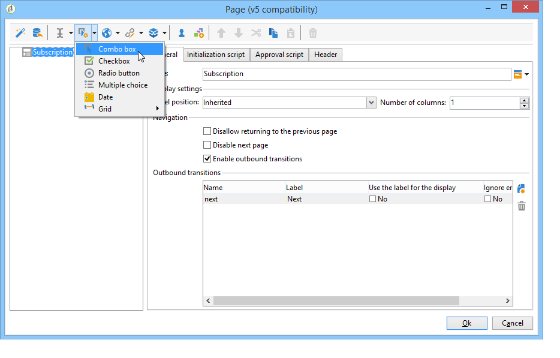

# 向 Web 窗体添加字段{#adding-fields-to-a-web-form}

在Web窗体中，字段使用户能够输入信息并选择选项。 Web窗体可以提供输入字段、选择字段、静态和高级内容（字幕、订阅等）。

使用向导添加字段时，将根据所选字段或存储变量自动检测字段类型。 您可以使用进行编辑 **[!UICONTROL Type]** 中的下拉框 **[!UICONTROL General]** 选项卡。

使用工具栏中的按钮时，选择要添加的字段类型。

可使用以下类型的字段：

* 文本/数字输入。 参见 [添加输入字段](#adding-input-fields).
* 下拉列表选择。 参见 [添加下拉列表](#adding-drop-down-lists).
* 通过复选框进行多项选择。 参见 [添加复选框](#adding-checkboxes).
* 通过单选按钮进行独占选择。 参见 [添加单选按钮](#adding-radio-buttons).
* 在选项网格中投票。 参见 [添加网格](#adding-grids).
* 数字和日期。 参见 [添加日期和数字](#adding-dates-and-numbers).
* 订阅/退订信息服务。 参见 [“订阅”复选框](#subscription-checkboxes).
* 验证码验证。 参见 [插入验证码](#inserting-a-captcha).
* 下载按钮。 [上传文件](#uploading-a-file).
* 隐藏常量。 参见 [插入隐藏的常量](#inserting-a-hidden-constant).

请指定响应存储模式：更新数据库中的字段（仅存储上次保存的值）或存储在变量中（未存储答案）。 有关更多信息，请参阅 [响应存储字段](web-forms-answers.md#response-storage-fields).

>[!NOTE]
>
>默认情况下，该字段会插入到当前树的底部。 使用工具栏中的箭头可将其向上或向下移动。

## 字段创建向导 {#field-creation-wizard}

对于表单的每个页面，您可以通过工具栏中的第一个按钮添加字段。 为此，请转到 **[!UICONTROL Add using the wizard]** 菜单。

选择要创建的字段类型：可选择在数据库中添加字段、变量或导入一组在其他表单中创建并在容器中收集的字段。

单击 **[!UICONTROL Next]** 并选择存储字段或变量，或要导入的容器。

单击 **[!UICONTROL Finish]** 以将所选字段插入页面。

## 添加输入字段 {#adding-input-fields}

要添加输入字段，请单击 **[!UICONTROL Input control]** 按钮，并选择要添加的字段类型。

### 输入字段类型 {#types-of-input-fields}

可以将五种不同类型的文本字段插入到表单页面中：

* **文本**：允许用户在一行中输入文本。

   

* **数字**：允许用户在一行中输入数字。 有关更多信息，请参阅 [添加数字](#adding-numbers).

   页面获得批准后，将检查字段内容，以确保输入的值与字段兼容。 有关更多信息，请参阅 [定义控制设置](form-rendering.md#defining-control-settings).

* **密码**：允许用户在一行中输入文本。 在文本输入期间，字符会被替换为句点：

   

   >[!CAUTION]
   >
   >口令以未加密的方式存储在数据库中。

* **多行文本**：允许用户在多行中输入文本。

   

   >[!CAUTION]
   >
   >多行文本字段是可以包含回车符的特定字段。 它们的存储空间必须与映射到XML元素的字段相关联，而不是XML属性。

* **丰富的多行文本**：允许用户输入布局为的文本，该布局将以HTML格式存储。

   

   您可以选择提供给用户的编辑器类型。 要执行此操作，请使用 **[!UICONTROL HTML editor]** 中的字段 **[!UICONTROL Advanced]** 选项卡。

   

   显示的图标数量因编辑器类型而异。 对于 **[!UICONTROL Advanced]** 编辑器中，渲染将如下所示：

   

### 配置输入字段 {#configure-input-fields}

可使用以下选项，根据相同的模式配置所有输入字段：

此 **[!UICONTROL General]** 选项卡允许您输入字段的名称，并根据需要为其指定默认值。

答案存储模式可通过 **[!UICONTROL Edit storage...]** 链接。 值可以存储在数据库的现有字段中；也可以选择不在数据库中保存信息（使用局部变量）。

>[!NOTE]
>
>有关存储模式的详情，请参见 [响应存储字段](web-forms-answers.md#response-storage-fields)

此 **[!UICONTROL Advanced]** 选项卡用于定义字段的显示参数（标签位置、对齐方式等）。 参见 [定义Web窗体布局](defining-web-forms-layout.md).

## 添加下拉列表 {#adding-drop-down-lists}

您可以在调查页面中插入下拉列表。 这允许用户在下拉菜单中选择选件中的值。

要将下拉框添加到表单页面，请单击 **[!UICONTROL Selection controls > Drop-down list]** 按钮时，才能看到页面编辑器的图标。

选择答案存储模式并确认您的选择。

在列表的下部定义标签和值 **[!UICONTROL General]** 选项卡。 如果信息存储在数据库的现有字段中，并且它是一个枚举字段，则可以通过单击自动填写值 **[!UICONTROL Initialize the list of values from the database]** ，如下所示：

>[!NOTE]
>
>使用值列表右侧的箭头可更改其顺序。

如果数据存储在链接表中，则可以选择保存列表中要建议的值的字段。 例如，如果选择国家/地区表，请单击 **[!UICONTROL Initialize the list of values from the database...]** 并选择所需的字段。

接下来，单击 **[!UICONTROL Load]** 用于检索值的链接：

>[!CAUTION]
>
>每当更新列表以刷新选件上的值时，请重复此操作。

## 添加复选框 {#adding-checkboxes}

为了让用户选择选项，您需要使用复选框。

要将复选框添加到表单，请单击 **[!UICONTROL Selection controls > Checkbox...]** 图标。

选择答案存储模式并确认您的选择。

在中输入框的标签 **[!UICONTROL Label]** 字段 **[!UICONTROL General]** 选项卡。

通过复选框，可根据是否选中该框为存储字段（或值）分配值。 此 **[!UICONTROL Values]** 部分，可让您输入如果选中此框时要分配的值(在 **[!UICONTROL Value]** 字段)，以及未选中时要分配的值(在 **[!UICONTROL Empty value]** 字段)。 这些值取决于数据存储格式。

如果存储字段（或变量）是布尔值，则将自动推导未选中该框时要分配的值。 在此例中，仅 **[!UICONTROL Value if checked]** 字段中提供了相应的字段，如下所示：

## 示例：如果选中了框，则为字段分配值 {#example--assign-a-value-to-a-field-if-a-box-is-checked}

我们希望在表单中插入复选框以发送维护请求，如下所示：

该信息将上载到数据库并放入现有字段(在本例中， **[!UICONTROL Comment]** 字段)：

如果选中“需要维护”框，则 **[!UICONTROL Comment]** 列将包含“需要维护”。 如果未勾选该框，列将显示“不需要维护”。 要获得此结果，请将以下配置应用于表单页面上的复选框：

## 添加单选按钮 {#adding-radio-buttons}

通过单选按钮，可为用户提供一系列独占选项供用户选择。 这些是同一字段的不同值。

您可以单独创建单选按钮（单一按钮）或通过多选列表创建单选按钮，但由于单选按钮的要点在于选择一个或多个选项，因此我们将始终至少创建一对单选按钮，而不是只创建单个按钮。

>[!CAUTION]
>
>要将选择设为必选，您需要创建一个多选列表。

### 添加单个按钮 {#add-single-buttons}

要将单选按钮添加到表单页面，请转到 **[!UICONTROL Selection controls > Radio button]** 工具栏中的菜单，然后选择存储模式。

单选按钮的配置方式与复选框类似(请参阅 [添加复选框](#adding-checkboxes))。 但是，如果未选择该选项，则不会分配任何值。 为了使多个按钮相互依赖（即选择一个按钮会自动取消选择其他按钮），必须将它们存储在同一字段中。 如果它们未存储在数据库中，则必须使用相同的本地变量进行临时存储。 参见 [响应存储字段](web-forms-answers.md#response-storage-fields).

### 添加按钮列表 {#add-a-list-of-buttons}

要通过列表添加单选按钮，请转到 **[!UICONTROL Selection controls>Multiple choice]** 页面编辑器工具栏中的菜单。

添加标签数量相同的单选按钮。 此功能的优势在于，您可以从现有字段（如果为分项字段）导入值，并让用户选择一个选项。 但是，按钮的布局不太灵活。

>[!NOTE]
>
>无法在Web应用程序中启用多选功能。
>但是，可以插入 **[!UICONTROL Multiple choice]** 在Web应用程序中键入字段，但这不会使用户能够选择多个值。

## 添加网格 {#adding-grids}

在Web应用程序中，使用网格来设计投票页。 这样，您就可以提供用于回答调查或评估类型Web窗体的单选按钮列表，如下所示：

要在表单中使用此类型的元素，请创建一个简单的网格，并为要评估的每个元素添加一行。

网格每行中的单选按钮数量与在简单网格中定义的值数量匹配。

每个网格线只能选择一个选项。

>[!NOTE]
>
>在我们的示例中，网格的标签是隐藏的。 为此，请转到 **[!UICONTROL Advanced]** 选项卡， **[!UICONTROL Label position]** 显示定义为 **[!UICONTROL Hidden]** . 参见 [定义标签的位置](defining-web-forms-layout.md#defining-the-position-of-labels).

## 添加日期和数字 {#adding-dates-and-numbers}

可以格式化表单字段的内容，以匹配数据库中存储的数据或满足特定要求。 您可以为数字和日期的输入创建合适的字段。

### 添加日期 {#adding-dates}

要允许用户在表单页面中输入日期，请添加输入字段并选择类型 **[!UICONTROL Date...]**.

为字段输入标签并配置数据存储模式。

窗口的下半部分允许您为此字段中存储的值选择日期和时间格式。

您还可以选择不显示日期（或时间）。

可以通过日历或下拉框选择日期。 您也可以直接在字段中输入它们，但它们需要匹配上面屏幕中指定的格式。

>[!NOTE]
>
>默认情况下，表单中使用的日期是通过日历输入的。 对于多语言表单，请检查日历是否以使用的所有语言提供。 参见 [翻译Web窗体](translating-a-web-form.md).

但是，在某些情况下（例如，输入出生日期），使用下拉列表可能更容易。

要执行此操作，请单击 **[!UICONTROL Advanced]** 选项卡并选择输入模式，使用 **[!UICONTROL Drop-down lists]**.

然后，可以为列表中提供的值设置限制。

### 添加数字 {#adding-numbers}

您可以为数字输入创建合适的字段。

在数字字段中，用户只能输入数字。 在批准页面后，将自动应用登入控制。

根据数据库中存储数据的字段，可能会应用特殊格式或某些限制。 您还可以指定最大值和最小值。 此类型的字段配置如下：

默认值为发布表单时字段中显示的值。 用户可对其进行更正。

您可以通过，向数值字段添加前缀和/或后缀， **[!UICONTROL Advanced]** 选项卡，如下所示：

在表单中，渲染将如下所示：

## “订阅”复选框 {#subscription-checkboxes}

您可以添加控件以允许用户订阅或取消订阅一个或多个信息服务（新闻稿、警告、实时通知等）。 要订阅，用户将检查相应的服务。

要创建订阅复选框，请单击 **[!UICONTROL Advanced controls>Subscription]**.

指示复选框的标签，并使用 **[!UICONTROL Service]** 下拉框。

>[!NOTE]
>
>有关信息服务的详情，请参见 [此页面](../../delivery/using/managing-subscriptions.md).

用户通过选中相关选项来订阅服务。

>[!CAUTION]
>
>如果用户已经订阅了信息服务，并且在他们批准表单时未选中链接到此服务的框，则将取消订阅这些服务。

## 插入验证码 {#inserting-a-captcha}

目的 **验证码** 测试是为了防止欺骗性使用Web窗体。

>[!CAUTION]
>
>如果您的表单包含多个页面，则必须始终将验证码放在最后一页（紧靠存储盒之前），以防止任何安全措施被绕过。

要将验证码插入到表单中，请单击工具栏上的第一个按钮并选择 **[!UICONTROL Advanced controls>Captcha]**.

输入字段的标签。 此标签将显示在Captcha显示区域的前面。 您可以更改此标签在 **[!UICONTROL Advanced]** 选项卡。

>[!NOTE]
>
>对象 **[!UICONTROL captcha]** 类型控件，无需指示存储字段或变量。

将验证码插入到页面中，并将输入字段置于视觉效果下方。 这两个元素不可分，在页面布局中会视为单个项目（它们占用一个单元格）。

确认页面后，如果输入的验证码内容不正确，则输入字段以红色显示。

您可以创建一个要显示的错误消息。 为此，请使用 **[!UICONTROL Personalize the message]** 中的链接 **[!UICONTROL General]** 选项卡。

>[!NOTE]
>
>字幕长度始终为8个字符。 您无法修改此值。

## 上传文件 {#uploading-a-file}

您可以向页面添加上载字段。 例如，此功能可用于Intranet文件共享。

要将上传字段插入表单页面，请选择 **[!UICONTROL Advanced controls > File...]** 页面编辑器工具栏中的菜单。

默认情况下，上传的文件存储在可通过访问的资源文件中 **[!UICONTROL Resources > Online > Public resources]** 菜单。 您可以使用脚本更改此行为。 此脚本可以使用中定义的函数 [Campaign JSAPI文档](https://experienceleague.adobe.com/developer/campaign-api/api/index.html?lang=zh-Hans)，包括与文件操纵有关的内容。

可以将指向这些文件的链接存储在本地变量或数据库字段中。 例如，您可以扩展收件人模式以添加指向基于文件的资源的链接。

>[!CAUTION]
>
>* 必须为具有安全访问权限（使用凭据）的表单保留此类型的文件。
>* Adobe Campaign不控制上传的资源大小或类型：因此，强烈建议仅对安全类型的intranet站点使用上传字段。
>* 如果多个服务器链接到实例（负载平衡架构），则需要确保对Web窗体的调用到达同一服务器。
>* 这些实施需要Adobe Campaign咨询团队的协助。
>

## 插入隐藏的常量 {#inserting-a-hidden-constant}

当用户验证表单的某个页面时，您可以将特定值设置为用户档案的字段或变量。

此字段对用户不可见，但可用于扩充用户配置文件中的数据。

为此，请放置 **常量** ，并指定值和存储位置。

在以下示例中， **来源** 每当用户批准此页面时，将自动填写收件人用户档案的字段。 该常量不显示在页面上。

