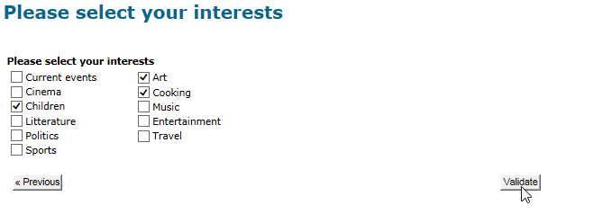

# 设计调查{#building-a-survey}

## Creating a new survey {#creating-a-new-survey}

本章详细介绍了使用 **调查** 设计Adobe Campaign类型表单的过程，以及可用的选项和配置。 Adobe Campaign允许您向用户提供此调查，并在数据库中收集和存档答案。

Web 窗体通过树 **[!UICONTROL Resources > Online > Web applications]** 的节点访问。 要创建调查，请单 **[!UICONTROL New]** 击应用程序列表上方的按钮，或右键单击列表并选择 **[!UICONTROL New]**。

选择调查模板(**[!UICONTROL newSurvey]** 默认)。

表单的页面是使用特殊编辑器创建的，它允许您定义和配置（文本）输入字段、选择字段(列表、复选框等) 和静态元素（图像、HTML内容等）。 可以在“容器”中收集它们，并根据要求进行排版(请参 [阅添加问题](#adding-questions))。

>[!NOTE]
>
>有关如何定义内容和创建Web表单的屏幕布局的详细信息，请参 [阅此部分](../../web/using/about-web-forms.md)。

## 添加字段 {#adding-fields}

表单中的字段使用户能够输入信息并选择选项。 对于表单中的每个页面，它们是使用菜单通过工具栏中的第一个按钮创 **[!UICONTROL Add using the wizard]** 建的。

>[!NOTE]
>
>您还可以使用右键单击并插入输入区域。 默认情况下，区域会插入到所选树的末尾。 使用工具栏中的箭头移动它。

### 字段类型 {#types-of-fields}

向调查添加字段时，您需要选择其类型。 可以使用以下选项：

1. **[!UICONTROL Answer a question]**:通过此选项，可声明新字段（称为“已存档字段”）以存储答案。 在这种情况下，将保存收集的所有值，即使参加者多次填写表单也是如此。 此存储模式仅在调查中 **可用**。 请参阅存 [储收集的答案](../../web/using/managing-answers.md#storing-collected-answers)。
1. **[!UICONTROL Edit a recipient]**:通过此选项，您可以在数据库中选择一个字段。 在这种情况下，用户答案将存储在此字段中。 对于每个参加者，仅保留保存的最后一个值，并将其添加到用户档案数据。
1. **[!UICONTROL Add a variable]**:此选项允许您创建一个设置，以便信息不存储在数据库中。 局部变量可声明为上游。 您还可以在创建字段时直接添加这些字段。
1. **[!UICONTROL Import an existing question]**:通过此选项，可导入在其他调查创建的现有问题。

   >[!NOTE]
   >
   >存储模式和字段导入在存储收 [集的答案中详细介绍](../../web/using/managing-answers.md#storing-collected-answers)。

要添加的字段的性质(下拉列表、文本字段、复选框等) 调整为选定的存储模式。 您可以使用选项卡 **[!UICONTROL Type]** 的字段进 **[!UICONTROL General]** 行更改，但应确保与数据类型保持一致。

本节详细介绍了各种类型的可 [用字段](../../web/using/about-web-forms.md)。

## 调查特定元素 {#survey-specific-elements}

在线调查使用Web 应用程序功能。 链接到调查字段的特定功能详见下文。

### 多选 {#multiple-choice}

对于 **[!UICONTROL Multiple choice]** 类型控件，您可以定义最小和最大选择数。 例如，此选项允许您从可用选项强制选择 **至少** 2个值 **和最** 多4个值：

如果选择的数量太大或太小，将显示相应的消息。

>[!NOTE]
>
>在这种情况下，选项会使用复选框进行选择。 如果只能使用一个选项，则使用单选按钮。

相应的配置如下：

此外，此输入字段的存储位置必须是类 **[!UICONTROL Multiple values]** 型存 **档字段**:

>[!CAUTION]
>
>* 此功能仅对调查类 **型表** 单可用。
>* 此选项与随机问题显示不兼容。 For more on this, refer to [Adding questions](#adding-questions).

### 添加问题 {#adding-questions}

有两种容器:标准和问题。 标准容器用于配置页面布局和页面中的条件显示。 本节详细介绍 [了这些方法](../../web/using/about-web-forms.md)。

使用问 **题容器** ，向页面添加问题并在层次结构中的下方插入可能的答案。 可以在报告中分析用户对此类容器中所放置的问题的答复。

>[!CAUTION]
>
>切勿在层次 **结构中** ，将问题 **容器** 插入其他问题容器下。

问题的标签在标签字段中输入。 在这种情况下，将应用表单样式表中的样式。 选择选 **[!UICONTROL Enter the title in HTML format]** 项以对其进行个性化。 这将允许您访问HTML编辑器。

>[!NOTE]
>
>有关使 [用HTML编辑](../../web/using/about-web-forms.md) 器的详细信息，请参阅本节。

例如：

在以上示例中，渲染将如下所示：

>[!NOTE]
>
>每个问题都有“问 **题类型** ”容器。

您可以启用按Adobe Campaign随机绘制问题。 然后，可以在配置窗口底部的字段中指定要在页面中显示的问题数。

渲染将如下所示：

刷新页面时，显示的问题不相同。

>[!CAUTION]
>
>当随机显示问题(在页&#x200B;**[!UICONTROL Display randomly]** 面上选中的选项)时，请注意不要使用多个选择问题，对于这些问题，必须进行一个或多个选择。

