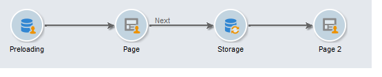

# 内容编辑最佳实践{#content-editing-best-practices}


为确保编辑的最佳操作，我们建议遵循以下准则：

* 之前 **导入HTML页面模板** 在Adobe Campaign中，请确保模板已打开，并在各种浏览器中正确显示。
* 如果HTML页面包含 **JavaScript脚本**，则需要执行 **无错误** 编辑器外。
* 在构建模板时，我们建议向标记添加 **&#39;type’** 属性。`<input>`此信息将由编辑器处理，并帮助用户在配置Web应用程序时将数据库的字段链接到表单的字段。

   模板中的 HTML 代码示例：

   ```
   <input id="email" type="email" name="email"/>
   ```

   的 **&#39;type&#39;** 属性在界面中以下形式显示：

   

   “type”属性的官方列表可用 [在此网站中](https://www.w3schools.com/tags/att_input_type.asp).

* 使用DCE模拟结束页面的步骤：

   

* 确保只有一个 `<body> </body>` 中。
* 上传CSS或JS文件后，将不会上传.zip文件中包含的图像。 因此，对CSS中存在的这些图像的引用不会更新。

## 内容编辑器支持的格式 {#content-editor-supported-formats}

数字内容编辑器支持HTML格式：您可以切换到 **来源** 模式。

数字内容编辑器的导入功能可与以下受支持的格式配合使用：

* CSS:.zip文件中存在的图像不会导入。 对CSS中这些图像的引用不会更新。
* JS:.zip文件中存在的图像不会导入。 JS中对这些图像的引用不会更新。
* Iframe:不会导入链接的页面。
* 登陆页面和Web应用程序：如果 **表单** 标记缺失，将显示警告。 A `<form> </form>` 消息正文中必须始终存在。

数字内容编辑器还可以与以下受支持的代码页面配合使用：

* iso-8859-1
* iso-8859-2
* utf-7
* utf-8（使用物料清单时推荐）
* iso-8859-15
* us-ascii
* 换行符
* iso-2022-jp
* big-5
* euc-kr
* utf-16

>[!NOTE]
>
>HTML代码页必须在元标记(HTML4或HTML5)或物料清单中定义。 如果没有可用的代码页，请在latin1中打开文件。

## HTML内容状态 {#html-content-statuses}

编辑器的上半部分显示与内容状态相关的消息。 消息的颜色代码如下所示：

* **灰色消息**:信息消息，则无需在编辑器中执行任何操作。
* **蓝色消息**:与正在编辑的内容相关的信息消息。
* **黄色消息**:警告或错误消息，需要代表用户执行操作。

### 编辑Web应用程序时的消息列表 {#list-of-messages-when-editing-a-web-application}

* HTML内容可正常使用。
* Web应用程序尚未发布，无法联机访问。
* Web应用程序处于联机状态，请再次发布以应用任何更改。
* 页面内容无法正常使用。 必须包含HTML表单(`<form>`)
* 没有要配置的输入区域或按钮。
* 要启用到下一页的过渡，您需要将“下一页”操作链接到当前页面上的按钮或链接。

### 编辑投放时的消息列表 {#list-of-messages-when-editing-a-delivery}

* 投放内容可正常使用
* 没有要配置的字段或个性化块。
* 投放内容已准备就绪，请再次运行分析以应用任何更改。
* 投放已准备就绪，可供发送。
