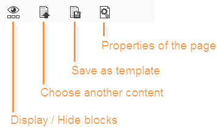

# 内容编辑器界面{#content-editor-interface}

## 编辑窗口 {#editing-window}

DCE编辑窗口分为三个不同的部分。 它们允许您查看、修改和检查内容的状态。

1. 的 **top** 部分是向用户发送消息的显示区域。 这些消息指示Web应用程序状态或正在创建的投放的状态，以及与内容相关的警告和错误消息。 有关更多信息，请参阅 [HTML内容状态](content-editing-best-practices.md#html-content-statuses).
1. 的部分 **left** 窗口的是用于编辑内容的区域。 在此区域中，用户可以使用弹出工具栏直接与内容交互：在图像中插入链接、更改字体、删除字段等。 有关更多信息，请参阅 [编辑表单](editing-content.md#editing-forms).
1. 的部分 **右** 窗口是控制面板区域。 此区域将编辑器的不同选项分组，特别是与配置页面标题和块常规选项相关的选项：添加边框、将数据库字段与输入区域链接、访问网页属性等。 有关更多信息，请参阅 [全局选项](#global-options) 和 [编辑内容](editing-content.md) 中。

## 全局选项 {#global-options}

编辑器的右上方部分允许您访问全局选项，这些选项允许您控制当前正在创建的内容。

它有四个图标：

* 的 **显示/隐藏块** 图标，可在内容块周围显示蓝色框架(对应于 `
` HTML标记)。

* 的 **选择其他内容** 图标，允许用户从模板（现有模板或现成模板）加载新内容。

   

   >[!CAUTION]
   >
   >所选内容将替换当前内容。

* 的 **另存为模板** 图标，可将当前内容另存为模板。 必须输入模板的标签和内部名称。 模板存储在 **[!UICONTROL Resources > Templates > Content templates]** 节点。

   

   保存后，该模板即可用，并可在创建新内容时进行选择。

   

* 的 **页面属性** 图标，可选择HTML页面顶部的内容信息。

   

   >[!NOTE]
   >
   >此信息对应于 **`<title>`** 和 **`<meta>`** HTML标记。
   >
   >关键词必须用逗号分隔。

## 块选项 {#block-options}

编辑器右侧的部分将允许您对内容执行操作的主要选项分组。 要显示这些选项，必须选择块：这些选项的性质取决于所选块。

您可以：

* 确定一个或多个块的显示，请参阅 [定义可见性条件](editing-content.md#defining-a-visibility-condition),
* 定义边框和框架，请参阅 [添加边框和背景](editing-content.md#adding-a-border-and-background),
* 定义图像属性（大小、标题），请参阅 [编辑图像属性](editing-content.md#editing-image-properties),
* 将数据库链接到表单元素（输入区域、复选框），请参阅 [更改表单的数据属性](editing-content.md#changing-the-data-properties-for-a-form),
* 将表单的一部分设为必填项，请参阅 [更改表单的数据属性](editing-content.md#changing-the-data-properties-for-a-form),
* 为按钮定义操作，请参阅 [向按钮添加操作](editing-content.md#adding-an-action-to-a-button).

## 内容工具栏 {#content-toolbar}

工具栏是 **弹出元素** DCE接口的DCE接口根据所选块显示不同的功能。

>[!CAUTION]
>
>利用某些工具栏功能，可将 HTML 格式的格式化。但是，如果页面包含CSS样式表，则 **说明** 从样式表中 **优先级** 在工具栏指定的说明上。
