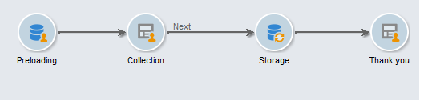
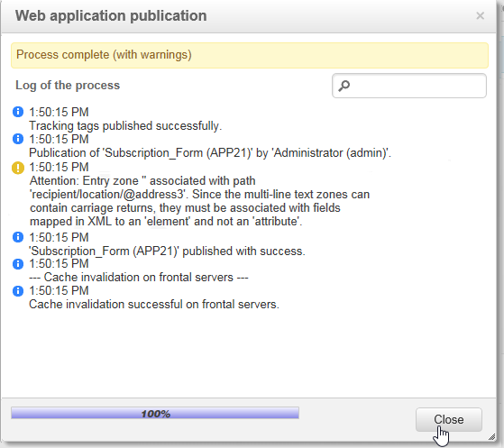

# 创建登陆页面{#creating-a-landing-page}

## 关于创建登陆页面 {#about-landing-pages-creation}

此用例展示了如何使用数字编辑器从Adobe Campaign控制台创建登陆页面。

在Adobe Campaign中开始配置登陆页面之前，请确保您有&#x200B;**一个或多个模板**&#x200B;来表示HTML页面。

此用例的主要目的是使用DCE中的函数，使登陆页面表单字段与Adobe Campaign中的内部字段相对应。

## 创建登陆页面 {#creating-the-landing-page}

要创建新的登陆页面类型Web应用程序，请执行以下步骤：

1. 转到&#x200B;**[!UICONTROL Campaigns]**&#x200B;选项卡，单击&#x200B;**[!UICONTROL Web application]**&#x200B;链接，然后单击&#x200B;**[!UICONTROL Create]**&#x200B;按钮。
1. 选择&#x200B;**[!UICONTROL New landing page]**&#x200B;模板并输入标签，然后单击&#x200B;**[!UICONTROL Save]**。

   

1. 单击&#x200B;**[!UICONTROL Edit]**&#x200B;选项卡。
1. 删除&#x200B;**End**&#x200B;活动。
1. 在&#x200B;**[!UICONTROL Storage]**&#x200B;活动之后添加&#x200B;**[!UICONTROL Page]**&#x200B;活动。
1. 编辑&#x200B;**页面2**&#x200B;活动，然后取消选中&#x200B;**[!UICONTROL Properties]**&#x200B;选项卡中的&#x200B;**[!UICONTROL Activate outbound transitions]**&#x200B;选项。

   

1. 保存更改。

然后，您将获得以下排序：

>[!NOTE]
>
>有关创建Web应用程序的更多信息，请参阅[此部分](creating-a-new-web-application.md)。

## 步骤1 — 选择和加载模板 {#step-1---selecting-and-loading-templates}

在本节中，我们将介绍如何&#x200B;**导入Web应用程序每个页面的HTML内容**。

模板必须包含：

* **HTML**&#x200B;文件（必填）
* 一个或多个&#x200B;**CSS**&#x200B;文件（可选）
* 一个或多个&#x200B;**图像**（可选）

要在第一页上加载模板，请应用以下步骤：

1. 打开Web应用程序的第一个&#x200B;**[!UICONTROL Page]**&#x200B;活动。
1. 选择&#x200B;**[!UICONTROL From a file]**&#x200B;以获取内容模板。

   

1. 选择要使用的HTML文件。
1. 单击&#x200B;**Open**&#x200B;以开始导入。

   加载期间，将显示共享文件的列表。 导入系统会检查链接到所选HTML的所有文件（CSS、图像等）是否都存在。

   完成导入后，单击&#x200B;**[!UICONTROL Close]**&#x200B;按钮。

   

   >[!CAUTION]
   >
   >您必须等到收到以下消息后才能关闭：**[!UICONTROL The external resources have been successfully published]** 。

1. 单击&#x200B;**[!UICONTROL Properties]**&#x200B;选项卡。
1. 为每个页面输入&#x200B;**标签**(例如：第1页=收集，第2页=谢谢)。

   

对Web应用程序中插入的每个页面应用这些步骤。

>[!CAUTION]
>
>**DCE为加载的HTML页面执行JavaScript代码。** HTML模板中可能显示在Adobe Campaign界面中的JavaScript错误。这些错误与编辑器无关。 要检查导入的文件中是否没有错误，建议先在浏览器(Internet Explorer / Firefox / Chrome)中测试这些文件，然后再将文件导入DCE。

## 步骤2 — 配置内容 {#step-2---configuring-the-content}

在本节中，我们将调整导入的内容，并将数据库的字段链接到网页的形式。 以前创建的Web应用程序是：

### 修改内容 {#modifying-content}

让我们从更改页面的颜色开始。 操作步骤：

1. 打开&#x200B;**[!UICONTROL Collection]**&#x200B;页面。
1. 单击背景。
1. 单击右侧的&#x200B;**背景颜色**。
1. 选择新的背景颜色。
1. 单击&#x200B;**确定**&#x200B;以确认更改。

   

1. 应用这些相同的流程以更改按钮的颜色

   

### 链接表单字段 {#linking-form-fields}

为了保存提供的信息，我们将将页面中的字段链接到数据库中的字段。

1. 选择表单字段。
1. 编辑编辑器右侧的&#x200B;**[!UICONTROL Field]**&#x200B;部分。
1. 选择要链接到选定字段的数据库字段。

   

1. 对页面上的每个字段重复此过程。

您可以将字段设为必填字段：例如，单击&#x200B;**[!UICONTROL Email]**&#x200B;字段，然后启用&#x200B;**Mandatory**&#x200B;选项。

### 创建指向下一页的链接 {#creating-a-link-to-the-next-page}

此步骤是强制性的，因为它将允许Web应用程序确定后续步骤的顺序：将收集的数据保存到数据库中，然后显示下一页（**谢谢**&#x200B;页）。

1. 选择&#x200B;**[!UICONTROL Collection]**&#x200B;页面的&#x200B;**[!UICONTROL Send it!]**&#x200B;按钮。
1. 单击&#x200B;**[!UICONTROL Action]**&#x200B;下拉菜单。
1. 选择&#x200B;**[!UICONTROL Next page]**&#x200B;操作。

   

### 插入个性化字段 {#inserting-a-personalization-field}

此步骤允许您个性化“感谢”页面。 操作步骤：

1. 打开&#x200B;**[!UICONTROL Thank you]**&#x200B;页面。
1. 将光标放在要插入收件人名字的文本区域中。
1. 在工具栏的&#x200B;**[!UICONTROL Insert]**&#x200B;菜单中选择&#x200B;**[!UICONTROL Personalization field]**。
1. 选择名字。

   

个性化字段在编辑器中的背景为黄色。

## 步骤3 — 发布内容 {#step-3---publishing-content}

内容从Web应用程序功能板发布。 单击&#x200B;**[!UICONTROL Publish]**&#x200B;按钮以运行它。

在发布期间，会显示日志。 发布系统分析Web应用程序中找到的所有内容

>[!NOTE]
>
>在发布日志中，警告和错误按活动排序。

表单现已可用：其URL可在应用程序功能板中访问，并可发送给收件人。
