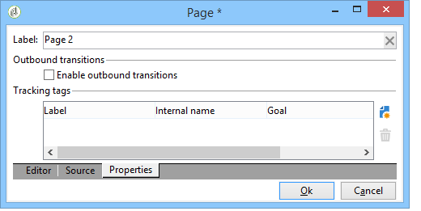
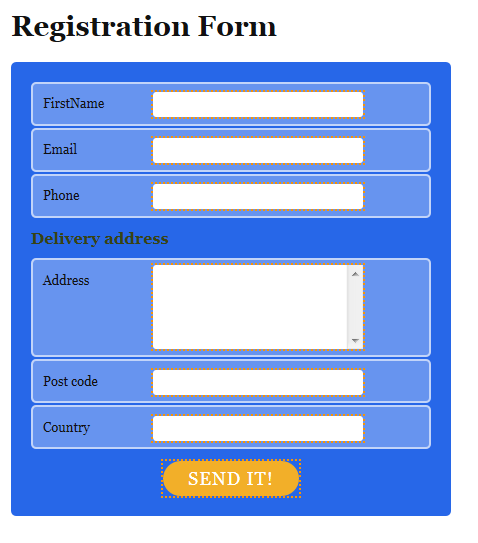

# 创建登陆页面{#creating-a-landing-page}

## 关于登陆页面创建 {#about-landing-pages-creation}

此用例展示了如何使用数字编辑器从Adobe Campaign控制台创建登陆页面。

在Adobe Campaign中开始配置登陆页面之前，请确保已 **一个或多个模板** 表示HTML页面。

此用例的主要目的是使用DCE中的函数，使登陆页面表单字段与Adobe Campaign中的内部字段相对应。

## 创建登陆页面 {#creating-the-landing-page}

要创建新的登陆页类型Web应用程序，请执行以下步骤：

1. 转到 **[!UICONTROL Campaigns]** 选项卡，然后单击 **[!UICONTROL Web application]** 链接，然后单击 **[!UICONTROL Create]** 按钮。
1. 选择 **[!UICONTROL New landing page]** 模板并输入标签，然后单击 **[!UICONTROL Save]**.

   

1. 单击 **[!UICONTROL Edit]** 选项卡。
1. 删除 **结束** 活动。
1. 添加 **[!UICONTROL Page]** 活动之后 **[!UICONTROL Storage]** 活动。
1. 编辑 **第2页** 活动，然后取消选中 **[!UICONTROL Activate outbound transitions]** 中的选项 **[!UICONTROL Properties]** 选项卡。

   

1. 保存更改.

然后，您将获得以下排序：

>[!NOTE]
>
>有关创建Web应用程序的详细信息，请参阅 [本节](creating-a-new-web-application.md).

## 步骤1 — 选择和加载模板 {#step-1---selecting-and-loading-templates}

在本节中，我们将了解如何 **导入HTML内容** Web应用程序的每个页面。

模板必须包含：

* 一个 **HTML** 文件（必需）
* 一个或多个 **CSS** 文件（可选）
* 一个或多个 **图像** （可选）

要在第一页上加载模板，请应用以下步骤：

1. 打开第一个 **[!UICONTROL Page]** Web应用程序的活动。
1. 选择 **[!UICONTROL From a file]** 以获取内容模板。

   

1. 选择要使用的HTML文件。
1. 单击 **打开** 以开始导入。

   在加载过程中，将显示共享文件的列表。 导入系统检查链接到选定HTML的所有文件（CSS、图像等）是否存在。

   单击 **[!UICONTROL Close]** 按钮。

   

   >[!CAUTION]
   >
   >您必须等到收到以下消息后再关闭： **[!UICONTROL The external resources have been successfully published]** .

1. 单击 **[!UICONTROL Properties]** 选项卡。
1. 输入 **标签** ，例如：Page 1=收集，Page 2=感谢)。

   

对Web应用程序中插入的每个页面应用这些步骤。

>[!CAUTION]
>
>**DCE执行已加载HTML页的JavaScript代码。** HTML模板中可能出现的Adobe Campaign界面中的JavaScript错误。 这些错误与编辑器无关。 要检查导入的文件中是否没有错误，建议在将文件导入DCE之前在Web浏览器中测试它们。

## 步骤2 — 配置内容 {#step-2---configuring-the-content}

在本节中，我们将调整导入的内容，并将数据库的字段链接到网页的形式。 以前创建的Web应用程序是：

### 修改内容 {#modifying-content}

让我们从更改页面的颜色开始。 操作步骤：

1. 打开 **[!UICONTROL Collection]** 页面。
1. 单击背景。
1. 单击 **背景颜色** 在右手边。
1. 选择新的背景颜色。
1. 单击 **确定** 以确认更改。

   

1. 应用这些相同的进程以更改按钮的颜色

   

### 链接表单字段 {#linking-form-fields}

为了保存提供的信息，我们将将页面中的字段链接到数据库中的字段。

1. 选择表单字段。
1. 编辑 **[!UICONTROL Field]** 部分。
1. 选择要链接到所选字段的数据库字段。

   

1. 对页面上的每个字段重复此过程。

您可以将字段设为必填：例如，单击 **[!UICONTROL Email]** 字段，然后启用 **必需** 选项。

### 创建指向下一页的链接 {#creating-a-link-to-the-next-page}

此步骤是必需的，因为它允许Web应用程序确定后续步骤的顺序：将收集的数据保存在数据库中，然后显示下一页(**谢谢** 页面)。

1. 选择 **[!UICONTROL Send it!]** 的按钮 **[!UICONTROL Collection]** 页面。
1. 单击 **[!UICONTROL Action]** 下拉菜单。
1. 选择 **[!UICONTROL Next page]** 操作。

   

### 插入个性化字段 {#inserting-a-personalization-field}

通过此步骤，您可以个性化感谢页面。 操作步骤：

1. 打开 **[!UICONTROL Thank you]** 页面。
1. 将光标放在要插入收件人名字的文本区域中。
1. 选择 **[!UICONTROL Personalization field]** 在 **[!UICONTROL Insert]** 工具栏的菜单。
1. 选择名字。

   

个性化字段在编辑器中具有黄色背景。

## 步骤3 — 发布内容 {#step-3---publishing-content}

内容从Web应用程序仪表板发布。 单击 **[!UICONTROL Publish]** 按钮以运行它。

在发布期间，将显示日志。 发布系统分析Web应用程序中的所有内容

>[!NOTE]
>
>在发布日志中，警告和错误按活动排序。

该表单现已可用：其URL可在应用程序功能板中访问，并可发送给收件人。
