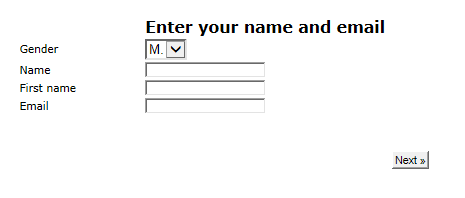
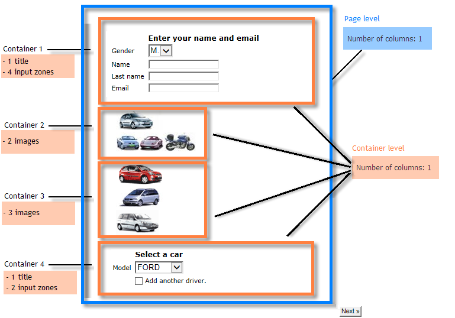

# 定义 Web 窗体布局{#defining-web-forms-layout}

## 创建容器 {#creating-containers}

容器允许您组合页面的字段并配置其布局；以组织页面中的元素。

对于表单的每个页面，容器都是通过 **[!UICONTROL Containers]** 工具栏的按钮。

使用容器可对页面的元素进行分组，而无需将标签添加到最终渲染。 元素将分组到容器子树中。 标准容器允许您管理布局。

例如：

标签的位置将应用于层次结构中放置在容器下方的元素。 如有必要，可以为每个元素重载。 添加或删除列以更改布局。 参见 [定位页面上的字段](#positioning-the-fields-on-the-page).

在上例中，渲染将如下所示：

## 定位页面上的字段 {#positioning-the-fields-on-the-page}

Web窗体的布局在每个容器中逐页定义，并且可以根据需要过载。

页面划分为列：每个页面包含特定数量的列。 页面占用的每个字段 **n** 单元格。 容器还占用一定数量的列，并且它们包含的字段占用一定数量的单元格。

默认情况下，页面构建在单个列上，每个元素占用一个单元格。 这意味着字段会逐行显示，每个字段占一整行，如下所示：

在以下示例中，保留了默认配置。 页面占用的单列包含四个容器。

每个容器占用一列，每个元素占用一个单元格：

渲染如下：

可以调整显示参数以获得以下渲染：

在上述渲染示例中，每个输入字段、标题和图像占据容器列中的一个单元格。

您可以修改每个容器中的格式。 在我们的示例中，您可以将容器4的内容分布到两列上并分发元素。

标题和列表各占一个单元格（因此是容器的整行），并且复选框在两个单元格上扩展。 归属于输入字段的单元格数在 **[!UICONTROL General]** 选项卡或 **[!UICONTROL Advanced]** 选项卡，根据字段类型：

## 定义标签的位置 {#defining-the-position-of-labels}

您可以在表单中定义字段和标签的对齐方式。

默认情况下，字段和页面其他内容的显示参数继承自表单的一般配置、页面的配置或父容器的配置（如果存在）。

在表单属性框中指定整个表单的全局显示参数。 此 **[!UICONTROL Rendering]** 选项卡允许您选择标签的位置。

可通过，为每个页面、每个容器和每个字段重载此位置 **[!UICONTROL Advanced]** 选项卡。

支持以下对齐：

* 继承：对齐方式继承自父元素（默认值），即父容器（如果有）或其他页面。
* 左/右：标签位于字段的右侧或左侧，
* 以上/以下：标签位于字段上方或下方，
* 隐藏：不显示标签。
