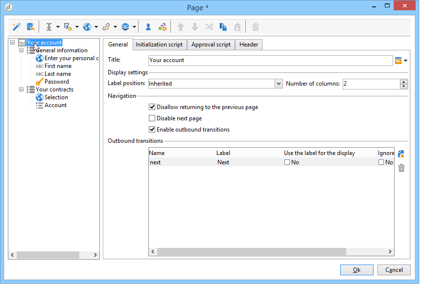

# 定义 Web 窗体布局{#defining-web-forms-layout}

## 创建容器{#creating-containers}

容器允许您组合页面的字段并配置其布局；来组织页面中的元素。

对于表单的每页，通过工具栏的&#x200B;**[!UICONTROL Containers]**&#x200B;按钮创建容器。

使用容器对页面元素进行分组，而不向最终呈现添加标签。 元素被分组到容器子树中。 标准容器允许您管理布局。

例如：

标签的位置将应用于层次结构中容器下方的元素。 如有必要，可以为每个元素重载。 添加或删除列以更改布局。 请参阅[定位页面](#positioning-the-fields-on-the-page)上的字段。

在上例中，渲染将如下所示：

## 在页面{#positioning-the-fields-on-the-page}上放置字段

Web表单的布局是在每个容器中逐页定义的，如果需要，可以重载。

页面分为多列：每个页面都包含一定数量的列。 页面的每个字段都占用&#x200B;**n**&#x200B;单元格。 容器还占用一定数量的列，而它们包含的字段占用一定数量的单元格。

默认情况下，页面构建在单个列上，每个元素占用一个单元格。 这意味着字段在另一个下方显示，每个字段占据一行，如下所示：

在以下示例中，保留了默认配置。 该页面占据一列，其中包括四个容器。

每个容器占据一列，每个元素占据一个单元格：

渲染如下：

您可以调整显示参数以获得以下渲染：

在上面的渲染示例中，每个输入字段、标题和图像在容器的列中占据一个单元格。

您可以在每个容器中修改格式。 在我们的示例中，您可以将容器4的内容分布到两列中，并分发元素。

标题和列表分别占用一个单元格(因此占用容器的整行)，复选框延伸到两个单元格上。 根据字段的类型，在&#x200B;**[!UICONTROL General]**&#x200B;选项卡或&#x200B;**[!UICONTROL Advanced]**&#x200B;选项卡中定义属于输入字段的单元格数：

## 定义标签{#defining-the-position-of-labels}的位置

您可以定义表单中字段和标签的对齐方式。

默认情况下，页面的字段和其他内容的显示参数从表单的常规配置、页面配置或父容器的配置（如果存在）继承。

整个表单的全局显示参数在表单属性框中指定。 使用&#x200B;**[!UICONTROL Rendering]**&#x200B;选项卡可以选择标签的位置。

通过&#x200B;**[!UICONTROL Advanced]**&#x200B;选项卡，可以为每个页面、每个容器和每个字段重载此位置。

支持以下对齐方式：

* 继承：对齐方式从父元素（默认值）继承，即父容器（如果有），或从页面继承。
* 左／右：标签位于字段的右侧或左侧，
* 上／下：标签位于字段上方或下方，
* 隐藏：不显示标签。

