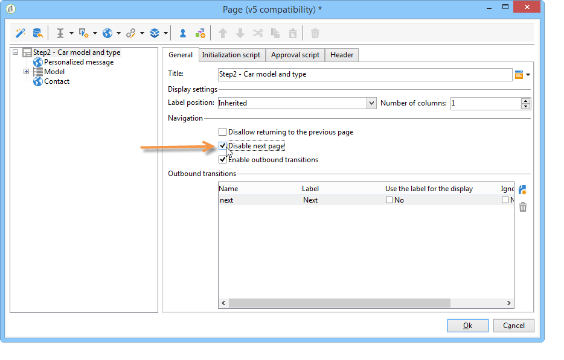
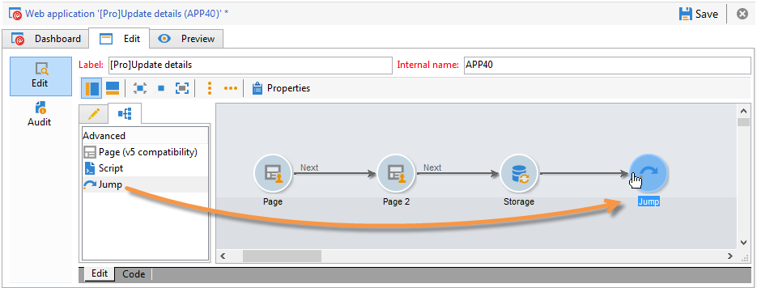

# 定义Web窗体页面排序{#defining-web-forms-page-sequencing}


表单可包含一个或多个页面。 它通过图表构建，允许您对页面进行排序、测试、脚本执行、页面跳转和记录步骤。 全局图设计模式与Campaign工作流相同。

## 关于上一页和下一页 {#about-previous-page-and-next-page}

对于每个页面，您可以删除 **[!UICONTROL Next]** 或 **[!UICONTROL Previous]** 按钮。 要执行此操作，请选择相关页面并选择选项 **[!UICONTROL Disable next page]** 或 **[!UICONTROL Disallow returning to the previous page]** .



您可以使用链接替换这些按钮。 参见 [插入HTML内容](static-elements-in-a-web-form.md#inserting-html-content).

## 插入跳转 {#inserting-a-jump}

此 **[!UICONTROL Jump]** 对象在用户单击时提供对另一个页面或其他表单的访问权限 **[!UICONTROL Next]**.

目标可以是：

* 表单的另一页。 要执行此操作，请选择 **[!UICONTROL Internal activity]** ，然后指定所需的页面，如下所示：

   

* 另一种形式。 要执行此操作，请选择 **[!UICONTROL Explicit]** 选项并指定目标表单。

   

* 目标可以存储在变量中。 在这种情况下，请从下拉列表中选择它，如下所示：

   

* 此 **[!UICONTROL Comment]** 选项卡允许您输入当操作员单击图中的对象时将显示的信息。

   

## 示例：根据URL的参数访问其他表单 {#example--accessing-another-form-according-to-a-parameter-of-the-url}

在以下示例中，我们要配置一个Web窗体，该窗体在获得批准后将显示另一个由URL参数指定的窗体。 要执行此操作，请应用以下步骤：

1. 在表单末尾插入跳转：这将替换 **[!UICONTROL End]** 盒子。

   

1. 在表单属性中，添加参数(**下一个**)存储在局部变量中(**下一个**)。 有关局部变量的详细信息，请参见 [将数据存储在局部变量中](web-forms-answers.md#storing-data-in-a-local-variable).

   

1. 编辑 **[!UICONTROL Jump]** 对象，选择 **[!UICONTROL Stored in a variable]** 选项，然后选择 **下一个** 变量。

   

1. 投放URL必须包含目标表单的内部名称，例如：

   ```
   https://[myserver]/webForm/APP62?&next=APP22
   ```

   当用户单击 **[!UICONTROL Approve]** 按钮，表单 **APP22** 将显示。

## 插入指向表单另一页的链接 {#inserting-a-link-to-another-page-of-the-form}

您可以插入指向表单其他页面的链接。 为此，请添加 **[!UICONTROL Link]** 在页面中键入静态元素。 有关更多信息，请参阅 [插入链接](static-elements-in-a-web-form.md#inserting-a-link).

## 条件页面显示 {#conditional-page-display}

### 根据响应显示 {#display-based-on-responses}

此 **[!UICONTROL Test]** 框可让您对表单中页面的排序进行条件。 它允许您根据测试结果定义各种分支行。 这样，您就可以根据用户提供的答案显示不同的页面。

例如，您可以为已在线订购的客户显示一个不同的页面，为已下十个以上订单的客户显示另一个页面。 要执行此操作，请在表单的第一页中插入 **[!UICONTROL Number]** 键入输入字段，以便用户说明他们下了多少订单。


您可以将此信息存储在数据库的字段中，也可以使用局部变量。

>[!NOTE]
>
>有关存储模式的详情，请参见 [响应存储字段](web-forms-answers.md#response-storage-fields).

在我们的示例中，我们希望使用变量：


在表单的图表中，插入测试框以定义条件。 对于每个条件，都将在测试框的输出中添加一个新分支。


选择 **[!UICONTROL Activate the default branching]** 选项，用于为没有任何条件为true的情况添加过渡。 如果定义的条件涵盖了每个可能的情况，则无需使用此选项。

接下来，当以下一个或多个条件为true时，定义页面排序：


### 根据参数显示 {#display-based-on-parameters}

您还可以根据Web窗体的初始化参数或根据数据库中存储的值对页面排序进行个性化设置。 参见 [表单URL参数](defining-web-forms-properties.md#form-url-parameters).

## 添加脚本 {#adding-scripts}

此 **[!UICONTROL Script]** 对象允许您直接输入JavaScript脚本，例如，修改字段值，从数据库中检索数据，或调用Adobe Campaign API。

## 个性化结束页面 {#personalizing-the-end-page}

必须在图的末尾放置一个结束页面。 用户单击 **[!UICONTROL Approve]** 按钮。

要个性化此页面，请双击 **[!UICONTROL End]** 并在中心编辑器中输入页面内容。


* 您可以复制和粘贴现有HTML内容。 要执行此操作，请单击 **[!UICONTROL Display source code]** 并插入HTML代码。
* 您可以使用外部URL；要实现此目的，请选择相应的选项，然后输入要显示的页面的URL。
