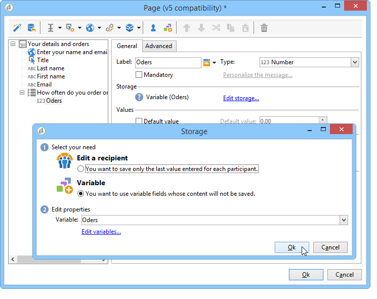

# 定义Web表单页面排序{#defining-web-forms-page-sequencing}

表单可以包含一个或多个页面。 它通过图表构建，该图表允许您对页面和测试、脚本执行和页面跳转录制阶段进行排序。 图构建模式与工作流相同。

## 关于上一页和下一页 {#about-previous-page-and-next-page}

对于每个页面，您都可以删除 **[!UICONTROL Next]** 或按 **[!UICONTROL Previous]** 钮。 为此，请选择相关页面，然后选择选 **[!UICONTROL Disable next page]** 项或 **[!UICONTROL Disallow returning to the previous page]** 。


您可以用链接替换这些按钮。 请参阅 [插入HTML内容](../../web/using/static-elements-in-a-web-form.md#inserting-html-content)。

## 插入跳转 {#inserting-a-jump}

当用 **[!UICONTROL Jump]** 户单击时，该对象允许访问其他页面或其他表单 **[!UICONTROL Next]**。

目标可以是：

* 表单的另一页。 为此，请选择 **[!UICONTROL Internal activity]** 并指定所需的页面，如下所示：

   

* 另一个表单。 为此，请选择选 **[!UICONTROL Explicit]** 项并指定目标表单。

   

* 目标可以存储在变量中。 在这种情况下，请从下拉列表中选择它，如下所示：

   

* 在选 **[!UICONTROL Comment]** 项卡中，您可以输入操作员单击图中的对象时可见的信息。

   

## 示例：根据URL的参数访问其他表单 {#example--accessing-another-form-according-to-a-parameter-of-the-url}

在以下示例中，我们要配置一个Web表单，该表单在获得批准后，将显示由URL参数指定的另一个表单。 为此，请应用以下步骤：

1. 在表单结尾处插入跳转：这将替换该 **[!UICONTROL End]** 框。

   

1. 在表单属性中，添加一个存储在本&#x200B;**地变量**（下一个）中的参数(**下一个**)。 本地变量在将数据存 [储到本地变量中有详细介绍](../../web/using/web-forms-answers.md#storing-data-in-a-local-variable)。

   

1. 编辑 **[!UICONTROL Jump]** 对象，选择 **[!UICONTROL Stored in a variable]** 选项，然后从下 **拉框中选** 择下一个变量。

   

1. 交付URL必须包括目标表单的内部名称，例如：

   ```
   https://[myserver]/webForm/APP62?&next=APP22
   ```

   当用户单击该按 **[!UICONTROL Approve]** 钮时，将显 **示表单APP22** 。

## 插入指向表单其他页面的链接 {#inserting-a-link-to-another-page-of-the-form}

您可以插入指向表单其他页面的链接。 为此，请向页面添 **[!UICONTROL Link]** 加一个类型静态元素。 有关此操作的详细信息，请参 [阅插入链接](../../web/using/static-elements-in-a-web-form.md#inserting-a-link)。

## 条件页面显示 {#conditional-page-display}

### 根据响应显示 {#display-based-on-responses}

通过 **[!UICONTROL Test]** 该框，您可以对表单中的页面排序进行条件设置。 它允许您根据测试结果定义不同的分支线。 这使您能够根据用户提供的答案显示不同的页面。

例如，您可以为已在线订购的客户显示其他页面，为已订购十个以上的客户显示其他页面。 为此，在表单的第一页中，插入一个类型输 **[!UICONTROL Number]** 入字段，以便用户声明已下达的订单数。


您可以将此信息存储在数据库的字段中，或使用本地变量。

>[!NOTE]
>
>“响应”存储字段中详 [细介绍了存储模式](../../web/using/web-forms-answers.md#response-storage-fields)。

在我们的示例中，我们希望使用一个变量：



在表单的图中，插入一个测试框以定义条件。 对于每个条件，将在测试框的输出处添加新分支。


选择 **[!UICONTROL Activate the default branching]** 此选项可在没有条件的情况下添加过渡。 如果所定义的条件涵盖了所有可能的情况，则此选项是不必要的。

接下来，当一个或其他条件为true时定义页面排序，例如：


### 基于参数显示 {#display-based-on-parameters}

您还可以根据Web表单的初始化参数或数据库中存储的值个性化页面排序。 请参 [阅表单URL参数](../../web/using/defining-web-forms-properties.md#form-url-parameters)。

## 添加脚本 {#adding-scripts}

该 **[!UICONTROL Script]** 对象允许您直接输入JavaScript脚本，例如修改字段值、从数据库检索数据或调用Adobe Campaign API。

## 个性化结束页面 {#personalizing-the-end-page}

必须在图的末尾放置一个结束页面。 当用户单击Web表单中的按钮时，将 **[!UICONTROL Approve]** 显示结束页面。

要个性化此页面，请在中 **[!UICONTROL End]** 央编辑器中双击并输入页面内容。


* 您可以复制和粘贴现有HTML内容。 为此，请单 **[!UICONTROL Display source code]** 击并插入HTML代码。
* 您可以使用外部URL;为此，请选择相应的选项并输入要显示的页面的URL。

