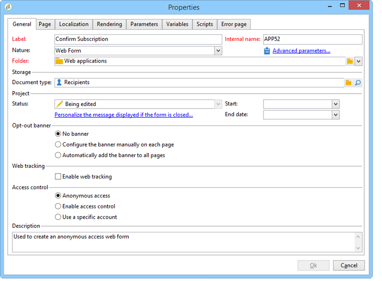

# 定义 Web 窗体属性{#defining-web-forms-properties}

您可以完全配置和个性化Web窗体，以满足您的要求。 必须在属性窗口中输入参数。

可通过访问属性窗口 **[!UICONTROL Properties]** 按钮。 利用此窗口，可访问特定于Web窗体的一系列设置。 某些设置可能源自模板配置。

## 表单的整体属性 {#overall-form-properties}

在 **[!UICONTROL General]** ，您可以修改 **标签** 表单中。 强烈建议不要更改 **内部名称**.

在表单创建过程中会选择表单模板。 以后无法更改。 有关创建和管理表单模板的更多信息，请参阅 [使用Web窗体模板](using-a-web-form-template.md).

## 表单数据存储 {#form-data-storage}

默认情况下，Web窗体的字段会存储在收件人表中。 您可以通过从 **[!UICONTROL Document type]** 字段。 的 **[!UICONTROL Zoom]** 图标可查看选定表格的内容。

默认情况下，答案存储在 **对收件人表单的答复** 表。

## 设置错误页面 {#setting-up-an-error-page}

您可以配置错误页面：在表单执行过程中出错时，将显示此页面。

错误页面在表单属性窗口的相应选项卡中定义。

默认情况下，它会显示以下信息：

显示的字符串的内容在 **[!UICONTROL Error page]** 选项卡。 的 **[!UICONTROL HTML]** 选项卡显示渲染， **[!UICONTROL Texts]** 选项卡，您可以修改文本字符串并根据需要添加一些文本：

## 表单本地化 {#form-localization}

的 **[!UICONTROL Localization]** 选项卡，可选择Web窗体的设计和显示语言。

请参阅 [翻译Web窗体](translating-a-web-form.md).

## 表单浏览和渲染 {#form-browsing-and-rendering}

的 **[!UICONTROL Rendering]** 选项卡，可定义在Web窗体页面和所用渲染模板之间浏览的类型。

您可以选择通过链接或按钮进行导航。

默认情况下，按钮是导航元素。 它们允许您执行以下操作：

* 通过单击 **[!UICONTROL Next]**. 此按钮显示在除最后一页之外的所有页面上。
* 通过单击 **[!UICONTROL Previous]**. 此按钮显示在除第一个按钮之外的所有页面上。
* 通过单击 **[!UICONTROL Approve]** 按钮。 此按钮仅在最后一页中显示。

这些元素显示在每个页面的底部。 他们的位置可以改变。 为此，必须修改样式表。

>[!NOTE]
>
>可以隐藏 **[!UICONTROL Previous]** 按钮。 要执行此操作，请转到相关页面并检查 **[!UICONTROL Disallow returning to the previous page]** 选项。 选择页面树的根后，即可访问此选项。

的 **[!UICONTROL Template]** 字段 **[!UICONTROL Rendering]** 选项卡，您可以从这些可用主题中选择主题。

主题保存在 **[!UICONTROL Administration>Configuration>Form rendering]** 树的节点。 请参阅 [选择表单渲染模板](form-rendering.md#selecting-the-form-rendering-template)

属性窗口的下半部分将显示示例渲染。 的 **[!UICONTROL Edit link]** 图标可让您查看所选主题的配置。

## 格式文本 {#texts-in-the-form}

的 **[!UICONTROL Page]** 选项卡，可定义表单页眉和页脚的内容。 请参阅 [定义页眉和页脚](form-rendering.md#defining-headers-and-footers).

它还允许您管理翻译。 请参阅 [翻译Web窗体](translating-a-web-form.md).

## 表单的辅助功能 {#accessibility-of-the-form}

用户可访问Web窗体（如果是） **[!UICONTROL Online]** 当前日期在有效期内时，则为“有效期”。 表单的状态在发布阶段期间被修改(请参阅 [发布表单](publishing-a-web-form.md#publishing-a-form))。 状态显示在 **项目** 部分 **[!UICONTROL General]** 选项卡。

有效期从 **[!UICONTROL Start]** 日期 **[!UICONTROL End date]**. 如果这些字段中未指定日期，则表单具有永久有效性。

>[!NOTE]
>
>如果表单已关闭，因此其有效期未达到或过期，或者如果表单已由Adobe Campaign运算符关闭，则当用户尝试访问该表单时，会显示一条消息。 您可以通过单击 **[!UICONTROL Personalize the message displayed if the form is closed...]**.

## 表单访问控制 {#form-access-control}

默认情况下，以匿名模式访问Web窗体：所有访问表单的运算符均分配有WebApp操作员权限。

您可以启用表单显示的访问控制，例如在内部网站上传送表单时，以验证用户。 为此，请显示 **[!UICONTROL Properties]** 窗口，然后单击 **[!UICONTROL Enable access control]** 选项，如下所示：

访问页面后，将显示以下身份验证表单：

登录名和密码是Adobe Campaign运算符使用的密码。 如需详细信息，请参阅[此部分](../../platform/using/access-management.md)。

的 **[!UICONTROL Use a specific account]** 选项允许您限制访问表单的操作员的读或写权限。 使用下拉框选择负责授予这些权限的操作员或操作员组。

## 表单URL参数 {#form-url-parameters}

您可以在表单的URL中添加其他参数，以个性化其内容并初始化上下文（语言、加密的收件人ID、公司、存储在变量中的计算公式等）。 这样，您就可以通过多个不同的URL访问一个表单，并根据URL中指示的参数值对页面内容进行个性化。

默认情况下，Adobe Campaign会提供用于预览表单和检查错误的参数。 您可以创建链接到表单的新设置，该设置可以使用数据库中某个字段或本地变量的值。

## 标准参数 {#standard-parameters}

默认情况下，以下参数可用：

* **id** 以指示已加密的标识符。
* **朗** 更改显示语言。
* **来源** 指定被申请人的来源。
* **_uuid** 允许在发布和错误跟踪之前查看表单。 此参数供内部使用（创建和调试）：当您通过此URL访问Web窗体时，跟踪（报表）中未考虑创建的记录。 源被强制发送至 **[!UICONTROL Adobe Campaign]** 值。

   它与 **_预览** 参数和/或 **_debug**:

   **_预览** 以显示上次保存的版本。 此参数只能在测试阶段使用。

   **_debug** 显示表单页面中输入或计算的数据跟踪。 用于获取有关错误的更多信息，包括在表单发布后。

   >[!CAUTION]
   >
   >通过URL显示表单时， **_uuid** 参数， **[!UICONTROL origin]** 参数被强制 **Adobe Campaign**.

## 添加参数 {#adding-parameters}

可以通过 **[!UICONTROL Parameters...]** 选项卡。 这些参数可设为必填项，如下所示：

您必须指定一个存储位置，参数值将从中检索。 要执行此操作，请选择其中一个存储选项，然后单击 **[!UICONTROL Storage]** 选项卡来访问Advertising Cloud帮助。 有关存储选项的详情，请参见 [响应存储字段](web-forms-answers.md#response-storage-fields).

然后，可将答复者状态（0、1或任何其他值）添加到URL中以访问表单。 此信息可在表单的页面或测试框中重复使用。 显示的页面可以根据上下文的值进行条件设置，如下所示：

1. 客户主页(**status=1**):

   

1. 潜在客户主页(**status=0**):

   

1. 其他用户档案(例如， **status=12**):

   

要配置此表单，请创建一个测试框并将其放在图表的开头，如下所示：

利用测试框，可配置页面排序条件：

