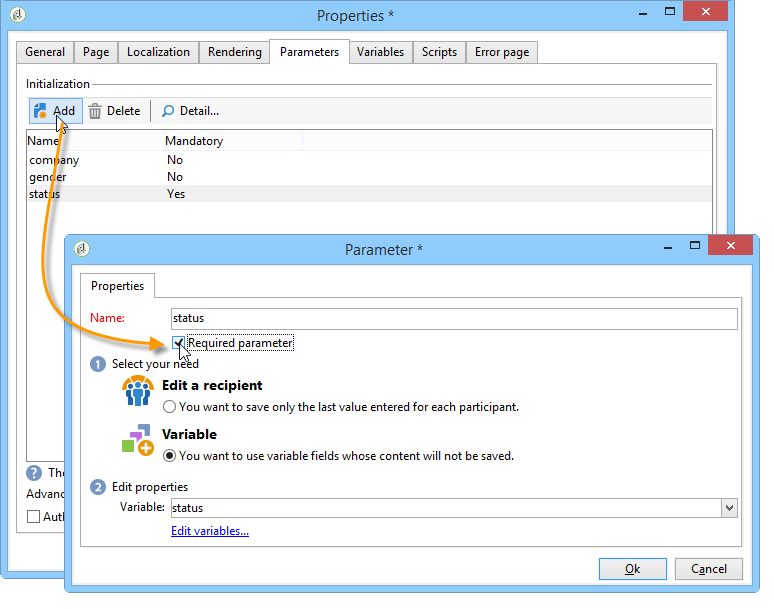

# 定义 Web 窗体属性{#defining-web-forms-properties}

您可以完全配置和个性化Web窗体，以满足您的要求。 必须在属性窗口中输入参数。

属性窗口可通过 **[!UICONTROL Properties]** 按钮。 通过此窗口，您可以访问特定于Web表单的一系列设置。 某些设置可能源自模板配置。

## 整体表单属性 {#overall-form-properties}

在 **[!UICONTROL General]** 选项卡，您可以修改 **标签** 表单的。 强烈建议不要更改 **内部名称**.

表单创建期间选择表单模板。 以后无法更改。 有关创建和管理表单模板的更多信息，请参阅 [使用Web窗体模板](using-a-web-form-template.md).

## 表单数据存储 {#form-data-storage}

默认情况下，Web窗体的字段存储在收件人表中。 通过从中选择新表，可以更改使用的表 **[!UICONTROL Document type]** 字段。 此 **[!UICONTROL Zoom]** 图标用于查看选定表的内容。

默认情况下，答案存储在 **对收件人表单的答复** 表格。

## 设置错误页面 {#setting-up-an-error-page}

您可以配置错误页面：如果在执行表单时出错，将显示此页面。

错误页面在表单属性窗口的相应选项卡中定义。

默认情况下，它会显示以下信息：

显示的字符串内容定义于 **[!UICONTROL Error page]** 属性窗口的选项卡。 此 **[!UICONTROL HTML]** 选项卡显示渲染和 **[!UICONTROL Texts]** 制表符可让您修改文本字符串并在必要时添加一些文本：

## 表单本地化 {#form-localization}

此 **[!UICONTROL Localization]** 选项卡允许您选择Web窗体的设计和显示语言。

参见 [翻译Web窗体](translating-a-web-form.md).

## 表单浏览和渲染 {#form-browsing-and-rendering}

此 **[!UICONTROL Rendering]** 选项卡允许您定义Web窗体页面与使用的渲染模板之间的浏览类型。

您可以选择通过链接或按钮进行导航。

默认情况下，按钮是导航元素。 它们允许您执行以下操作：

* 通过单击批准当前页面并显示下一页 **[!UICONTROL Next]**. 此按钮将显示在所有页面上，但最后一个页面除外。
* 通过单击显示上一页 **[!UICONTROL Previous]**. 此按钮显示在除第一个按钮之外的所有页面上。
* 通过单击 **[!UICONTROL Approve]** 按钮。 此按钮仅显示在最后一页。

这些元素显示在每个页面的底部。 他们的立场可以改变。 要执行此操作，必须修改样式表。

>[!NOTE]
>
>有可能隐藏 **[!UICONTROL Previous]** 按钮。 为此，请转到相关页面并检查 **[!UICONTROL Disallow returning to the previous page]** 选项。 在选择了页面树的根目录时，可以访问此选项。

此 **[!UICONTROL Template]** 字段 **[!UICONTROL Rendering]** 选项卡允许您从可用的主题中选择主题。

主题保存在中 **[!UICONTROL Administration>Configuration>Form rendering]** 树节点。 参见 [选择表单渲染模板](form-rendering.md#selecting-the-form-rendering-template)

“属性”窗口的下半部分将显示一个示例渲染。 此 **[!UICONTROL Edit link]** 图标用于查看选定主题的配置。

## 表单中的文本 {#texts-in-the-form}

此 **[!UICONTROL Page]** 选项卡允许您定义表单页眉和页脚的内容。 参见 [定义页眉和页脚](form-rendering.md#defining-headers-and-footers).

它还允许您管理翻译。 参见 [翻译Web窗体](translating-a-web-form.md).

## 表单的辅助功能 {#accessibility-of-the-form}

Web表单在以下情况下可供用户访问： **[!UICONTROL Online]** 以及当期在有效期内的。 表单的状态会在发布阶段进行修改(请参阅 [发布表单](publishing-a-web-form.md#publishing-a-form))。 状态显示在 **项目** 部分 **[!UICONTROL General]** 属性窗口的选项卡。

有效期从 **[!UICONTROL Start]** 结束日期 **[!UICONTROL End date]**. 如果未在这些字段中指定日期，则表单具有永久有效性。

>[!NOTE]
>
>如果表单已关闭，因此其有效期尚未达到或已过期，或者，如果表单由Adobe Campaign操作员关闭，则当用户尝试访问它时会显示一条消息。 您可以通过单击 **[!UICONTROL Personalize the message displayed if the form is closed...]**.

## 表单访问控制 {#form-access-control}

默认情况下，对Web窗体的访问以匿名模式执行：所有访问窗体的操作员都分配有WebApp操作员权限。

您可以为表单显示启用访问控制，例如在Intranet站点上提交表单时，以便对用户进行身份验证。 要执行此操作，请显示 **[!UICONTROL Properties]** 窗体的窗口，然后单击 **[!UICONTROL Enable access control]** 选项，如下所示：

在访问页面时，将会出现以下身份验证表单：

登录名和密码由Adobe Campaign操作员使用。 如需详细信息，请参阅[此部分](../../platform/using/access-management.md)。

此 **[!UICONTROL Use a specific account]** 选项允许您限制访问表单的操作员的读取或写入权限。 使用下拉框选择将负责授予这些权限的操作员或操作员组。

## 表单URL参数 {#form-url-parameters}

您可以在表单的URL中添加其他参数，以个性化其内容并初始化上下文（语言、加密的收件人ID、公司、存储在变量中的计算公式等）。 这样，您就可以通过多个不同的URL来授予对一个表单的访问权限，并根据URL中指示的参数值来个性化页面内容。

默认情况下，Adobe Campaign提供用于预览表单和检查错误的参数。 您可以创建链接到表单的新设置，这些设置可能使用数据库中字段的值或局部变量的值。

## 标准参数 {#standard-parameters}

默认情况下，以下参数可用：

* **id** 用于指示加密标识符。
* **lang** 以更改显示语言。
* **来源** 指定受访者的来源。
* **_uuid** 启用发布前的表单查看和错误跟踪。 此参数供内部使用（创建和调试）：通过此URL访问Web窗体时，创建的记录不会包含在跟踪（报表）中。 源被强制到 **[!UICONTROL Adobe Campaign]** 值。

   它与 **预览(_P)** 参数和/或 **调试(_D)**：

   **预览(_P)** 以显示上次保存的版本。 此参数必须仅在测试阶段使用。

   **调试(_D)** 在表单的页面中显示输入或计算的数据的跟踪。 用于获取有关错误的更多信息，包括发布表单后。

   >[!CAUTION]
   >
   >通过带有以下内容的URL显示表单时： **_uuid** 参数，值 **[!UICONTROL origin]** 参数被强制为 **Adobe Campaign**.

## 添加参数 {#adding-parameters}

可以通过以下方式添加参数 **[!UICONTROL Parameters...]** 选项卡。 可以将它们设为强制性的，如下所示：

您必须指定从中检索参数值的存储位置。 要执行此操作，请选择其中一个存储选项，然后单击 **[!UICONTROL Storage]** 选项卡以选择相关字段或变量。 有关存储选项的详情，请参见 [响应存储字段](web-forms-answers.md#response-storage-fields).

然后，可以将响应者状态（0、1或任何其他值）添加到用于访问表单的URL中。 此信息可在表单页面或测试框中重复使用。 显示的页面可以根据上下文的值设置条件，如下所示：

1. 客户主页(**status=1**)：

   

1. 潜在客户主页(**状态=0**)：

   

1. 其他配置文件的主页(例如， **status=12**)：

   

要配置此表单，请创建一个测试框并将其放在图的开头，如下所示：

通过测试框可配置页面排序条件：

