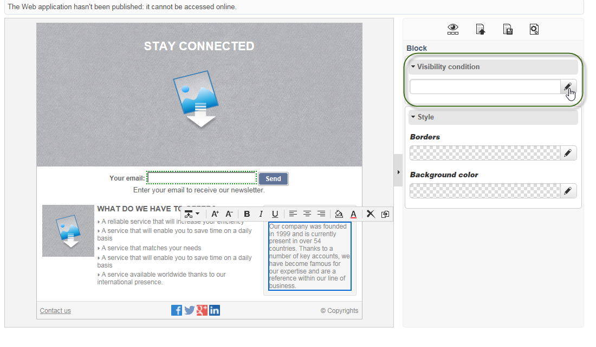

# 编辑内容{#editing-content}

## 定义可见性条件 {#defining-a-visibility-condition}

您可以在网页元素上指定一个可见性条件：仅当遵守条件时，此元素才可见。

要添加可见性条件，请选择一个块，然后使用表达式编辑器在&#x200B;**[!UICONTROL Visibility condition]**&#x200B;字段中输入条件。

>[!NOTE]
>
>在[此页面](../../platform/using/defining-filter-conditions.md#list-of-functions)上显示高级表达式编辑。

这些条件采用XTK表达式语法（例如&#x200B;**ctx.recipient）。@email != &quot;&quot;**&#x200B;或&#x200B;**ctx.recipient@status==&quot;0&quot;**)。 默认情况下，所有字段都可见。

>[!NOTE]
>
>无法编辑不可见的动态块（如下拉菜单）。

## 添加边框和背景 {#adding-a-border-and-background}

您可以将&#x200B;**border**&#x200B;添加到选定块。 使用以下三个选项来定义边框：样式、大小和颜色。

您还可以通过从颜色图表中选择颜色来定义&#x200B;**背景颜色**。

## 编辑窗体 {#editing-forms}

### 更改表单的数据属性 {#changing-the-data-properties-for-a-form}

您可以将数据库字段与输入区域、单选按钮或复选框类型块链接在一起。

>[!NOTE]
>
>默认字段是Web应用程序存储模式中的字段。

**字段**&#x200B;输入区域允许您选择要与表单字段链接的数据库字段。

默认情况下，提供的字段为&#x200B;**nms:recipient**&#x200B;表中的字段。

使用&#x200B;**必填字段**&#x200B;选项，可以仅在用户填写字段后才授权页面批准。 如果未填写必填字段，则会显示错误消息。

对于单选按钮和复选框，需要&#x200B;**其他配置**。

事实上，如果使用的模板默认不包含值，则必须在编辑器中完成该模板。

操作步骤：

* 单击&#x200B;**[!UICONTROL Edit]**&#x200B;图标。

   

* 在&#x200B;**[!UICONTROL Value]**&#x200B;字段中输入明细列表值（由选定的字段定义）。

   

### 修改表单字段 {#modifying-form-fields}

表单字段，如单选按钮、输入区域、下拉列表等。 可在其工具栏中修改。

这意味着您可以：

* 使用&#x200B;**[!UICONTROL Delete]**&#x200B;图标删除包含表单字段的块。
* 使用&#x200B;**[!UICONTROL Duplicate]**&#x200B;图标创建新块以复制所选字段。
* 编辑&#x200B;**[!UICONTROL Form data]**&#x200B;窗口，使用&#x200B;**[!UICONTROL Edit]**&#x200B;图标将数据库字段链接到表单区域。

   

## 向按钮添加操作 {#adding-an-action-to-a-button}

当用户单击按钮时，您可以定义一个关联的操作。 为此，请从下拉列表中选择要执行的操作。

可用的操作如下：

* **[!UICONTROL Refresh]** :刷新当前页面。
* **[!UICONTROL Next page]** :创建指向Web应用程序中下一页的链接。
* **[!UICONTROL Previous page]** :创建指向Web应用程序中上一页的链接。

>[!NOTE]
>
>**[!UICONTROL None]**&#x200B;值允许您不激活按钮。

您可以在相应字段中修改链接到按钮的标签。

## 添加链接 {#adding-a-link}

您可以将链接插入到任何页面元素中：图像、单词、词组、文本块等。

要实现此目的，请选择元素，然后使用弹出菜单中的第一个图标。

此图标允许您访问所有可用类型的链接。

个性化块和字段只能插入到文本类型块中。

>[!NOTE]
>
>对于每种类型的链接，可以配置打开模式：在&#x200B;**Target**&#x200B;下拉列表中选择目标窗口。 此值对应于&#x200B;**`<target>`** HTML标记。
>
>可用&#x200B;**目标**&#x200B;的列表如下所示：
>
>* 其他(IFrame)
>* 顶部窗口(_top)
>* 父窗口(_parent)
>* 新窗口(_blank)
>* 当前窗口(_self)
>* 默认浏览器行为

>

### 链接到URL {#link-to-a-url}

使用&#x200B;**链接到外部URL**&#x200B;选项可打开源内容中的任何URL。

在&#x200B;**URL**&#x200B;字段中输入相关链接地址。 URL字段应输入为：**https://www.myURL.com**。

### 链接到Web应用程序 {#link-to-a-web-application}

使用&#x200B;**链接到Web应用程序**&#x200B;选项可以访问Adobe Campaign Web应用程序。

从相应的字段中选择Web应用程序。

建议的Web应用程序列表对应于&#x200B;**[!UICONTROL Resources > Online > Web Applications]**&#x200B;节点中的可用应用程序。

### 操作链接 {#link-to-an-action}

通过&#x200B;**定义操作**&#x200B;选项的链接，您可以在单击源元素时配置操作。

>[!NOTE]
>
>[向按钮](#adding-an-action-to-a-button)添加操作一节中详细介绍了可用操作。

### 删除链接 {#delete-a-link}

插入链接后，工具栏会提供两个新图标：**编辑链接**&#x200B;和&#x200B;**中断链接**，以便与创建的链接进行交互。

* **[!UICONTROL Edit link]** 可显示一个窗口，其中包含链接的所有参数。
* **[!UICONTROL Break the link]** 允许您在确认后删除链接和所有相关参数。

>[!NOTE]
>
>如果删除链接，则内容仍会保留。

## 更改字体属性 {#changing-font-attributes}

选择文本元素时，可以修改字体属性（样式、格式）。

可用选项如下：

* **放大** 字体：增加所选文本的大小(添加 ``)
* **减少** 字体：减小所选文本的大小(添加 ``)
* **** Boldicon:将选定文本变为粗体(用标记换 `<strong> </strong>` 行文本)
* **** 斜体图标：将所选文本设置为斜体(使用标记将文本  `<em> </em>` 换行)
* **** 下行图标：为选定文本加下划线(用标记换 `` 行文本)
* **左对** 齐：将文本与选定块的左侧对齐(添加style=&quot;text-align:left；”)
* **** 中心图标：将选定块的文本居中(添加style=&quot;text-align:中心；”
* **右** 对齐：将文本与选定块的右侧对齐(添加style=&quot;text-align:右；”
* **更改背景颜** 色图标：允许您更改选定块的背景颜色(添加style=&quot;background-color:rgba(170, 86, 255, 0.87)
* **更改文本** 颜色图标：允许您更改选定块的文本颜色或仅更改选定文本(``)

>[!NOTE]
>
>* **** 删除图标：删除块及其所有内容。
>
>* **** 复制图标：复制块以及与块相关的所有样式。

## 管理图像和动画 {#managing-images-and-animations}

使用数字内容编辑器，可以处理与浏览器兼容的&#x200B;**任何类型的图像**。

>[!CAUTION]
>
>不得在HTML页面的&#x200B;**script**&#x200B;标记中调用外部文件。 这些文件将不会导入到Adobe Campaign服务器中。

### 添加/删除/复制图像 {#adding---deleting---duplicating-an-image}

要插入图像，请选择图像类型块，然后单击&#x200B;**图像**&#x200B;图标。

选择本地保存的图像文件。

**删除**&#x200B;图标会删除包含图像的标记。

**复制**&#x200B;图标会复制标记及其内容。

>[!CAUTION]
>
>复制图像时，与新图像相关的标识符会被删除。

### 编辑图像属性 {#editing-image-properties}

选择包含图像的块时，您可以访问以下属性：

* **** 通过字幕，您可以定义链接到图像的字幕(与altHTML **** 属性相对应)。
* **** 维度可指定图像大小（以像素为单位）。

   

## 添加个性化内容 {#adding-personalization-content}

### 插入个性化字段 {#inserting-a-personalization-field}

通过插入图标的&#x200B;**个性化字段**&#x200B;选项，您可以在内容中添加数据库字段，如收件人的姓名。 此选项仅适用于文本类型块。

默认情况下，提供的字段来自&#x200B;**[!UICONTROL Recipient]**&#x200B;表。 根据需要，编辑Web应用程序属性以选择另一个表。

该字段名称将在编辑器中显示，并以黄色突出显示。 在生成个性化时（例如，预览登陆页面时），该用户档案将被目标收件人的用户档案替换。

[插入个性化字段](creating-a-landing-page.md#inserting-a-personalization-field)部分中提供了一个示例。

### 插入个性化块 {#inserting-a-personalization-block}

通过&#x200B;**个性化块**&#x200B;选项，您可以在内容中插入动态和个性化的块。 例如，您可以添加徽标或问候语消息。 它不适用于文本类型块。

插入后，个性化块名称会显示在编辑器中，并以黄色突出显示。 在生成个性化时，会自动将其调整为收件人用户档案。

有关内置个性化块以及如何定义自定义个性化块的更多信息，请参阅[此页面](../../delivery/using/personalization-blocks.md)。
