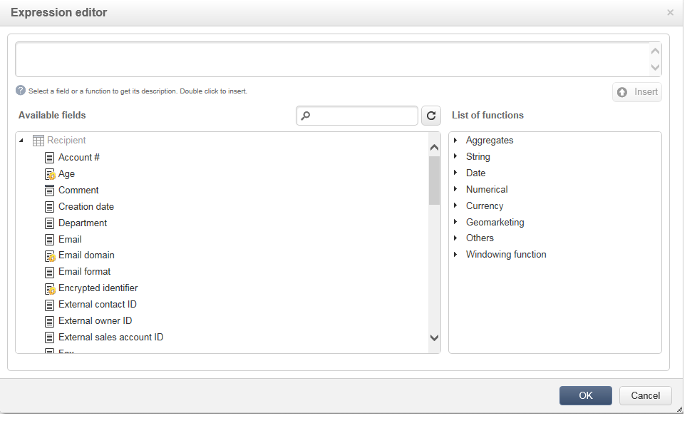

# 编辑内容{#editing-content}

## 定义可见性条件 {#defining-a-visibility-condition}

您可以指定网页元素的可见性条件：仅当满足该条件时，此元素才可见。

要添加可见性条件，请选择块并在 **[!UICONTROL Visibility condition]** 使用表达式编辑器的字段。

>[!NOTE]
>
>有关高级表达式编辑的介绍 [此页面](../../platform/using/defining-filter-conditions.md#list-of-functions).

这些条件采用XTK表达式语法(例如 **ctx.recipient.@email！=“”** 或 **ctx.recipient.@status==“0”**)。 默认情况下，所有字段均可见。

>[!NOTE]
>
>无法编辑不可见的动态块，例如下拉菜单。

## 添加边框和背景 {#adding-a-border-and-background}

您可以添加 **边框** 到选定块。 使用三个选项定义边框：样式、大小和颜色。

您还可以定义 **背景颜色** 从颜色图表中选择一种颜色。

## 编辑窗体 {#editing-forms}

### 更改表单的数据属性 {#changing-the-data-properties-for-a-form}

您可以将数据库字段与输入区域、单选按钮或复选框类型块链接在一起。

>[!NOTE]
>
>默认字段是Web应用程序存储架构中的字段。

此 **字段** 通过输入区域，您可以选择要与表单字段链接的数据库字段。

默认情况下，提供的字段是以下位置中的字段： **nms：recipient** 表格。

此 **必填字段** 选项允许您仅在用户填写字段后才授权页面审批。 如果未填写必填字段，则会显示错误消息。

对于单选按钮和复选框， **需要其他配置**.

事实上，如果所用的模板在默认情况下不包含值，则必须在编辑器中完成该设置。

操作步骤：

* 单击 **[!UICONTROL Edit]** 图标。

  

* 将明细列表值（由所选字段定义）输入 **[!UICONTROL Value]** 字段。

  

### 修改表单字段 {#modifying-form-fields}

表单字段，例如单选按钮、输入区域、下拉列表等。 可以从其工具栏进行修改。

这意味着您可以：

* 使用删除包含表单域的块 **[!UICONTROL Delete]** 图标。
* 通过使用创建新块来复制所选字段 **[!UICONTROL Duplicate]** 图标。
* 编辑 **[!UICONTROL Form data]** 窗口将数据库字段链接到表单区域，使用 **[!UICONTROL Edit]** 图标。

  

## 向按钮添加操作 {#adding-an-action-to-a-button}

当用户单击按钮时，您可以定义关联的操作。 要实现此目的，请从下拉列表中选择要执行的操作。

可用的操作如下：

* **[!UICONTROL Refresh]** ：刷新当前页面。
* **[!UICONTROL Next page]** ：创建指向Web应用程序中下一页的链接。
* **[!UICONTROL Previous page]** ：创建指向Web应用程序中上一页的链接。

>[!NOTE]
>
>此 **[!UICONTROL None]** 值允许您不激活按钮。

您可以在相应的字段中修改链接到按钮的标签。

## 添加链接 {#adding-a-link}

您可以将链接插入到任意页面元素中：图像、单词、单词组、文本块等。

要实现此目的，请选择元素，然后使用弹出菜单中的第一个图标。

利用此图标，可访问所有可用类型的链接。

个性化块和字段只能插入到文本类型块中。

>[!NOTE]
>
>对于每种类型的链接，都可以配置打开模式：选择中的目标窗口 **Target** 下拉列表。 此值对应于 **`<target>`** HTML标记。
>
>可用列表 **目标** 如下所示：
>
>* 其他(IFrame)
>* 顶部窗口(_top)
>* 父窗口(_parent)
>* 新窗口(_blank)
>* 当前窗口(_self)
>* 默认浏览器行为
>

### 链接到URL {#link-to-a-url}

此 **链接到外部URL** 选项允许您从源内容打开任何URL。

将相关链接地址输入到 **URL** 字段。 URL字段应输入为： **https://www.myURL.com**.

### 链接到Web应用程序 {#link-to-a-web-application}

此 **链接到Web应用程序** 选项允许您访问Adobe Campaign Web应用程序。

从相应的字段中选择Web应用程序。

建议的Web应用程序列表对应于 **[!UICONTROL Resources > Online > Web Applications]** 节点。

### 链接到操作 {#link-to-an-action}

此 **定义操作的链接** 选项允许您在单击源元素时配置操作。

>[!NOTE]
>
>有关可用操作的详情，请参见 [向按钮添加操作](#adding-an-action-to-a-button) 部分。

### 删除链接 {#delete-a-link}

插入链接后，工具栏会提供两个新图标： **编辑链接** 和 **断开链接** 可让您与创建的链接进行交互。

* **[!UICONTROL Edit link]** 用于显示一个包含链接所有参数的窗口。
* **[!UICONTROL Break the link]** 用于在确认后删除链接和所有相关参数。

>[!NOTE]
>
>如果删除了链接，内容仍会保留。

## 更改字体属性 {#changing-font-attributes}

选择文本元素时，可以修改字体属性（样式、格式）。

可用选项如下：

* **放大字体** 图标：增加所选文本的大小(添加 ``)
* **缩小字体** 图标：减小所选文本的大小(添加 ``)
* **粗体** 图标：将所选文本变为粗体（使用将文本换行） `<strong> </strong>` 标记)
* **斜体** 图标：将选定的文本变为斜体(使用自动换行  `<em> </em>` 标记)
* **下划线** 图标：将选定文本加下划线(文本换行 `` 标记)
* **左对齐** 图标：将文本与选定块的左侧对齐（添加style=&quot;text-align： left；&quot;）
* **居中** 图标：将选定块的文本居中（添加style=&quot;text-align： center；&quot;）
* **右对齐** 图标：将文本与选定块的右侧对齐（添加style=&quot;text-align： right；&quot;）
* **更改背景颜色** 图标：用于更改选定块的背景颜色(添加style=&quot;background-color： rgba(170， 86， 255， 0.87))
* **更改文本颜色** 图标：用于更改选定块的文本颜色或仅更改选定文本(``)

>[!NOTE]
>
>* **删除** 图标：删除块及其所有内容。
>
>* **复制** 图标：复制块以及与该块相关的所有样式。

## 管理图像和动画 {#managing-images-and-animations}

使用数字内容编辑器，您可以 **任何类型的图像** 与浏览器兼容。

>[!CAUTION]
>
>不能在中调用外部文件 **脚本** “HTML”页面的标记。 这些文件将不会导入到Adobe Campaign服务器上。

### 添加/删除/复制图像 {#adding---deleting---duplicating-an-image}

要插入图像，请选择图像类型块，然后单击 **图像** 图标。

选择本地保存的图像文件。

此 **删除** 图标会删除包含图像的标记。

此 **复制** 图标会复制标记及其内容。

>[!CAUTION]
>
>复制图像时，与新图像相关的标识符将被删除。

### 编辑图像属性 {#editing-image-properties}

当您选择包含图像的块时，您可以访问以下属性：

* **题注** 用于定义链接到图像的标题(对应于 **alt** HTML属性)。
* **Dimension** 用于指定图像大小（以像素为单位）。

  

## 添加个性化内容 {#adding-personalization-content}

### 插入个性化字段 {#inserting-a-personalization-field}

此 **个性化字段** 插入图标的选项允许您向内容添加数据库字段，如收件人的姓名。 此选项仅适用于文本类型块。

默认情况下，提供的字段来自 **[!UICONTROL Recipient]** 表格。 必要时，编辑Web应用程序属性以选择其他表。

字段名称显示在编辑器中，以黄色突出显示。 在生成个性化设置时（例如，预览登陆页面时），它将被目标收件人的用户档案替换。

有关示例，请参见 [插入个性化字段](creating-a-landing-page.md#inserting-a-personalization-field) 部分。

### 插入个性化块 {#inserting-a-personalization-block}

此 **个性化块** 选项允许您将动态块和个性化块插入到内容中。 例如，您可以添加徽标或问候语。 它不适用于文本类型块。

插入后，个性化块名称将显示在编辑器中，并以黄色突出显示。 当生成个性化时，它自动适应收件人用户档案。

有关内置个性化块以及如何定义自定义个性化块的更多信息，请参阅 [此页面](../../delivery/using/personalization-blocks.md).
