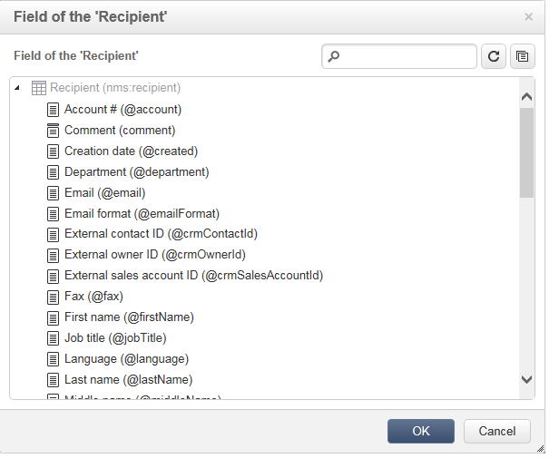

# 编辑内容{#editing-content}

## 定义可见性条件 {#defining-a-visibility-condition}

可以在网页元素上指定可见性条件：仅当考虑条件时，此元素才可见。

要添加可见性条件，请选择一个块，然后使用表达式编辑器 **[!UICONTROL Visibility condition]** 在字段中输入条件。


>[!NOTE]
>
>此页上显示高级表达 [式编辑](../../platform/using/defining-filter-conditions.md#list-of-functions)。


这些条件采用XTK表达式语法(例如 **ctx.recipient)。@email != &quot;&quot;** or **ctx.recipient.@status==&quot;0&quot;**)。 默认情况下，所有字段都可见。

>[!NOTE]
>
>无法编辑不可见的动态块（如下拉菜单）。

## 添加边框和背景 {#adding-a-border-and-background}

可向选定块 **添加** 边框。 边框使用三个选项进行定义：样式、大小和颜色。


您还可以通过从颜 **色图表中选择颜色** ，来定义背景颜色。


## 编辑表单 {#editing-forms}

### 更改表单的数据属性 {#changing-the-data-properties-for-a-form}

您可以将数据库字段与输入区域、单选按钮或复选框类型块链接。


>[!NOTE]
>
>默认字段是Web应用程序存储架构中的字段。

通过 **字段输入** ，您可以选择要与表单字段链接的数据库字段。

默认情况下，提供的字段是 **nms:recipient表中的字段** 。



“必 **需字段** ”选项仅允许您在用户已填写该字段时授权页面的批准。 如果未填写必填字段，将显示错误消息。

对于单选按钮和复选框， **需要进行其他配置**。

事实上，如果使用的模板默认不包含值，则必须在编辑器中完成它。

操作步骤：

* 单击该 **[!UICONTROL Edit]** 图标。

   

* 在字段中输入分项列表值（由选定字段定义）。 **[!UICONTROL Value]**

   

### 修改表单字段 {#modifying-form-fields}

表单字段，如单选按钮、输入区域、下拉列表等。 可从工具栏中修改。

这意味着您可以：

* 使用图标删除包含表单字段的 **[!UICONTROL Delete]** 块。
* 使用图标创建新块，复制选定的字 **[!UICONTROL Duplicate]** 段。
* 编辑窗 **[!UICONTROL Form data]** 口以使用图标将数据库字段链接到表单 **[!UICONTROL Edit]** 区域。

   

## 向按钮添加操作 {#adding-an-action-to-a-button}

当用户单击按钮时，您可以定义关联的操作。 为此，请从下拉列表中选择要执行的操作。


可用的操作如下：

* **[!UICONTROL Refresh]** :刷新当前页面。
* **[!UICONTROL Next page]** :创建指向Web应用程序中下一页的链接。
* **[!UICONTROL Previous page]** :创建指向Web应用程序中上一页的链接。

>[!NOTE]
>
>该 **[!UICONTROL None]** 值允许您不激活按钮。

您可以在相应字段中修改链接到按钮的标签。

## 添加链接 {#adding-a-link}

可以向任何页面元素中插入链接：图像、单词、单词组、文本块等。

为此，请选择元素，然后使用弹出菜单中的第一个图标。


此图标允许您访问所有可用类型的链接。


个性化块和字段只能插入到文本类型块中。

>[!NOTE]
>
>对于每种类型的链接，您可以配置打开模式：在“目标”下拉列 **表中** ，选择目标窗口。 此值与 **`<target>`** HTML标记相对应。
>
>可用目标 **列表** 如下：
>
>* 其他(IFrame)
>* 顶部窗口(_top)
>* 父窗口(_parent)
>* 新窗口(_blank)
>* 当前窗口(_self)
>* 默认浏览器行为
>


### URL链接 {#link-to-a-url}

通过 **链接到外部URL** 选项，可以打开源内容中的任何URL。


在 **URL字段中输入相关的链接地** 址。 URL字段应输入为： **https://www.myURL.com**。

### 链接到Web应用程序 {#link-to-a-web-application}

通过 **“链接到Web应用程序** ”选项，您可以访问Adobe Campaign web应用程序。


从相应的字段中选择Web应用程序。

建议的Web应用程序列表与节点中的可用应用程序相 **[!UICONTROL Resources > Online > Web Applications]** 对应。

### 指向操作的链接 {#link-to-an-action}

通过 **定义操作选项的链接** ，您可以在单击源元素时配置操作。


>[!NOTE]
>
>“向按钮添加动作” [部分中详细介绍了可用的动作](#adding-an-action-to-a-button) 。

### 删除链接 {#delete-a-link}

插入链接后，工具栏会提供两个新图标：编 **辑链接** , **** 并断开与创建的链接交互的链接。

* **[!UICONTROL Edit link]** 允许您显示一个窗口，其中包含链接的所有参数。
* **[!UICONTROL Break the link]** 允许您在确认后删除链接和所有相关参数。

>[!NOTE]
>
>如果删除链接，则内容仍会保留。

## 更改字体属性 {#changing-font-attributes}

选择文本元素时，可以修改字体属性（样式、格式）。


可用选项如下：

* **放大字体** 图标：增加所选文本的大小(添加 `<span style="font size:">`)
* **减少字体** 图标：减小选定文本的大小(添加 `<span style="font size:">`)
* **粗体图标** :使选定文本变为粗体(用标记换行 `<strong> </strong>` 文本)
* **斜体图标** :使选定文本为斜体(用标签绕排文 `<em> </em>` 本)
* **下划线** 图标：使选定文本带下划线(用标记换行 `<span style="text-decoration: underline;">` 文本)
* **左对齐图标** :将文本与选定块的左侧对齐(add style=&quot;text-align:左；”)
* **中心** 图标：将所选块的文本居中(add style=&quot;text-align:中；”)
* **右对齐图标** :将文本与选定块的右侧对齐(add style=&quot;text-align:对；”)
* **更改背景颜色图标** :允许您更改所选块的背景颜色(add style=&quot;background-color:rgba(170, 86, 255, 0.87)
* **更改文本颜色** 图标：允许您更改选定块的文本颜色或仅更改选定文本(`<span style="color: #CODE">`)

>[!NOTE]
>
>* **删除图标** :删除块及其所有内容。
   >
   >
* **复制** 图标：复制块以及与块相关的所有样式。


## 管理图像和动画 {#managing-images-and-animations}

通过数字内容编辑器，您可以处理与浏 **览器兼容的任何类型** 的图像。

要与DCE兼容， **必须通过以下方式将** “Flash”类型的动画插入HTML页面：

```
<object type="application/x-shockwave-flash" data="https://www.mydomain.com/flash/your_animation.swf" width="200" height="400">
 <param name="movie" value="https://www.mydomain.com/flash/your_animation.swf" />
 <param name="quality" value="high" />
 <param name="play" value="true"/>
 <param name="loop" value="true"/> 
</object>
```

>[!CAUTION]
>
>不得在HTML页的script标签中 **调用** 外部文件。 这些文件不会导入到Adobe Campaign服务器上。

### 添加／删除／复制图像 {#adding---deleting---duplicating-an-image}

要插入图像，请选择图像类型块，然后单击图 **像** 图标。


选择保存在本地的图像文件。


“删 **除** ”图标将删  除包含图像的标记。

复制 **图标** ，将复制标  记及其内容。

>[!CAUTION]
>
>复制图像时，与新图像相关的标识符将被删除。

### 编辑图像属性 {#editing-image-properties}

选择包含图像的块时，您可以访问以下属性：

* **“题注** ”允许您定义链接到图像的题注(与 **alt** HTML属性相对应)。
* **使用尺寸** ，可以指定图像大小（以像素为单位）。

   

## 添加个性化内容 {#adding-personalization-content}

### 插入个性化字段 {#inserting-a-personalization-field}

通过 **插入图标的** “个性化字段”选项，可向内容中添加数据库字段，如收件人的姓名。 此选项仅对文本类型块可用。


默认情况下，提供的字段来自表 **[!UICONTROL Recipient]** 格。 根据需要，编辑Web应用程序属性以选择其他表。

该字段名称显示在编辑器中，以黄色突出显示。 在生成个性化时（例如，在预览登陆页面时），它将被目标收件人的配置文件替换。

在插入个性化字段部 [分中显示了一个示例](../../web/using/creating-a-landing-page.md#inserting-a-personalization-field) 。

### 插入个性化块 {#inserting-a-personalization-block}

“个 **性化块** ”选项允许您在内容中插入动态和个性化的块。 例如，可以添加徽标或问候语消息。 它不适用于文本类型块。


插入后，个性化块名称会显示在编辑器中，并以黄色突出显示。 在生成个性化时，它自动适应于接收者配置文件。

有关内置个性化基块以及如何定义自定义个性化基块的更多信息，请参阅 [本页](../../delivery/using/personalization-blocks.md)。
