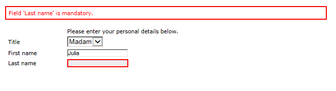
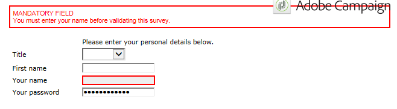

# 窗体渲染{#form-rendering}

## 选择表单渲染模板 {#selecting-the-form-rendering-template}

通过表单设置，您可以选择用于生成页面的模板。 要访问这些页面，请单击 **[!UICONTROL Properties]** 按钮，然后选择 **[!UICONTROL Rendering]** 选项卡。 默认情况下，有许多模板（样式表）可用。

通过编辑器的底部，可以查看所选模板的渲染。

缩放功能允许您编辑选定的模板。

您可以修改或覆盖这些模板。 为此，请单击 **[!UICONTROL Page layout...]** 链接和个性化信息。

您可以：

* 更改用作徽标的图像并调整其大小，
* 此外，还指定用户选择此渲染模板时访问预览图像的路径。

的 **[!UICONTROL Headers/Footers]** 选项卡，您可以使用此模板更改每个表单页面的页眉和页脚中显示的信息。

每行 **[!UICONTROL Page headers]** 和 **[!UICONTROL Page footers]** 部分对应于HTML页面中的行。 单击 **[!UICONTROL Add]** 来创建新行。

选择现有行，然后单击 **[!UICONTROL Detail]** 按钮将其个性化。

您可以通过相关选项卡更改行的内容、添加边框和更改字体属性。 单击 **[!UICONTROL OK]** 以确认这些更改。

的 **[!UICONTROL Position]** 利用字段，可定义元素在页眉和页脚中的位置。

>[!NOTE]
>
>渲染模板存储在 **[!UICONTROL Administration > Configuration > Form rendering]** 节点。\
>有关更多信息，请参阅 [自定义表单渲染](#customizing-form-rendering)

## 自定义表单渲染 {#customizing-form-rendering}

### 更改元素布局 {#changing-the-layout-of-elements}

您可以使表单中每个元素（输入字段、图像、单选按钮等）的样式表过载。

为此，请使用 **[!UICONTROL Advanced]** 选项卡。

它允许您定义以下属性：

* **[!UICONTROL Label position]**:请参阅 [定义标签的位置](defining-web-forms-layout.md#defining-the-position-of-labels),
* **[!UICONTROL Label format]**:自动换行或无自动换行，
* **[!UICONTROL Number of cells]** :请参阅 [在页面上定位字段](defining-web-forms-layout.md#positioning-the-fields-on-the-page),
* **[!UICONTROL Horizontal alignment]** （左、右、居中）和 **[!UICONTROL Vertical alignment]** （高、低、中），
* **[!UICONTROL Width]** 区域：可以以百分比或em、点或像素（默认值）表示，
* 最大值 **[!UICONTROL Length]**:允许的最大字符数（对于文本、数字和密码类型控件）；
* **[!UICONTROL Lines]**:行数 **[!UICONTROL Multi-line text]** 类型区域，
* **[!UICONTROL Style inline]**:允许您使用其他设置使CSS样式表过载。 这些区段使用 **;** 如下例所示的字符：

   

### 定义页眉和页脚 {#defining-headers-and-footers}

字段在树结构中排列，树结构的根与页面名称相同。 选择它以修改名称。

必须在 **[!UICONTROL Page]** 选项卡。 您还可以在页眉和页脚中添加一组内容（此信息将在每个页面上显示）。 此内容是在 **[!UICONTROL Texts]** 选项卡，如下所示：

### 将元素添加到HTML标题 {#adding-elements-to-html-header}

您可以输入要插入表单页面HTML标题的其他元素。 为此，请在 **[!UICONTROL Header]** 选项卡。

例如，您可以引用将在页面标题栏中显示的图标。

## 定义控制设置 {#defining-control-settings}

用户填写表单时，会根据特定字段的格式或配置对其自动执行检查。 这允许您将某些字段设为必填字段(请参阅 [定义必填字段](#defining-mandatory-fields))或检查输入数据的格式(请参阅 [检查数据格式](#checking-data-format))。 在页面批准期间执行检查（通过单击启用输出过渡的链接或按钮）。

### 定义必填字段 {#defining-mandatory-fields}

要将某些字段设为必填字段，请在创建字段时选择此选项。

如果用户未输入字段就批准此页面，则将显示以下消息：

您可以通过单击 **[!UICONTROL Personalize this message]** 链接。

如果用户未输入字段就批准此页面，则将显示以下消息：

### 检查数据格式 {#checking-data-format}

对于值存储在数据库现有字段中的表单检查，将应用存储字段的规则。

对于值存储在变量中的表单检查，批准规则取决于变量的格式。

例如，如果您创建 **[!UICONTROL Number]** 选中以存储客户端号，如下所示：

用户必须在表单字段中输入整数。

## 定义字段条件显示 {#defining-fields-conditional-display}

您可以根据用户选择的值配置页面上要显示的字段的显示。 这可以应用于一个字段或一组字段（当它们被分组到容器中时）。

对于页面的每个元素， **[!UICONTROL Visibility]** 部分，可定义显示条件。

条件可能与数据库字段或变量的值有关。

在字段选择窗口中，您可以从以下数据中进行选择：

* 主树包含表单上下文的参数。 默认参数为Identifier（与收件人的加密标识符匹配）、Language和Origin。

   有关详细信息，请参见此 [ 页面](defining-web-forms-properties.md#form-url-parameters)。

* 的 **[!UICONTROL Recipients]** 子树包含插入到表单中并存储在数据库中的输入字段。

   有关更多信息，请参阅 [在数据库中存储数据](web-forms-answers.md#storing-data-in-the-database).

* 的 **[!UICONTROL Variables]** 子树包含此表单的可用变量。 有关更多信息，请参阅 [将数据存储在本地变量中](web-forms-answers.md#storing-data-in-a-local-variable).

有关更多信息，请参阅此处提供的用例： [根据所选值显示不同的选项](use-cases--web-forms.md#displaying-different-options-depending-on-the-selected-values).

您还可以使用 **[!UICONTROL Test]** 对象。 有关详细信息，请参见此 [ 页面](defining-web-forms-page-sequencing.md#conditional-page-display)。

## 从现有表单导入元素 {#importing-elements-from-an-existing-form}

可以从其他Web窗体导入字段或容器。 这样，您就可以创建一个可重用块库，这些块将插入到表单中，如地址块、新闻稿订阅区域等。

要将元素导入表单，请应用以下步骤：

1. 编辑要在其中插入一个或多个元素的页面，然后单击 **[!UICONTROL Import an existing block]** 中。

   

1. 选择包含要导入的字段的Web窗体，然后选择要导入的容器和字段。

   

   >[!NOTE]
   >
   >的 **[!UICONTROL Edit link]** 源表单名称右侧的图标可让您查看选定的Web表单。

1. 单击 **[!UICONTROL Ok]** 确认插入。

   
