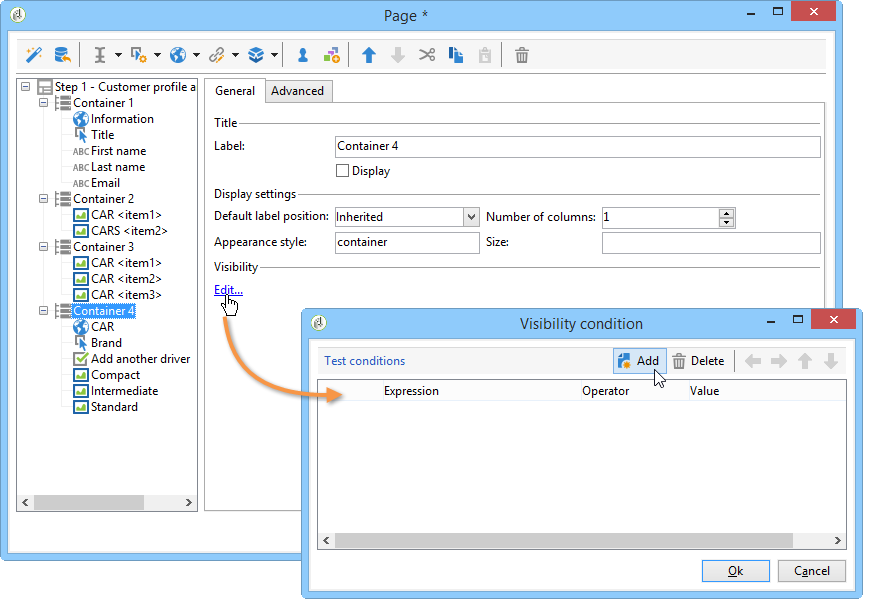

# 窗体渲染{#form-rendering}

## 选择表单渲染模板 {#selecting-the-form-rendering-template}

利用表单设置，可选择用于生成页面的模板。 要访问它们，请单击表单详细信息工具栏中的&#x200B;**[!UICONTROL Properties]**&#x200B;按钮，然后选择&#x200B;**[!UICONTROL Rendering]**&#x200B;选项卡。 默认情况下，有许多模板（样式表）可用。

该编辑器的底部部分允许您查看所选模板的渲染。

缩放功能允许您编辑选定的模板。

您可以修改或覆盖这些模板。 为此，请单击&#x200B;**[!UICONTROL Page layout...]**&#x200B;链接并个性化信息。

您可以：

* 更改用作徽标的图像，并调整其大小，
* 在用户选择此渲染模板时，还可以指定用于访问预览图像的路径。

**[!UICONTROL Headers/Footers]**&#x200B;选项卡允许您使用此模板更改每个表单页面页眉和页脚中显示的信息。

**[!UICONTROL Page headers]**&#x200B;和&#x200B;**[!UICONTROL Page footers]**&#x200B;部分的每一行都对应于HTML页中的一行。 单击&#x200B;**[!UICONTROL Add]**&#x200B;以创建新行。

选择现有行并单击&#x200B;**[!UICONTROL Detail]**&#x200B;按钮对其进行个性化。

您可以通过相关选项卡更改线条内容、添加边框和更改字体属性。 单击&#x200B;**[!UICONTROL OK]**&#x200B;以确认这些更改。

**[!UICONTROL Position]**&#x200B;字段允许您定义页眉和页脚中元素的位置。

>[!NOTE]
>
>渲染模板存储在&#x200B;**[!UICONTROL Administration > Configuration > Form rendering]**&#x200B;节点中。\
>有关详细信息，请参阅[自定义表单渲染](#customizing-form-rendering)

## 自定义表单渲染 {#customizing-form-rendering}

### 更改元素布局 {#changing-the-layout-of-elements}

您可以重载表单每个元素（输入字段、图像、单选按钮等）的样式表。

为此，请使用&#x200B;**[!UICONTROL Advanced]**&#x200B;选项卡。

它允许您定义以下属性：

* **[!UICONTROL Label position]**：请参阅[定义标签的位置](defining-web-forms-layout.md#defining-the-position-of-labels)，
* **[!UICONTROL Label format]**：自动换行或不自动换行，
* **[!UICONTROL Number of cells]** ：请参阅[定位页面上的字段](defining-web-forms-layout.md#positioning-the-fields-on-the-page)，
* **[!UICONTROL Horizontal alignment]** （左、右、中）和&#x200B;**[!UICONTROL Vertical alignment]** （高、低、中），
* 区域的&#x200B;**[!UICONTROL Width]**：这可以用百分比或以ems、点或像素（默认值）表示，
* 最大&#x200B;**[!UICONTROL Length]**：允许的最大字符数（对于文本、数字和密码类型控件），
* **[!UICONTROL Lines]**： **[!UICONTROL Multi-line text]**&#x200B;类型区域的行数，
* **[!UICONTROL Style inline]**：允许您使用其他设置重载CSS样式表。 这些字符使用&#x200B;**；**&#x200B;字符分隔，如以下示例所示：

  

### 定义页眉和页脚 {#defining-headers-and-footers}

字段以树结构排序，树结构的根与页面同名。 选择它以修改名称。

必须在表单属性窗口的&#x200B;**[!UICONTROL Page]**&#x200B;选项卡中输入窗口标题。 您还可以向页眉和页脚添加设置的内容（此信息将显示在每个页面上）。 此内容输入到&#x200B;**[!UICONTROL Texts]**&#x200B;选项卡的匹配部分中，如下所示：

### 向HTML标题添加元素 {#adding-elements-to-html-header}

您可以输入要插入到表单页面的HTML标题中的其他元素。 为此，请在相关页面的&#x200B;**[!UICONTROL Header]**&#x200B;选项卡中输入元素。

这允许您引用将显示在页面标题栏中的图标，例如。

## 定义控制设置 {#defining-control-settings}

当用户填写表单时，将根据字段的格式或配置，自动对特定字段执行检查。 这使您可以将某些字段设为必填字段（请参阅[定义必填字段](#defining-mandatory-fields)）或检查输入数据的格式（请参阅[检查数据格式](#checking-data-format)）。 在页面审批期间执行检查（通过单击启用输出转换的链接或按钮）。

### 定义必填字段 {#defining-mandatory-fields}

要将某些字段设为必填字段，请在创建字段时选择此选项。

如果用户未输入字段即批准此页面，则将显示以下消息：

您可以通过单击&#x200B;**[!UICONTROL Personalize this message]**&#x200B;链接将此邮件个性化。

如果用户未输入字段即批准此页面，则将显示以下消息：

### 检查数据格式 {#checking-data-format}

对于其值存储在数据库的现有字段中的表单检查，将应用存储字段的规则。

对于其值存储在变量中的表单检查，审批规则取决于变量的格式。

例如，如果创建&#x200B;**[!UICONTROL Number]**&#x200B;检查以存储客户端编号，如下所示：

用户必须在表单字段中输入整数。

## 定义字段条件显示 {#defining-fields-conditional-display}

您可以根据用户选择的值，配置要在页面上显示的字段的显示。 这可以应用于一个字段或一组字段（当它们分组在容器中时）。

对于页面的每个元素，**[!UICONTROL Visibility]**&#x200B;部分允许您定义显示条件。

条件可能与数据库字段或变量的值有关。

在字段选择窗口中，可以从以下数据中选择：

* 主树包含表单上下文的参数。 默认参数是Identifier（与收件人的加密标识符匹配）、Language和Origin。

  有关详细信息，请参见此 [ 页面](defining-web-forms-properties.md#form-url-parameters)。

* **[!UICONTROL Recipients]**&#x200B;子树包含插入到表单中并存储在数据库中的输入字段。

  有关详细信息，请参阅[将数据存储在数据库中](web-forms-answers.md#storing-data-in-the-database)。

* **[!UICONTROL Variables]**&#x200B;子树包含此表单的可用变量。 有关详细信息，请参阅[将数据存储在局部变量中](web-forms-answers.md#storing-data-in-a-local-variable)。

有关详细信息，请参阅此处提供的用例： [根据所选的值显示不同的选项](use-cases-web-forms.md#displaying-different-options-depending-on-the-selected-values)。

您还可以使用&#x200B;**[!UICONTROL Test]**&#x200B;对象来设置表单页面的显示条件。 有关详细信息，请参见此 [ 页面](defining-web-forms-page-sequencing.md#conditional-page-display)。

## 从现有表单导入元素 {#importing-elements-from-an-existing-form}

可以从其他Web窗体导入字段或容器。 这样，您就可以创建可重复使用的块库，这些块将插入到表单中，例如地址块、新闻稿订阅区域等。

要将元素导入表单，请应用以下步骤：

1. 编辑要向其中插入一个或多个元素的页面，然后单击工具栏中的&#x200B;**[!UICONTROL Import an existing block]**。

   

1. 选择包含要导入的字段的Web窗体，然后选择要导入的容器和字段。

   

   >[!NOTE]
   >
   >通过源表单名称右侧的&#x200B;**[!UICONTROL Edit link]**&#x200B;图标，可以查看选定的Web表单。

1. 单击&#x200B;**[!UICONTROL Ok]**&#x200B;确认插入。

   
