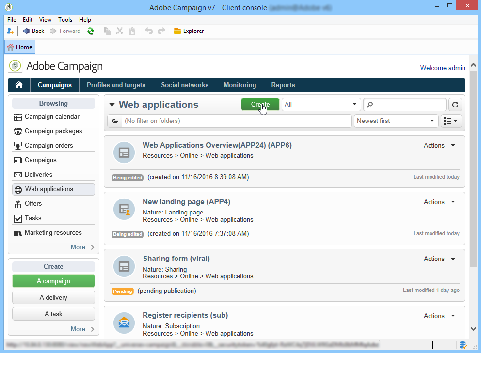

# 创建调查的关键步骤{#getting-started-with-surveys}

以下是使用以下模板快速概述创建简单调查的主要步骤：

这些步骤是：

1. [第1步——创建调查](#step-1---creating-a-survey),
1. [第2步——选择模板](#step-2---selecting-the-template),
1. [第3步——构建调查](#step-3---building-the-survey),
1. [第4步——创建页面内容](#step-4---creating-the-page-content),
1. [第5步——存储调查数据](#step-5---storing-the-survey-data-),
1. [第6步——发布页面](#step-6---publishing-the-pages),
1. [第7步——共享在线调查](#step-7---sharing-your-online-survey)。

## 步骤1 —— 创建调查{#step-1---creating-a-survey}

要创建新调查，请转至&#x200B;**[!UICONTROL Campaigns]**&#x200B;或&#x200B;**[!UICONTROL Profiles and targets]**&#x200B;选项卡，然后单击&#x200B;**[!UICONTROL Web Applications]**&#x200B;菜单。 单击表单列表上方的&#x200B;**[!UICONTROL Create]**&#x200B;按钮。

## 第2步——选择模板{#step-2---selecting-the-template}

选择调查模板，然后为调查命名。 此名称不会被最终用户看到，但允许在调查中识别Adobe Campaign。 单击&#x200B;**[!UICONTROL Save]**&#x200B;将调查添加到Web 应用程序的列表。

## 步骤3 —— 构建调查{#step-3---building-the-survey}

调查在放置以下元素的图中构建：创建内容的页面、数据预加载和保存步骤以及测试阶段。 脚本和查询也可以插入。

要构建图表，请单击调查的&#x200B;**[!UICONTROL Edit]**&#x200B;表单。

调查必须至少包含以下三个组件：****:页面、存储框和结束页面。

* 要创建页面，请在编辑器的左侧部分选择&#x200B;**[!UICONTROL Page]**&#x200B;对象，然后将其放入中间部分，如下所示：

   

* 然后，选择&#x200B;**[!UICONTROL Storage]**&#x200B;对象，并将其放在页面的输出过渡。
* 最后，选择&#x200B;**[!UICONTROL End]**&#x200B;对象并将其放在存储框的输出过渡的末尾，以获得以下图：

   

## 第4步——创建页面内容{#step-4---creating-the-page-content}

在以下示例中，我们使用&#x200B;**[!UICONTROL Page (v5 compatibility)]**&#x200B;类型页面。 此类型的页面可通过&#x200B;**[!UICONTROL Edit]**&#x200B;选项卡的高级菜单访问。

* 添加输入字段

   要创建页面内容，您必须编辑该内容：为此，请多次单击&#x200B;**[!UICONTROL Page]**&#x200B;对象。 单击工具栏中的第一个图标以打开字段创建向导。 要为要存储在收件人用户档案匹配字段中的用户名创建一个输入字段，请选择&#x200B;**[!UICONTROL Edit a recipient]**。

   

   单击&#x200B;**[!UICONTROL Next]**&#x200B;按钮以选择数据库中存储的字段。 在这种情况下，为“姓”字段。

   

   单击&#x200B;**[!UICONTROL Finish]**&#x200B;以确认字段创建。

   默认情况下，当信息存储在数据库中已存在的字段中时，该字段将使用选定字段的名称，即此示例中为“姓氏”。 您可以修改此标签，如下所示：

   

   现在为用户帐户号创建一个输入字段。 重复此操作，然后选择“帐户否”。 的双曲余切值。

   应用相同的过程，为用户添加一个字段以输入电子邮件地址。

* 要创建问题，请右键单击树中的最后一个元素，然后选择&#x200B;**[!UICONTROL Containers > Question]**，或单击&#x200B;**[!UICONTROL Containers]**&#x200B;图标并选择&#x200B;**[!UICONTROL Question]**。

   

   输入问题的标签并插入答案字段作为问题的子分支。 为此，在创建答案字段时，必须选择与问题链接的节点。 使用&#x200B;**[!UICONTROL Selection controls]**&#x200B;图标或右键单击添加&#x200B;**[!UICONTROL drop-down listx]**，如下所示：

   

   选择存储空间：选择一个明细列表字段以自动检索值(本例中为电子邮件格式)。

   

   在&#x200B;**[!UICONTROL General]**&#x200B;选项卡中，单击&#x200B;**[!UICONTROL Initialize the list of values from the database]**&#x200B;链接：将自动输入值表。

   

   单击&#x200B;**[!UICONTROL OK]**&#x200B;关闭编辑器，单击&#x200B;**[!UICONTROL Save]**&#x200B;保存更改。

   >[!NOTE]
   >
   >由于&#x200B;**[!UICONTROL Advanced]**&#x200B;选项卡中的选项，您可以针对每个字段或问题调整页面布局以满足您的需求。 [此部分](../../web/using/about-web-forms.md)中详细介绍了调查屏幕的布局。

   在详细信息屏幕中，单击&#x200B;**[!UICONTROL Preview]**&#x200B;选项卡以视图您刚刚创建的调查的呈现。

   

## 步骤5 —— 存储调查数据{#step-5---storing-the-survey-data-}

存储框允许您将用户响应保存在数据库中。 必须选择一个合并关键项来标识数据库中已有的用户档案。

为此，请编辑该框，并选择存储合并关键项时将用作数据的字段。

在以下示例中，在进行保存（确认）时，如果用户档案与表单中的一个输入具有相同的帐号保存在数据库中，则用户档案将会更新。 如果用户档案不存在，则将创建它。

单击&#x200B;**[!UICONTROL OK]**&#x200B;进行确认，然后单击&#x200B;**[!UICONTROL Save]**&#x200B;保存调查

## 第6步——发布页面{#step-6---publishing-the-pages}

要使用户能够访问HTML页面，必须使应用程序可用。 它不再处于编辑阶段，而是在生产阶段。 要将调查投入生产，您必须发布它。 操作步骤：

* 单击位于调查仪表板上方的&#x200B;**[!UICONTROL Publish]**&#x200B;按钮。
* 单击&#x200B;**[!UICONTROL Start]**&#x200B;启动发布并关闭向导。

   

   调查的状态将更改为：**联机**。

   

## 第7步——共享在线调查{#step-7---sharing-your-online-survey}

调查投入生产后，服务器上即可访问它，并且您可以提供它。 访问调查的URL显示在仪表板上。

要传送调查，您可以发送一条消息，其中包含指向目标群的访问链接，或将调查访问URL放在网页上。

然后，您可以通过报告和日志监视用户响应。 请参阅[响应跟踪](../../web/using/publish--track-and-use-collected-data.md#response-tracking)。

>[!CAUTION]
>
>公共URL包括调查的内部名称。 修改内部名称时，URL会自动更新：必须同时更新指向调查的所有链接。
>
>如果已发送包含指向表单的链接的投放，则此链接将不再有效。

