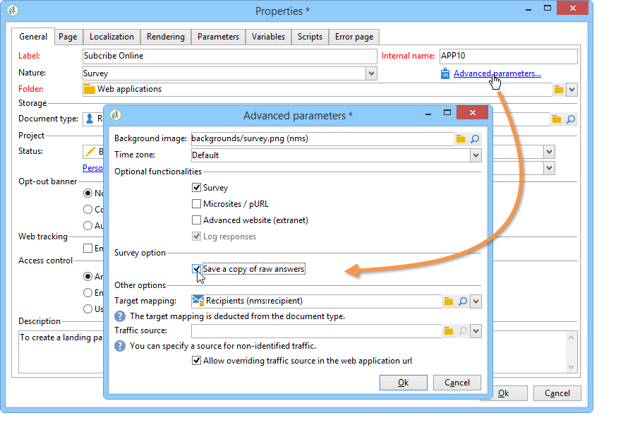

# 管理答案{#managing-answers}

## 存储收集的答案{#storing-collected-answers}

除了Adobe Campaign中所有Web 窗体（数据库字段和本地变量）通用的标准存储模式之外，调查还支持使用归档字段动态扩展数据模型。

>[!CAUTION]
>
>此选项仅适用于&#x200B;**调查**&#x200B;类型Web 应用程序。 它不提供给其他类型的Web 窗体。

### 存储在存档字段{#storing-in-an-archived-field}中

通过添加新的存储空间来保存调查中提供的响应，可以轻松扩展数据模板。 为此，请在创建输入字段时选择&#x200B;**[!UICONTROL Store answers to a question]**&#x200B;选项。 单击&#x200B;**[!UICONTROL New field...]**&#x200B;链接并指定其属性：


输入字段的标签和名称，然后选择字段类型：文本、布尔、整数或小数、日期等

所选字段的类型涉及在用户输入响应时控制数据。 对于&#x200B;**text**&#x200B;字段，可添加约束（大小写，格式）或指向现有明细列表的链接以强制选择。

要添加约束，请从下拉列表中选择它。 有两种约束：

1. 字符大小写

   输入的信息可以以下列格式存储在字段中：全大写、全小写或初始大写。 此约束不要求用户以所选格式输入数据，但在保存时将转换在字段中输入的内容。

1. 数据格式

如果在列表中使用此字段，则可以使用值列表上方的&#x200B;**[!UICONTROL Initialize the list of values from the database]**&#x200B;链接在值表中自动检索明细列表的值。

例如，您可以为用户创建一个下拉列表以选择其本地语言。 相应的存档字段可以与&#x200B;**language**&#x200B;明细列表关联，后者包含语言列表:


位于字段右侧的&#x200B;**[!UICONTROL Edit link]**&#x200B;图标允许您编辑此明细列表的内容：


在字段的&#x200B;**[!UICONTROL General]**&#x200B;选项卡中，**[!UICONTROL Initialize the list of values from the database]**&#x200B;链接允许您自动输入所提供标签的列表。


**示例**:将收件人合同存储在一个字段

要在一个字段中存储不同类型的合同，请创建一个&#x200B;**[!UICONTROL Text]**&#x200B;输入字段并选择&#x200B;**[!UICONTROL Store answers to a question]**&#x200B;选项。

单击&#x200B;**[!UICONTROL New field...]**&#x200B;链接并输入字段属性。 选择&#x200B;**[!UICONTROL Multiple values]**&#x200B;选项以启用多个值的存储。


为其他合同创建条目字段，并将数据存储在同一存档字段中。


用户批准调查后，其答案将存储在&#x200B;**[!UICONTROL Contracts]**&#x200B;字段中。

在我们的示例中，对于以下答案：


被申请人的用户档案将包含所输入的四份合同。

可通过显示相关列，在调查的&#x200B;**[!UICONTROL Answers]**&#x200B;选项卡中查看它们。


您还可以根据答案筛选收件人，以仅显示您感兴趣的用户。 要执行此操作，请创建定位工作流并使用&#x200B;**[!UICONTROL Survey responses]**&#x200B;框。


根据要恢复的用户档案创建查询。 在以下示例中，查询允许您选择具有至少两个合同的用户档案，包括A类型合同。


对于每个表单，提供的答案可用于字段或标签中。 对存储在存档字段中的内容使用以下语法：

```
<%= ctx.webAppLogRcpData.name of the archived field %
```

>[!NOTE]
>
>对于其他类型的字段，[本节](../../platform/using/about-queries-in-campaign.md)中详细介绍了语法。

### 存储设置{#storage-settings}

可以将答案以XML格式存档到调查。 这样，您可以保存收集的答案的原始副本，当分项列表中的数据过度标准化时，这非常有用（有关详细信息，请参阅[标准化数据](../../web/using/publish--track-and-use-collected-data.md#standardizing-data)）。

>[!CAUTION]
>
>归档原始响应会大大增加所需的存储空间。 谨慎使用此选项。

操作步骤：

* 通过&#x200B;**[!UICONTROL Edit]**&#x200B;选项卡的&#x200B;**[!UICONTROL Properties]**&#x200B;按钮编辑调查属性。
* 单击&#x200B;**[!UICONTROL Advanced parameters]**&#x200B;链接并选中&#x200B;**[!UICONTROL Save a copy of raw answers]**&#x200B;选项。



默认情况下，您可以为所有调查启用此选项(在发布调查时应用此选项)。 为此，请创建&#x200B;**[!UICONTROL NmsWebApp_XmlBackup]**&#x200B;选项并为其分配值&#x200B;**[!UICONTROL 1]**，如下所示：


## 得分管理{#score-management}

您可以为表单页面中提供的选项分配分数。 得分只能链接到已结问题：复选框、来自下拉列表的值、订阅等。

>[!CAUTION]
>
>得分管理仅适用于&#x200B;**调查**。


当确认页面时，即当用户单击&#x200B;**[!UICONTROL Next]**&#x200B;或&#x200B;**[!UICONTROL Finish]**&#x200B;按钮时，会在服务器端累积和保存分数。

>[!NOTE]
>
>可以使用正值或负值、整数值或非整数值。

可在测试或脚本中使用分数。

>[!CAUTION]
>
>分数不能用于同一页面上字段的可见性条件。 但是，它们可在后续页面中使用。

* 要在测试中使用分数，请使用测试计算公式中的&#x200B;**[!UICONTROL Score]**&#x200B;字段，如下所示：

   

* 您可以在脚本中使用得分。

**示例**:计算分数，并将其用作显示下一页的条件：

* 在调查中，下一页允许您根据在下拉列表中选择的值为用户分配不同的分数：

   

* 您可以根据选定的选项，将此得分与第二个值组合在一起：

   

* 当用户单击&#x200B;**[!UICONTROL Next]**&#x200B;按钮时，这两个值相加。

   

* 可以根据分数对要显示的页面应用条件。 配置如下：

   

   

