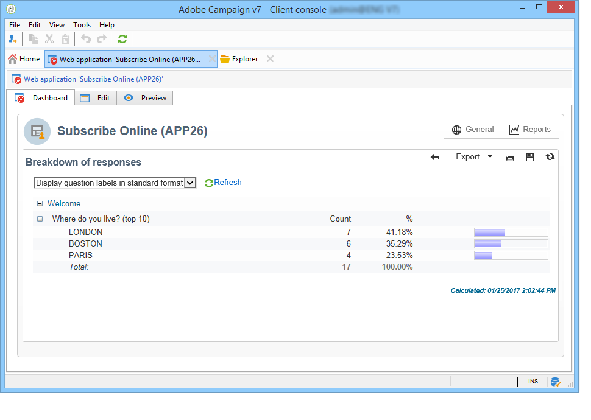
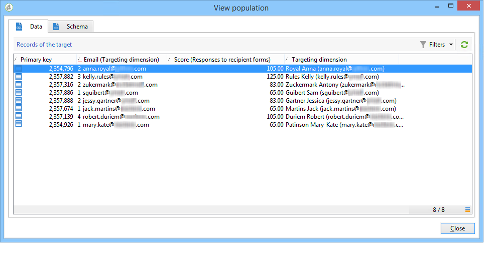
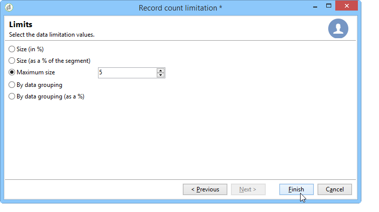

# 发布、跟踪和使用收集的数据{#publish-track-and-use-collected-data}

创建、配置和发布表单后，您可以与受众共享该链接并跟踪响应。

>[!NOTE]
>
>Adobe Campaign中调查的生命周期及其发布和投放模式与Web 窗体的生命周期相似：这些内容详见[本节](../../web/using/about-web-forms.md)。

## 调查仪表板{#survey-dashboard}

每个调查都有自己的仪表板，您可以通过它视图其状态、描述、公共URL和可用性计划。 它还允许您视图可用的报表。 有关详细信息，请参阅[关于调查的报告](#reports-on-surveys)。

调查的公共URL显示在仪表板上：


## 响应跟踪{#response-tracking}

您可以在日志和报表中跟踪对调查的响应。

### 调查日志{#survey-logs}

对于交付的每个调查，您可以在&#x200B;**[!UICONTROL Logs]**&#x200B;选项卡中跟踪响应。 此选项卡显示已完成调查的用户的列表及其来源:


多次单击某行，以显示被答复者填写的调查表单。 您可以全文浏览调查并完整访问答案。 这些文件可以导出到外部文件中。 有关详细信息，请参阅[导出答案](#exporting-answers)。

来源通过添加以下字符在调查URL中指示：

```
?origin=xxx
```

在编辑调查时，其URL包含参数&#x200B;**[!UICONTROL __uuid]**，该参数指示它处于测试阶段且尚未联机。 当您通过此URL访问调查时，在跟踪（报告）中不会考虑创建的记录。 来源被强制为值&#x200B;**[!UICONTROL Adobe Campaign]**。

有关URL参数的详细信息，请参阅[此页](../../web/using/defining-web-forms-properties.md#form-url-parameters)。

### 关于调查{#reports-on-surveys}的报告

通过“仪表板”选项卡可访问调查报告。 单击报表名称以视图它。


**[!UICONTROL Documentation]**&#x200B;报告中显示调查的结构。

Web调查的&#x200B;**[!UICONTROL Reports]**&#x200B;选项卡中提供了另外两个Web调查报告：**[!UICONTROL General]**&#x200B;和&#x200B;**[!UICONTROL Breakdown of responses]**。

* 常规

   本报告包含有关该调查的一般信息：响应数随时间的变化情况以及按来源和语言分布的情况。

   一般报告示例：

   

* 答复分类

   此报表显示每个问题的答复的细目。 此划分仅适用于对存储在&#x200B;**[!UICONTROL Question]**&#x200B;类型容器中的字段给出的答案。 它仅对选择控件有效（例如，不对文本字段进行划分）。

   

## 导出答案{#exporting-answers}

可以将调查的答案导出到外部文件中，以便日后处理。 有两种方法可以实现：

1. 导出报告数据

   要导出报告数据，请单击&#x200B;**[!UICONTROL Export]**&#x200B;按钮并选择导出格式。

   有关导出报告数据的详细信息，请参阅[本节](../../reporting/using/about-reports-creation-in-campaign.md)。

1. 导出答案

   要导出答案，请单击调查的&#x200B;**[!UICONTROL Responses]**&#x200B;选项卡，然后右键单击。 选择 **[!UICONTROL Export...]**。

   

   然后输入要导出的信息和存储文件。

   您可以在导出向导中配置输出文件的内容和格式。

   这样您可以：

   * 向输出文件添加列并恢复收件人（存储在数据库中）上的信息，
   * 格式化导出的数据，
   * 为文件中的信息选择编码格式。

   如果要导出的调查包含多个&#x200B;**[!UICONTROL Multi-line text]**&#x200B;或&#x200B;**[!UICONTROL HTML text]**&#x200B;字段，则必须以&#x200B;**[!UICONTROL XML]**&#x200B;格式导出。 为此，请在&#x200B;**[!UICONTROL Output format]**&#x200B;字段的下拉列表中选择此格式，如下所示：

   

   单击&#x200B;**[!UICONTROL Start]**&#x200B;以运行导出。

   >[!NOTE]
   >
   >[本节](../../platform/using/about-generic-imports-exports.md)详细介绍了数据导出及其配置的各个阶段。

## 使用收集的数据{#using-the-collected-data}

通过在线调查收集的信息可以在定位工作流的框架内恢复。 为此，请使用&#x200B;**[!UICONTROL Survey responses]**&#x200B;框。

在以下示例中，我们希望为五个在线优惠中至少有两个子级且得分最高的收件人制作Web调查。 本调查的答案是：


在定位工作流中，**[!UICONTROL Survey responses]**&#x200B;将配置如下：


开始，选择相关调查，然后在窗口的中央部分提取数据。 在这种情况下，我们至少需要提取分数列，因为它将用在拆分框中以恢复最高的五分。

单击&#x200B;**[!UICONTROL Edit query...]**&#x200B;链接以指示答案的筛选条件。


开始定位工作流。 查询恢复了8个收件人。


右键单击收藏集框的输出过渡以视图它们。



然后在工作流中放置一个拆分框以恢复得分最高的5个收件人。

编辑拆分框以配置它：

* 开始，在&#x200B;**[!UICONTROL General]**&#x200B;选项卡中选择适当的模式，然后配置子集：

   

* 转到&#x200B;**[!UICONTROL Sub-sets]**&#x200B;选项卡并选择&#x200B;**[!UICONTROL Limit the selected records]**&#x200B;选项，然后单击&#x200B;**[!UICONTROL Edit...]**&#x200B;链接。

   

* 选择&#x200B;**[!UICONTROL Keep only the first records after sorting]**&#x200B;选项，然后选择排序列。 勾选 **[!UICONTROL Descending sort]** 选项。

   

* 单击&#x200B;**[!UICONTROL Next]**&#x200B;按钮，将记录数限制为5。

   

* 单击&#x200B;**[!UICONTROL Finish]**，然后重新启动工作流以批准定位。

## 标准化数据{#standardizing-data}

可以在Adobe Campaign中设置标准化流程，以便使用别名收集数据。 这样，您就可以标准化存储在数据库中的数据：为此，请在包含相关信息的分项列表中定义别名。

有关详细信息，请参见[此页面](../../platform/using/managing-enumerations.md#about-enumerations)。
