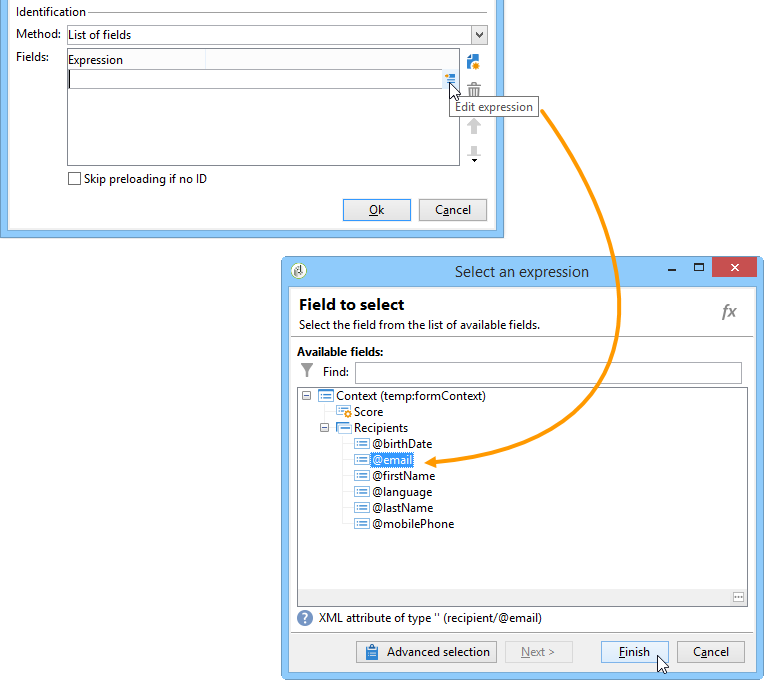
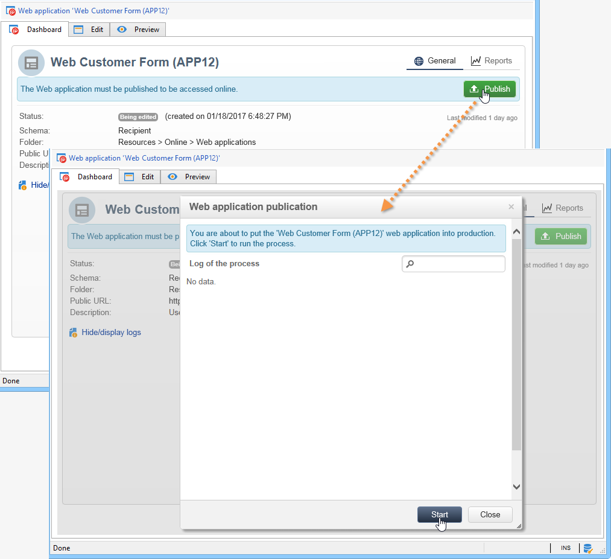
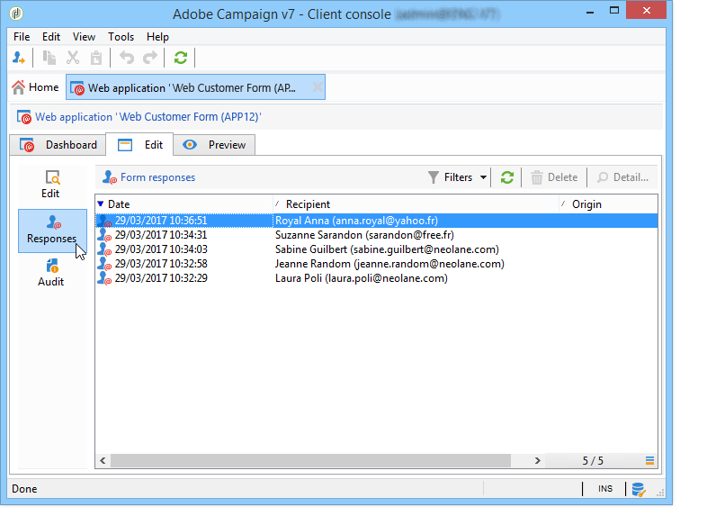

# 发布 Web 窗体{#publishing-a-web-form}


## 预加载表单数据 {#pre-loading-the-form-data}

如果您希望通过Web窗体更新存储在数据库中的用户档案，则可以使用预加载框。 通过预加载框，您可以指示如何在数据库中查找要更新的记录。

可以使用以下识别方法：

* **[!UICONTROL Adobe Campaign Encryption]**

  此加密方法使用加密的Adobe Campaign标识符(ID)。 此方法仅适用于Adobe Campaign对象，并且加密的ID只能由Adobe Campaign平台生成。

  使用此方法时，您需要通过添加&#x200B;**`<%=escapeUrl(recipient.cryptedId) %>`**&#x200B;参数来调整要传送到电子邮件地址的表单的URL。 有关详情，请参阅[通过电子邮件传递表单](#delivering-a-form-via-email)。

* **[!UICONTROL DES encryption]**

  

  此加密方法使用外部提供的标识符(ID)，该ID链接到Adobe Campaign和外部提供商共享的密钥。 **[!UICONTROL Des key]**&#x200B;字段允许您输入此加密密钥。

* **[!UICONTROL List of fields]**

  此选项允许您从表单当前上下文中的字段中进行选择，这些字段将用于查找数据库中的相应用户档案。

  

  可以通过&#x200B;**[!UICONTROL Parameters]**&#x200B;选项卡向表单属性添加字段（请参阅[添加参数](defining-web-forms-properties.md#adding-parameters)）。 它们以URL或输入区域的形式放置。

  >[!CAUTION]
  >
  >所选字段中的数据未加密。 不能以加密形式提供它，因为如果选择&#x200B;**[!UICONTROL Field list]**&#x200B;选项，Adobe Campaign将无法对其进行解密。

  在以下示例中，用户档案预加载基于电子邮件地址。

  URL可以包含未加密的电子邮件地址，在这种情况下，用户可以直接访问与其相关的页面。

  

  否则，将要求他们提供密码。

  

  >[!CAUTION]
  >
  >如果列表中指定了多个字段，则&#x200B;**ALL FIELDS**&#x200B;的数据必须与数据库中存储的数据匹配，才能更新配置文件。 否则，将创建一个新配置文件。
  > 
  >此函数对于Web应用程序特别有用，但不建议用于公共表单。 选择的访问控制选项必须是“启用访问控制”。

如果您不想更新配置文件，则必须选择&#x200B;**[!UICONTROL Skip preloading if no ID]**&#x200B;选项。 在这种情况下，输入的每个用户档案都将在批准表单后添加到数据库中。 例如，当表单在网站上发布时，将使用此选项。

**[!UICONTROL Auto-load data referenced in the form]**&#x200B;选项允许您自动预加载与表单中的输入和合并字段匹配的数据。 但是，不涉及&#x200B;**[!UICONTROL Script]**&#x200B;和&#x200B;**[!UICONTROL Test]**&#x200B;活动中引用的数据。 如果未选择此选项，则需要使用&#x200B;**[!UICONTROL Load additional data]**&#x200B;选项定义字段。

使用&#x200B;**[!UICONTROL Load additional data]**&#x200B;选项，您可以添加表单页面中未使用但将预加载的信息。

例如，您可以预先加载收件人的性别，并通过测试框自动将他们定向到适当的页面。


## 管理Web窗体交付和跟踪 {#managing-web-forms-delivery-and-tracking}

创建、配置和发布表单后，您可以交付表单并跟踪用户响应。

### 表单的生命周期 {#life-cycle-of-a-form}

在形式的生命周期中，有三个阶段：

1. **正在编辑**

   这是初始设计阶段。 创建新表单时，它处于编辑阶段。 访问表单仅用于测试目的，然后要求在其URL中使用参数&#x200B;**[!UICONTROL __uuid]**。 此URL可在&#x200B;**[!UICONTROL Preview]**&#x200B;子选项卡中访问。 请参阅[表单URL参数](defining-web-forms-properties.md#form-url-parameters)。

   >[!CAUTION]
   >
   >只要正在编辑表单，其访问URL就是特殊的URL。

1. **待处理发布**

   在某些情况下（例如当[通过包](#import-web-packages)导入表单时），Web表单可能具有&#x200B;**[!UICONTROL Pending publication]**&#x200B;状态，直到其上线为止。

   >[!NOTE]
   >
   >对于技术Web应用程序（通过&#x200B;**[!UICONTROL Administration]** > **[!UICONTROL Configuration]** > **[!UICONTROL Web applications]**&#x200B;菜单提供），状态为&#x200B;**[!UICONTROL Pending publication]**&#x200B;的表单会自动[已发布](#publishing-a-form)，并获得&#x200B;**[!UICONTROL Online]**&#x200B;状态。

1. **联机**

   设计阶段完成后，即可交付表单。

   当表单的状态为&#x200B;**[!UICONTROL Being edited]**&#x200B;或&#x200B;**[!UICONTROL Pending publication]**&#x200B;时，它必须是[已发布](#publishing-a-form)才能联机并可通过Web表单URL在浏览器中访问。

   发布后，该表单将一直有效，直到其过期。

   该表单将为&#x200B;**[!UICONTROL Live]**，直到它过期。

   >[!CAUTION]
   >
   >要传递，表单的URL不得包含&#x200B;**[!UICONTROL __uuid]**&#x200B;参数。

1. **已关闭**

   表单关闭后，投放阶段结束，表单不可用：用户无法再访问该表单。

   可在表单属性窗口中定义到期日期。 有关详情，请参阅[在线提供表单](#making-a-form-available-online)。

表单的发布状态会显示在表单列表中。


### 发布表单 {#publishing-a-form}

要更改表单的状态，您需要发布表单。 为此，请单击Web窗体列表上方的&#x200B;**[!UICONTROL Publication]**&#x200B;按钮，然后在下拉框中选择状态。



### 在线提供表单 {#making-a-form-available-online}

要被用户访问，表单必须处于生产状态并启动，即在其有效期内。 通过表单的&#x200B;**[!UICONTROL Properties]**&#x200B;链接输入有效日期。

* 使用&#x200B;**[!UICONTROL Project]**&#x200B;部分中的字段输入表单的开始日期和结束日期。

  

* 单击&#x200B;**[!UICONTROL Personalize the message displayed if the form is closed...]**&#x200B;链接以定义当用户尝试在表单无效时访问表单时显示的错误消息。

  查看表单[&#128279;](defining-web-forms-properties.md#accessibility-of-the-form)的辅助功能。

### 通过电子邮件投放表单 {#delivering-a-form-via-email}

当您通过电子邮件发送邀请时，可以使用&#x200B;**[!UICONTROL Adobe Campaign Encryption]**&#x200B;选项进行数据协调。 为此，请转到投放助手，并通过添加以下参数将链接调整为表单：

```
<a href="https://server/webApp/APP264?&id=<%=escapeUrl(recipient.cryptedId) %>">
```

在这种情况下，数据存储的协调密钥必须是收件人的加密标识符。 有关详细信息，请参阅[预加载表单数据](#pre-loading-the-form-data)。

在这种情况下，您需要选中记录框中的&#x200B;**[!UICONTROL Update the preloaded record]**&#x200B;选项。 有关详情，请参阅[保存Web窗体答案](web-forms-answers.md#saving-web-forms-answers)。


### 日志响应 {#log-responses}

可以在专用选项卡中激活响应跟踪，以监控Web表单的影响。 为此，请单击表单属性窗口中的&#x200B;**[!UICONTROL Advanced parameters...]**&#x200B;链接，然后选择&#x200B;**[!UICONTROL Log responses]**&#x200B;选项。


**[!UICONTROL Responses]**&#x200B;选项卡允许您查看受访者的身份。



选择收件人并单击&#x200B;**[!UICONTROL Detail...]**&#x200B;按钮以查看提供的响应。


您可以处理查询中提供的响应日志，例如，在发送提醒时仅定向非回应者，或仅向回应者提供特定通信。

### 导入Web窗体包 {#import-web-packages}

将包含Web表单的包从实例导出和导入另一个实例（例如，从暂存到生产）时，新实例上的Web表单状态可能会因几种情况而异。 下面列出了不同的情况。

在[本节](#life-cycle-of-a-form)中了解有关Web窗体不同状态的更多信息。

>[!NOTE]
>
>通过资源包导出Web表单时，表单状态将显示在结果资源包的内容中。

* 如果从第一个实例导出Web窗体时其状态为&#x200B;**[!UICONTROL Pending publication]**&#x200B;或&#x200B;**[!UICONTROL Online]**：

   * 在新实例上导入Web窗体时，该窗体获得&#x200B;**[!UICONTROL Pending publication]**&#x200B;状态。

   * 如果新实例上已存在该Web表单，则该表单会被替换为表单的新版本，并具有&#x200B;**[!UICONTROL Pending publication]**&#x200B;状态，即使表单的旧版本为&#x200B;**[!UICONTROL Online]**&#x200B;也是如此。

   * 无论该表单是否存在都必须为[已发布](#publishing-a-form)，才能在新实例上变为&#x200B;**[!UICONTROL Online]**，并且可通过浏览器中的Web表单URL访问。

* 如果Web窗体在导出时状态为&#x200B;**[!UICONTROL Being edited]**：

   * 如果在导入包的实例上新增Web窗体，则Web窗体将获得&#x200B;**[!UICONTROL Being edited]**&#x200B;状态。

   * 如果新实例上已存在该Web表单，则这是对现有表单的修改。 如果表单的旧版本为&#x200B;**[!UICONTROL Online]**，则旧版本将保持联机状态，直到表单的新版本在新实例上再次发布为[&#128279;](#publishing-a-form)。

  >[!NOTE]
  >
  >您可以使用&#x200B;**[!UICONTROL Preview]**&#x200B;选项卡检查Web窗体的最新版本。

<!--For RN:
* Now, when a web form has the **Pending publication** status, it must be published before it becomes **Online** and accessible through the web form URL in a web browser. [Read more](../../web/using/publishing-a-web-form.md#life-cycle-of-a-form)
-->
