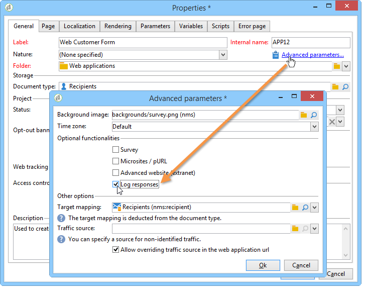

# 发布 Web 窗体{#publishing-a-web-form}


## 预加载表单数据 {#pre-loading-the-form-data}

如果希望通过Web窗体更新存储在数据库中的用户档案，则可以使用预加载框。 利用预加载框，可指示如何在数据库中查找要更新的记录。

可以使用以下识别方法：

* **[!UICONTROL Adobe Campaign Encryption]**

   此加密方法使用加密的Adobe Campaign标识符(ID)。 此方法仅适用于Adobe Campaign对象，且加密的ID只能由Adobe Campaign平台生成。

   使用此方法时，您需要修改表单的URL，以将 **`<%=escapeUrl(recipient.cryptedId) %>`** 参数。 有关更多信息，请参阅 [通过电子邮件投放表单](#delivering-a-form-via-email).

* **[!UICONTROL DES encryption]**

   

   此加密方法使用外部提供的标识符(ID)，该标识符链接到由Adobe Campaign和外部提供商共享的密钥。 的 **[!UICONTROL Des key]** 字段中，您可以输入此加密密钥。

* **[!UICONTROL List of fields]**

   此选项允许您从表单当前上下文中的字段进行选择，这些字段将用于在数据库中查找相应的用户档案。

   

   可以通过 **[!UICONTROL Parameters]** 选项卡(请参阅 [添加参数](defining-web-forms-properties.md#adding-parameters))。 它们以URL或输入区域的形式放置。

   >[!CAUTION]
   >
   >所选字段中的数据未加密。 不得以加密形式提供，因为如果 **[!UICONTROL Field list]** 选项。

   在以下示例中，用户档案预加载基于电子邮件地址。

   该URL可以包含未加密的电子邮件地址，在这种情况下，用户可以直接访问与他们相关的页面。

   

   否则，将要求他们输入密码。

   

   >[!CAUTION]
   >
   >如果在列表中指定了多个字段，则 **所有字段** 必须匹配数据库中存储的数据才能更新用户档案。 否则，将创建新用户档案。
   > 
   >此函数对Web应用程序特别有用，但不建议用于公共表单。 选定的访问控制选项必须是“启用访问控制”。

的 **[!UICONTROL Skip preloading if no ID]** 选项。 在这种情况下，输入的每个用户档案都将在表单获得批准后添加到数据库中。 例如，当表单发布到网站时，会使用此选项。

的 **[!UICONTROL Auto-load data referenced in the form]** 选项允许您自动预载与表单中的输入和合并字段匹配的数据。 但是， **[!UICONTROL Script]** 和 **[!UICONTROL Test]** 活动不关心。 如果未选择此选项，则需要使用 **[!UICONTROL Load additional data]** 选项。

的 **[!UICONTROL Load additional data]** 选项允许您添加未在表单页面中使用但仍将预加载的信息。

例如，您可以预加载收件人的性别，并通过测试框自动将其定向到相应的页面。


## 管理Web窗体交付和跟踪 {#managing-web-forms-delivery-and-tracking}

创建、配置和发布表单后，您可以交付该表单并跟踪用户响应。

### 表单的生命周期 {#life-cycle-of-a-form}

表单生命周期有三个阶段：

1. **正在编辑的表单**

   这是最初的设计阶段。 创建新表单后，该表单将处于编辑阶段。 访问表单（仅用于测试目的），然后需要参数 **[!UICONTROL __uuid]** 用于其URL中。 此URL可在 **[!UICONTROL Preview]** 子选项卡。 请参阅 [表单URL参数](defining-web-forms-properties.md#form-url-parameters).

   >[!CAUTION]
   >
   >只要对表单进行编辑，其访问URL就是特殊的URL。

1. **联机表单**

   设计阶段完成后，即可提交表单。 首先，它需要发布。 有关更多信息，请参阅 [发布表单](#publishing-a-form).

   表格将为 **[!UICONTROL Live]** 直到它过期。

   >[!CAUTION]
   >
   >要传送，调查的URL不得包含 **[!UICONTROL __uuid]** 参数。

1. **表单不可用**

   表单关闭后，投放阶段即告结束，表单将变得不可用：用户无法再访问该库。

   到期日期可在表单属性窗口中定义。 有关更多信息，请参阅 [联机提供表单](#making-a-form-available-online)

表单的发布状态显示在表单列表中。


### 发布表单 {#publishing-a-form}

要更改表单的状态，您需要发布它。 为此，请单击 **[!UICONTROL Publication]** 按钮，然后在下拉框中选择状态。


### 联机提供表单 {#making-a-form-available-online}

要供用户访问，表单必须在生产中并启动，即在其有效期内。 有效日期通过 **[!UICONTROL Properties]** 链接。

* 使用 **[!UICONTROL Project]** 部分输入表单的开始和结束日期。

   

* 单击 **[!UICONTROL Personalize the message displayed if the form is closed...]** 链接以定义用户在表单无效时尝试访问表单时要显示的错误消息。

   请参阅 [表单的辅助功能](defining-web-forms-properties.md#accessibility-of-the-form).

### 通过电子邮件投放表单 {#delivering-a-form-via-email}

通过电子邮件发送邀请时，您可以使用 **[!UICONTROL Adobe Campaign Encryption]** 用于数据协调的选项。 为此，请转到投放向导，并通过添加以下参数来调整表单的链接：

```
<a href="https://server/webApp/APP264?&id=<%=escapeUrl(recipient.cryptedId) %>">
```

在这种情况下，数据存储的协调密钥必须是收件人的加密标识符。 有关更多信息，请参阅 [预加载表单数据](#pre-loading-the-form-data).

在这种情况下，您需要检查 **[!UICONTROL Update the preloaded record]** 中，选择“使用Advertising Cloud”选项。 有关更多信息，请参阅 [保存Web窗体答案](web-forms-answers.md#saving-web-forms-answers).


### 日志响应 {#log-responses}

可以在专用选项卡中激活响应跟踪，以监控Web表单的影响。 为此，请单击 **[!UICONTROL Advanced parameters...]** 链接，然后选择 **[!UICONTROL Log responses]** 选项。



的 **[!UICONTROL Responses]** 选项卡，以查看被访者的身份。


选择收件人并单击 **[!UICONTROL Detail...]** 按钮以查看提供的响应。


您可以处理查询中提供的响应日志，例如，在发送提醒时仅定向非应答者，或仅向应答者提供特定通信。
