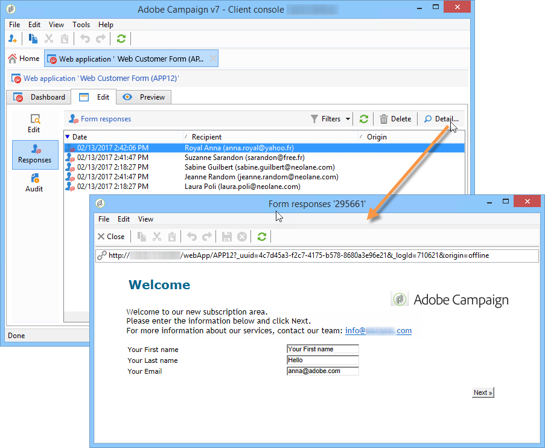

# 发布 Web 窗体{#publishing-a-web-form}


## 预加载表单数据 {#pre-loading-the-form-data}

如果您希望通过Web窗体更新存储在数据库中的用户档案，则可以使用预加载框。 通过预加载框，您可以指示如何在数据库中查找要更新的记录。

可以使用以下识别方法：

* **[!UICONTROL Adobe Campaign Encryption]**

  此加密方法使用加密的Adobe Campaign标识符(ID)。 此方法仅适用于Adobe Campaign对象，并且加密的ID只能由Adobe Campaign平台生成。

  使用此方法时，您需要通过添加 **`<%=escapeUrl(recipient.cryptedId) %>`** 参数。 有关详细信息，请参见 [通过电子邮件投放表单](#delivering-a-form-via-email).

* **[!UICONTROL DES encryption]**

  

  此加密方法使用外部提供的标识符(ID)，该ID链接到Adobe Campaign和外部提供商共享的密钥。 此 **[!UICONTROL Des key]** 字段可让您输入此加密密钥。

* **[!UICONTROL List of fields]**

  此选项允许您从表单当前上下文中的字段中进行选择，这些字段将用于查找数据库中的相应用户档案。

  

  字段可以通过以下方式添加到表单属性 **[!UICONTROL Parameters]** 选项卡(请参阅 [添加参数](defining-web-forms-properties.md#adding-parameters))。 它们以URL或输入区域的形式放置。

  >[!CAUTION]
  >
  >所选字段中的数据未加密。 Adobe Campaign不得以加密形式提供，因为如果 **[!UICONTROL Field list]** 已选中选项。

  在以下示例中，用户档案预加载基于电子邮件地址。

  URL可以包含未加密的电子邮件地址，在这种情况下，用户可以直接访问与其相关的页面。

  

  否则，将要求他们提供密码。

  

  >[!CAUTION]
  >
  >如果在列表中指定了多个字段，则数据 **所有字段** 必须与数据库中存储的数据匹配，才能更新用户档案。 否则，将创建一个新配置文件。
  > 
  >此函数对于Web应用程序特别有用，但不建议用于公共表单。 选择的访问控制选项必须是“启用访问控制”。

此 **[!UICONTROL Skip preloading if no ID]** 如果不希望更新用户档案，则必须选择选项。 在这种情况下，输入的每个用户档案都将在批准表单后添加到数据库中。 例如，当表单在网站上发布时，将使用此选项。

此 **[!UICONTROL Auto-load data referenced in the form]** 选项允许您自动预加载与表单中的输入和合并字段匹配的数据。 但是，中引用的数据 **[!UICONTROL Script]** 和 **[!UICONTROL Test]** 活动无关。 如果未选择此选项，则需要使用 **[!UICONTROL Load additional data]** 选项。

此 **[!UICONTROL Load additional data]** 选项允许您添加未在表单页面中使用，但将预加载的信息。

例如，您可以预先加载收件人的性别，并通过测试框自动将他们定向到适当的页面。


## 管理Web窗体交付和跟踪 {#managing-web-forms-delivery-and-tracking}

创建、配置和发布表单后，您可以交付表单并跟踪用户响应。

### 表单的生命周期 {#life-cycle-of-a-form}

在形式的生命周期中，有三个阶段：

1. **正在编辑**

   这是初始设计阶段。 创建新表单时，它处于编辑阶段。 访问表单仅用于测试目的，因此需要参数 **[!UICONTROL __uuid]** 将在其URL中使用。 此URL可在以下位置访问： **[!UICONTROL Preview]** 子选项卡。 请参阅 [表单URL参数](defining-web-forms-properties.md#form-url-parameters).

   >[!CAUTION]
   >
   >只要正在编辑表单，其访问URL就是特殊的URL。

1. **待发布**

   在某些情况下(例如 [通过资源包导入表单](#import-web-packages))，Web窗体可以具有 **[!UICONTROL Pending publication]** 状态，直到它处于活动状态。

   >[!NOTE]
   >
   >对于技术Web应用程序(可通过 **[!UICONTROL Administration]** > **[!UICONTROL Configuration]** > **[!UICONTROL Web applications]** 菜单)，具有的表单 **[!UICONTROL Pending publication]** 状态为自动 [已发布](#publishing-a-form) 并获取 **[!UICONTROL Online]** 状态。

1. **在线**

   设计阶段完成后，即可交付表单。

   当表单具有 **[!UICONTROL Being edited]** 或 **[!UICONTROL Pending publication]** 状态，它必须 [已发布](#publishing-a-form) 可以在浏览器中通过Web窗体URL在线访问。

   发布后，该表单将一直有效，直到其过期。

   表单将为 **[!UICONTROL Live]** 直到它过期。

   >[!CAUTION]
   >
   >要传送，表单的URL不得包含 **[!UICONTROL __uuid]** 参数。

1. **已关闭**

   表单关闭后，投放阶段结束，表单不可用：用户无法再访问该表单。

   可在表单属性窗口中定义到期日期。 有关详细信息，请参见 [在线提供表单](#making-a-form-available-online).

表单的发布状态会显示在表单列表中。


### 发布表单 {#publishing-a-form}

要更改表单的状态，您需要发布表单。 要执行此操作，请单击 **[!UICONTROL Publication]** 按钮，然后在下拉框中选择状态。


### 在线提供表单 {#making-a-form-available-online}

要被用户访问，表单必须处于生产状态并启动，即在其有效期内。 有效日期通过以下方式输入 **[!UICONTROL Properties]** 表单的链接。

* 使用中的字段 **[!UICONTROL Project]** 输入表单的开始日期和结束日期。

  

* 单击 **[!UICONTROL Personalize the message displayed if the form is closed...]** 定义当用户尝试在表单无效时访问表单时显示的错误消息的链接。

  请参阅 [表单的辅助功能](defining-web-forms-properties.md#accessibility-of-the-form).

### 通过电子邮件投放表单 {#delivering-a-form-via-email}

通过电子邮件发送邀请时，您可以使用 **[!UICONTROL Adobe Campaign Encryption]** 数据协调选项。 为此，请转到投放向导，并通过添加以下参数将链接调整为表单：

```
<a href="https://server/webApp/APP264?&id=<%=escapeUrl(recipient.cryptedId) %>">
```

在这种情况下，数据存储的协调密钥必须是收件人的加密标识符。 有关详细信息，请参见 [预加载表单数据](#pre-loading-the-form-data).

这种情况下，您需要检查 **[!UICONTROL Update the preloaded record]** 选项。 有关详细信息，请参见 [保存Web窗体答案](web-forms-answers.md#saving-web-forms-answers).


### 日志响应 {#log-responses}

可以在专用选项卡中激活响应跟踪，以监控Web表单的影响。 要执行此操作，请单击 **[!UICONTROL Advanced parameters...]** 链接表单属性窗口，然后选择 **[!UICONTROL Log responses]** 选项。


此 **[!UICONTROL Responses]** 选项卡显示，允许您查看回应者的身份。


选择一个收件人，然后单击 **[!UICONTROL Detail...]** 按钮以查看提供的响应。



您可以处理查询中提供的响应日志，例如，在发送提醒时仅定向非回应者，或仅向回应者提供特定通信。

### 导入Web窗体包 {#import-web-packages}

将包含Web表单的包从实例导出和导入另一个实例（例如，从暂存到生产）时，新实例上的Web表单状态可能会因几种情况而异。 下面列出了不同的情况。

在中了解有关Web表单不同状态的更多信息 [本节](#life-cycle-of-a-form).

>[!NOTE]
>
>通过资源包导出Web表单时，表单状态将显示在结果资源包的内容中。

* 如果Web窗体状态为 **[!UICONTROL Pending publication]** 或 **[!UICONTROL Online]** 从第一个实例导出时：

   * Web窗体获得 **[!UICONTROL Pending publication]** 在新实例上导入时的状态。

   * 如果新实例上已存在该Web表单，则会将其替换为表单的新版本，并采用 **[!UICONTROL Pending publication]** 状态，即使表单的旧版本为 **[!UICONTROL Online]**.

   * 无论该表单是否存在，该表单都必须 [已发布](#publishing-a-form) 成为 **[!UICONTROL Online]** ，并可通过Web窗体URL在浏览器中访问。

* 如果Web窗体状态为 **[!UICONTROL Being edited]** 导出时：

   * 如果在导入包的实例上新增Web窗体，则Web窗体将获得 **[!UICONTROL Being edited]** 状态。

   * 如果新实例上已存在该Web表单，则这是对现有表单的修改。 如果表单的旧版本为 **[!UICONTROL Online]**，旧版本将保持联机状态，直到新版本的表单为 [已发布](#publishing-a-form) 再次在新实例上执行。

  >[!NOTE]
  >
  >您可以使用检查Web窗体的最新版本 **[!UICONTROL Preview]** 选项卡。

<!--For RN:
* Now, when a web form has the **Pending publication** status, it must be published before it becomes **Online** and accessible through the web form URL in a web browser. [Read more](../../web/using/publishing-a-web-form.md#life-cycle-of-a-form)
-->
