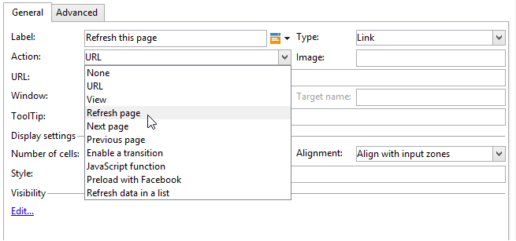
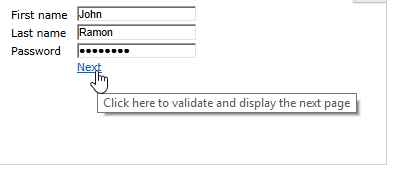
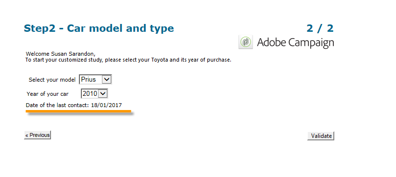

# Web 窗体中的静态元素{#static-elements-in-a-web-form}


您可以在表单页面中包含用户不会与之交互的元素；这些是静态元素，例如图像、HTML内容、水平条形图或超文本链接。 这些元素是通过工具栏中的第一个按钮创建的，方法是选择&#x200B;**[!UICONTROL Static elements]**。


以下类型的字段可用：

* 基于之前提供的答案（在表单的上下文中）或基于数据库的值。
* 超文本链接、HTML、水平条。 请参阅[插入HTML内容](#inserting-html-content)。
* 保存在资源库或用户可访问的服务器上的图像。 请参阅[插入图像](#inserting-images)。
* 在客户端和/或服务器端执行的脚本。 此插件必须使用JavaScript编写并与大多数浏览器兼容，以确保在客户端正确执行。

  >[!NOTE]
  >
  >在服务器端，脚本可以使用[Campaign JSAPI文档](https://experienceleague.adobe.com/developer/campaign-api/api/index.html?lang=zh-Hans)中定义的函数。

## 插入HTML内容 {#inserting-html-content}

您可以在表单页面中包含HTML内容：超文本链接、图像、带格式的段落、视频等。

HTML编辑器允许您输入要插入到表单页面中的内容。 要打开编辑器，请单击&#x200B;**[!UICONTROL Static elements]** > **[!UICONTROL HTML]** 。

您可以直接输入内容并设置其格式，也可以显示源代码窗口以粘贴某些外部内容。 要切换到“源代码”模式，请单击工具栏中的第一个图标：


要插入数据库字段，请使用个性化按钮。


>[!NOTE]
>
>只有在&#x200B;**[!UICONTROL Texts]**&#x200B;子选项卡中定义了在HTML编辑器中输入的字符串，才会翻译这些字符串。 否则，将不会收集这些数据。 有关详细信息，请参阅[翻译Web窗体](translating-a-web-form.md)。

### 插入链接 {#inserting-a-link}

填写编辑窗口中的字段，如以下示例所示：

要添加超文本链接，请转到&#x200B;**[!UICONTROL Static elements]** > **[!UICONTROL Link]**。


* **[!UICONTROL Label]**&#x200B;是超文本链接的内容，因为它将显示在表单页面上。
* **[!UICONTROL URL]**&#x200B;是所需的地址，例如： [https://www.adobe.com](https://www.adobe.com)网站，或[info@adobe.com](mailto:info@adobe.com)发送消息。
* **[!UICONTROL Window]**&#x200B;字段允许您在站点中选择链接的显示模式。 您可以决定在新窗口、当前窗口或其他窗口中打开链接。
* 您可以添加工具提示，如下所示：

  

* 您可以选择将链接显示为按钮或图像。 为此，请在&#x200B;**[!UICONTROL Type]**&#x200B;字段中选择显示类型。

### 链接类型 {#types-of-links}

默认情况下，链接与URL类型操作相关联，以便可以在URL字段中输入链接目标地址。


您可以为链接定义其他操作，以便用户可以单击链接执行以下操作：

* 刷新页面

  为此，请在&#x200B;**[!UICONTROL Action]**&#x200B;字段的下拉框中选择&#x200B;**[!UICONTROL Refresh page]**&#x200B;选项。

  

* 显示下一页/上一页

  为此，请在&#x200B;**[!UICONTROL Action]**&#x200B;字段的下拉框中选择&#x200B;**[!UICONTROL Next page]**&#x200B;或&#x200B;**[!UICONTROL Previous page]**&#x200B;选项。

  

  如果要将&#x200B;**[!UICONTROL Next]**&#x200B;和/或&#x200B;**[!UICONTROL Back]**&#x200B;按钮替换为链接，则可以隐藏这些按钮。 请参阅此[页面](defining-web-forms-page-sequencing.md)。

  该链接将替换默认使用的&#x200B;**[!UICONTROL Next]**&#x200B;按钮。

  

* 显示其他页面

  使用&#x200B;**[!UICONTROL Enable a transition]**&#x200B;选项，可显示与在&#x200B;**[!UICONTROL Transition]**&#x200B;字段中选择的传出过渡关联的特定页面。

  

  默认情况下，页面只有一个输出过渡。 要创建新过渡，请选择页面，然后单击&#x200B;**[!UICONTROL Output transitions]**&#x200B;部分中的&#x200B;**[!UICONTROL Add]**&#x200B;按钮，如下所示：

  

  在图中，此添加内容将如下所示：

  

  >[!NOTE]
  >
  >有关Web窗体中的页面排序的更多信息，请参阅[定义Web窗体页面排序](defining-web-forms-page-sequencing.md)。

### 个性化HTML内容 {#personalizing-html-content}

您可以使用上一页记录的数据对表单页面的HTML内容进行个性化设置。 例如，您可以创建一个汽车保险Web窗体，其第一个页面允许您提供联系信息和汽车品牌。


使用个性化字段将用户名和选定品牌重新注入下一页。 要使用的语法取决于信息存储模式。 有关详细信息，请参阅[使用收集的信息](web-forms-answers.md#using-collected-information)。

>[!NOTE]
>
>出于安全原因，在&#x200B;**`<%=`**&#x200B;公式中输入的值将被转义字符替换。

在我们的示例中，收件人的名字和姓氏存储在数据库的一个字段中，而他们的汽车品牌存储在变量中。 第2页上个性化的消息的语法如下所示：


```
<P>Welcome <%= ctx.recipient.@firstName %> <%= ctx.recipient.@lastName %>,</P>
<P>To start your customized study, please select your car <%=ctx.vars.marque%> and its year of purchase.</P>
```

这将产生以下结果：


### 使用文本变量 {#using-text-variables}

**[!UICONTROL Text]**&#x200B;选项卡允许您创建变量字段，这些字段可在&lt;%=和%>字符之间的HTML中使用，语法如下： **$(IDENTIFIER)**。

使用此方法可轻松本地化字符串。 请参阅[翻译Web窗体](translating-a-web-form.md)

例如，您可以创建一个&#x200B;**联系人**&#x200B;字段，以便在HTML内容中显示“上次联系日期：”字符串。 为此请执行以下操作步骤：

1. 单击HTML文本的&#x200B;**[!UICONTROL Text]**&#x200B;选项卡。
1. 单击&#x200B;**[!UICONTROL Add]**&#x200B;图标。
1. 在&#x200B;**[!UICONTROL Identifier]**&#x200B;列中，输入变量的名称
1. 在&#x200B;**[!UICONTROL Text]**&#x200B;列中，输入默认值。

   

1. 在HTML内容中，通过&#x200B;**&lt;%= $(Contact) %>**&#x200B;语法插入此文本变量。

   

   >[!CAUTION]
   >
   >如果在HTML编辑器中输入这些字符，**&lt;**&#x200B;和&#x200B;**>**&#x200B;字段将替换为其转义字符。 在这种情况下，您需要通过单击HTML文本编辑器的&#x200B;**[!UICONTROL Display source code]**&#x200B;图标来更正源代码。

1. 打开窗体的&#x200B;**[!UICONTROL Preview]**&#x200B;标签以查看在HTML中输入的值：

   

使用此操作模式，您可以仅定义Web窗体的文本一次，并使用集成的翻译工具管理翻译。 有关详细信息，请参阅[翻译Web窗体](translating-a-web-form.md)。

## 插入图像 {#inserting-images}

对于要包含在表单中的图像，必须将其保存在可从外部访问的服务器上。

选择&#x200B;**[!UICONTROL Static elements]** > **[!UICONTROL Image]**&#x200B;菜单。

选择要插入的图像的源：该图像可以来自公共资源库，也可以存储在可从外部访问的外部服务器上。


如果这是库中的图像，请在字段的组合框中选择它；如果它位于外部文件中，请输入访问路径。 通过将光标置于图像上来显示标签(与HTML中的ALT字段一致)，或者在图像未显示时显示标签。

可以在编辑器的中心部分查看图像。
