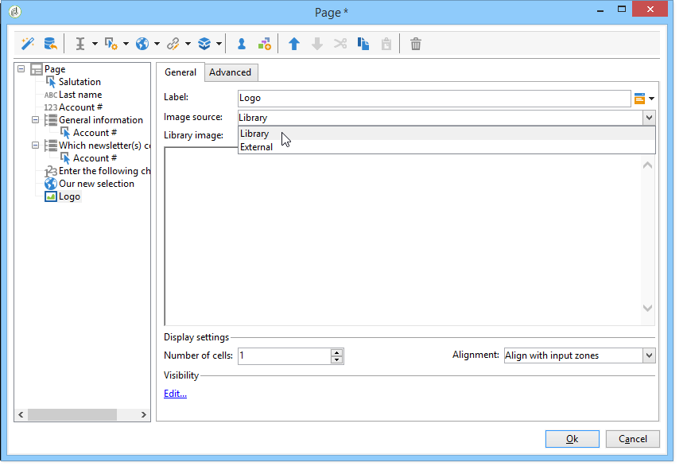

# Web 窗体中的静态元素{#static-elements-in-a-web-form}

您可以在表单的页面中包含用户没有交互的元素；这些是静态元素，如图像、HTML内容、水平条或超文本链接。 通过单击菜单，通过工具栏中的第一个按钮创建这些 **[!UICONTROL Add static element]** 元素。


有以下类型的字段可用：

* 值基于以前提供的答案（在表单的上下文中）或数据库。
* 超文本链接、HTML、水平栏。 请参 [阅插入HTML内容](#inserting-html-content)。
* 保存在资源库中或用户可访问的服务器上的图像。 请参阅 [插入图像](#inserting-images)。
* 在客户端和／或服务器端执行的脚本。 它必须用JavaScript编写，并且与大多数浏览器兼容，以确保在客户端正确执行。

   >[!NOTE]
   >
   >在服务器端，脚本可以使用活动JSAPI文档中定 [义的函数](https://docs.adobe.com/content/help/en/campaign-classic/technicalresources/api/index.html)。

## 插入HTML内容 {#inserting-html-content}

您可以在表单页面中包含HTML内容：超文本链接、图像、格式化段落、视频或Flash对象等。

HTML编辑器允许您输入要插入到表单页面的内容。 要打开编辑器，请转到 **[!UICONTROL Static elements>HTML]** 。

您可以直接输入内容并设置其格式，也可以显示要粘贴到某些外部内容中的源代码窗口。 要切换到“源代码”模式，请单击工具栏中的第一个图标：


要插入数据库字段，请使用个性化按钮。


>[!NOTE]
>
>只有在子选项卡中定义了在HTML编辑器中输入的字符串，才 **[!UICONTROL Texts]** 能转换它们。 否则，将不收集这些内容。 有关此内容的详细信息，请 [参阅翻译Web表单](../../web/using/translating-a-web-form.md)。

### Inserting a link {#inserting-a-link}

填写编辑窗口中的字段，如以下示例所示：

要添加超文本链接，请转至 **[!UICONTROL Static elements>Link]**。


* 超文 **[!UICONTROL Label]** 本链接的内容将显示在表单页面上。
* 该 **[!UICONTROL URL]** 地址是所需的地址，例如： [https://www.adobe.com](https://www.adobe.com) （适用于网站）或 [info@adobe.com](mailto:info@adobe.com) （用于发送消息）。
* 通 **[!UICONTROL Window]** 过该字段，您可以选择站点链接的显示模式。 您可以决定在新窗口、当前窗口或其他窗口中打开链接。
* 您可以添加工具提示，如下所示：

   

* 您可以选择将链接显示为按钮或图像。 为此，请在字段中选择显示的类 **[!UICONTROL Type]** 型。

### 链接类型 {#types-of-links}

默认情况下，链接与URL类型的操作相关联，因此可以在URL字段中输入链接目标地址。


您可以为链接定义其他操作，以便用户单击链接以执行以下操作：

* 刷新页面

   为此，请在字 **[!UICONTROL Refresh page]** 段的下拉框中选择选 **[!UICONTROL Action]** 项。

   

* 显示下一页／上一页

   为此，请在字 **[!UICONTROL Next page]** 段 **[!UICONTROL Previous page]** 的下拉框中选择或选 **[!UICONTROL Action]** 项。

   

   如果要将和/ **[!UICONTROL Next]** 或按钮 **[!UICONTROL Back]** 替换为链接，则可以隐藏这些按钮。 Refer to this [page](../../web/using/defining-web-forms-page-sequencing.md).

   链接将替换默 **[!UICONTROL Next]** 认使用的按钮。

   

* 显示其他页面

   通过 **[!UICONTROL Enable a transition]** 此选项，可显示与字段中选定的传出过渡关联的特定 **[!UICONTROL Transition]** 页面。

   

   默认情况下，页面只有一个输出过渡。 要创建新过渡，请选择页面，然后单 **[!UICONTROL Add]** 击部分中的 **[!UICONTROL Output transitions]** 按钮，如下所示：

   

   在图中，此添加项将如下所示：

   

   >[!NOTE]
   >
   >有关Web表单中页面排序的详细信息，请参 [阅定义Web表单页面排序](../../web/using/defining-web-forms-page-sequencing.md)。

* 预载包含从Facebook用户档案获取的数据的表单字段

   >[!CAUTION]
   >
   >此功能仅在您安装了应用程序时才可 **[!UICONTROL Social Marketing]** 用。 要使用此选项，您需要创建Facebook应用程序以及类 **[!UICONTROL Facebook Connect]** 型外部帐户。 有关详细信息，请参见[此页面](../../social/using/creating-a-facebook-application.md#configuring-external-accounts)。

   通过 **[!UICONTROL Preload with Facebook]** 此选项，您可以在表单中插入按钮，以使用Facebook用户档案信息预载字段。

   

   当用户单击该按 **[!UICONTROL Fill in automatically]** 钮时，Facebook将打开权限请求窗口。

   

   >[!NOTE]
   >
   >在配置列表时，可以更改扩展权限的外部帐户。 如果您未输入任何扩展权限，Facebook将默认转发基本用户档案信息。\
   >要视图扩展权限及其语法的列表，请单击此处： [https://developers.facebook.com/docs/reference/api/permissions/](https://developers.facebook.com/docs/reference/api/permissions/)

   如果用户同意共享其信息，则预加载表单的字段。

   

对于此用例，我们创建了一个由以下元素组成的Web 应用程序:

* 包含表单的页面
* **[!UICONTROL Record]** 活动
* an **[!UICONTROL End]** activity


要添加预载按钮，请应用以下步骤：

1. 创建表单。

   

1. 转到与表单中的字段相同的级别并添加链接。

   

1. 输入标签并选择 **[!UICONTROL Button]** 类型。

   

1. 转到字段 **[!UICONTROL Action]** 并选择 **[!UICONTROL Preload with Facebook]**。

   

1. 转到字段 **[!UICONTROL Application]** 并选择之前创 **[!UICONTROL Facebook Connect]** 建的类型外部帐户。 有关详细信息，请参见[此页面](../../social/using/creating-a-facebook-application.md#configuring-external-accounts)。

   

### 个性化HTML内容 {#personalizing-html-content}

您可以使用在上一页中记录的数据个性化表单页面的HTML内容。 例如，您可以创建汽车保险Web表单，其第一页允许您提供联系信息和汽车品牌。


使用个性化字段将用户名和密码重新注入到下一页。 要使用的语法取决于信息存储模式。 有关此信息的详细信息，请参 [阅使用收集的信息](../../web/using/web-forms-answers.md#using-collected-information)。

>[!NOTE]
>
>出于安全原因，在公式中输入的 **`<%=`** 值将替换为转义字符。 要避免这种情况，并且仅在必要时使用以下语法： **`<%=`**.

在我们的示例中，收件人的名字和姓氏存储在数据库的字段中，而其汽车品牌存储在变量中。 第2页个性化消息的语法如下：


```
<P>Welcome <%= ctx.recipient.@firstName %> <%= ctx.recipient.@lastName %>,</P>
<P>To start your customized study, please select your car <%=ctx.vars.marque%> and its year of purchase.</P>
```

这将产生以下结果：


### 使用文本变量 {#using-text-variables}

在该 **[!UICONTROL Text]** 选项卡中，可以创建变量字段，这些字段可在HTML中使用&lt;%=和%>字符，语法如下： **$(IDENTIFIER)**。

使用此方法可轻松将字符串本地化。 See [Translating a web form](../../web/using/translating-a-web-form.md)

例如，您可以创建一 **个“联** 系人”字段，该字段将允许您在HTML内容中显示“上次联系日期：”字符串。 为此请执行以下操作步骤：

1. 单击HTML **[!UICONTROL Text]** 文本的选项卡。
1. 单击该 **[!UICONTROL Add]** 图标。
1. 在列 **[!UICONTROL Identifier]** 中，输入变量的名称
1. 在列 **[!UICONTROL Text]** 中，输入默认值。

   

1. 在HTML内容中，通过&lt;%= $(联 **系人)%>语法插入此文本变量** 。

   

   >[!CAUTION]
   >
   >如果在HTML编辑器中输入这些字符，&lt; **和** > **字** 段将替换为转义字符。 在这种情况下，您需要通过单击HTML文本编辑器 **[!UICONTROL Display source code]** 的图标来更正源代码。

1. 打开表 **[!UICONTROL Preview]** 单的标签以视图在HTML中输入的值：

   

此操作模式允许您对Web 窗体文本进行分解，并使用集成的翻译工具管理翻译。 有关此内容的详细信息，请 [参阅翻译Web表单](../../web/using/translating-a-web-form.md)。

## Inserting images {#inserting-images}

要将图像包含在表单中，必须将其保存在可从外部访问的服务器上。

选择菜 **[!UICONTROL Static elements>Image]** 单。

选择要插入的图像的源：它可以来自公共资源库，也可以存储在外部可访问的外部服务器上。



如果这是库中的图像，请在字段的组合框中选择它；如果它位于外部文件中，请输入访问路径。 标签将通过将光标传递到图像上（与HTML中的ALT字段一致）或图像未显示时显示。

可在编辑器的中央部分查看图像。
