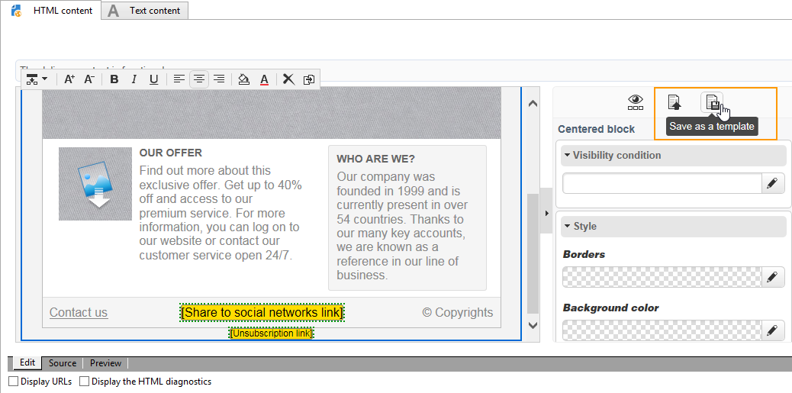

# 模板管理{#template-management}

数字内容编辑器提供 **标准模板** 用于Web应用程序和投放。

创建登陆页类型的Web应用程序时，用户可以选择其中一个模板。 您还可以导入在Adobe Campaign之外创建的HTML模板。

要添加模板，请参阅 [全局选项](content-editor-interface.md#global-options).

## 将投放另存为模板 {#saving-a-delivery-as-a-template}

配置投放后，可将其另存为模板，以便将来可重复使用。

在 **营销活动** 选项卡，打开选定的投放。 单击 **另存为模板** 按钮，命名模板，然后保存。

新模板保存在 **资源>模板>内容模板** 节点。
