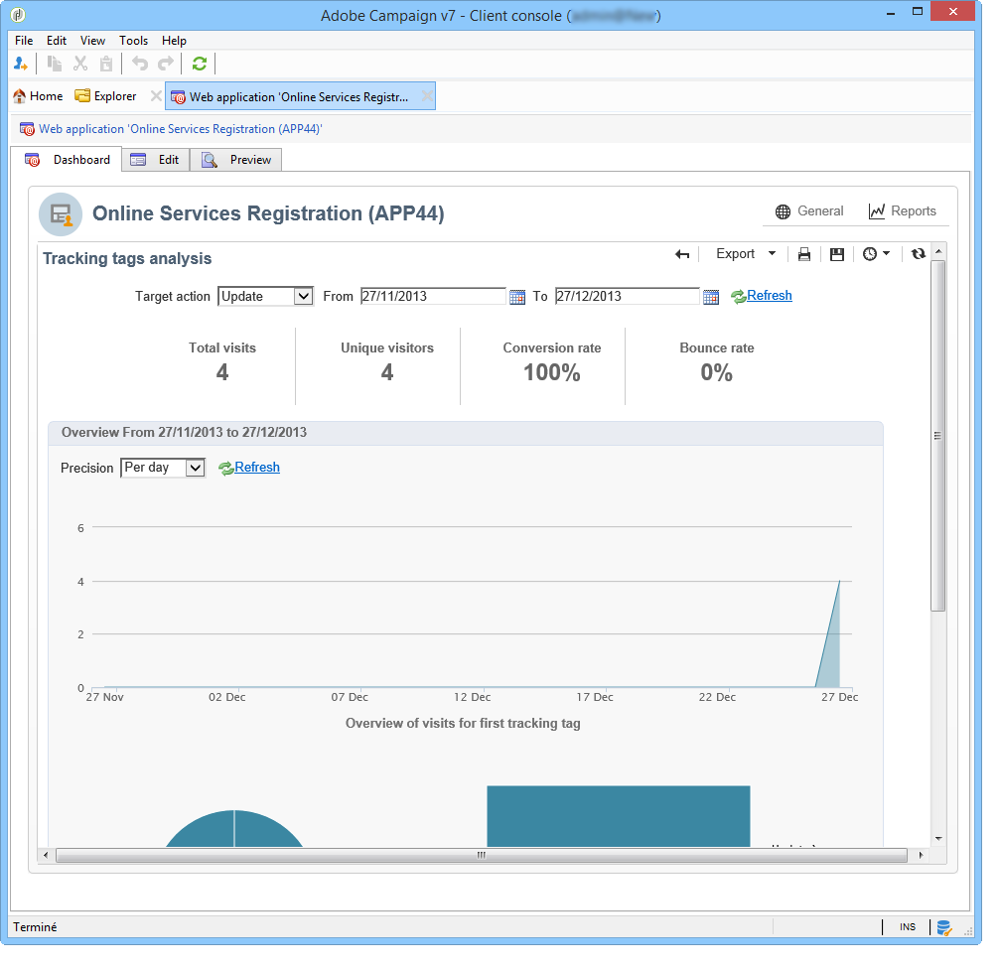
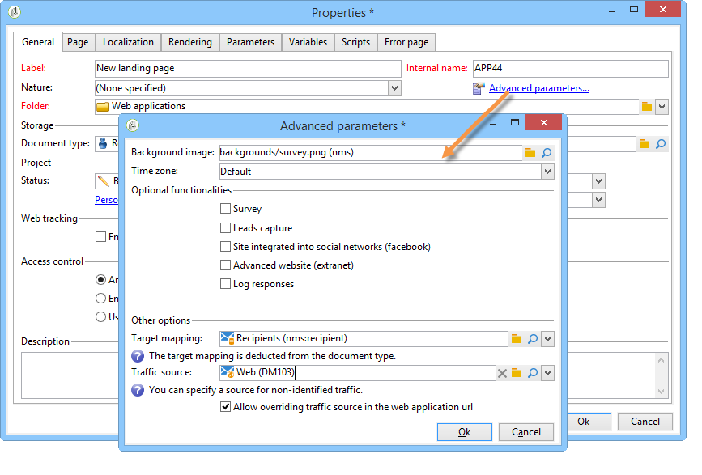

# 跟踪 Web 应用程序访问{#tracking-a-web-application}

Adobe Campaign允许您通过插入跟踪标记来跟踪和测量Web应用程序页面上的访问次数。 此功能可用于所有Web应用程序类型（表单、网页等）。

因此，您可以定义多个导航路径并评估其成功与否。 然后，恢复的数据便可在每个应用程序的报表中使用。

此版本中的主要改进如下：

* 可以在同一页面上插入多个跟踪标记，以简化导航路径定义（例如购买、订阅、返回等）。
* 在Web应用程序仪表板中查看不同页面的导航路径和跟踪标记。

   

* 生成完整的跟踪报告。

   

   主要指标如下：

   * **转化率**：显示导航路径所有步骤的人数。
   * **跳出率**：仅显示第一步的人数
   * **转化漏斗**：每一步骤之间的丢失率。

   此外， **扇区** 类型图显示按源划分的群体。

## 识别流量源 {#identifying-the-traffic-source}

可以使用两种不同的模式来识别访问Web应用程序时访客的来源：

1. 发送特定投放以授予对Web应用程序页面的访问权限：在这种情况下，流量源为此投放，
1. 将Web应用程序与专用流量源关联：在这种情况下，它必须是外部“流量源”类型的投放。 可以从Web应用程序属性或目标映射中选择它。

   

为了识别Web应用程序中的流量源，Adobe Campaign会连续查找以下信息：

1. 源投放标识符（如果存在）(nlId Cookie)，
1. Web应用程序属性中定义的外部投放的标识符（如果存在），
1. 目标映射中定义的外部投放的标识符（如果存在）。

>[!NOTE]
>
>只有在安装Campaign时已在部署向导中激活该选项的情况下，匿名跟踪才可用。

## 使用数字内容编辑器(DCE)设计的Web应用程序 {#web-applications-designed-with-digital-content-editor--dce-}

使用HTML内容编辑器创建Web应用程序时 —  **数字内容编辑器(DCE)**  — 跟踪标记插入 **[!UICONTROL Properties]** 选项卡。 有关数字内容编辑器(DCE)的更多信息，请参阅 [本节](about-campaign-html-editor.md).

使用Web界面时，必须从页面属性插入跟踪标记。

此 **[!UICONTROL Display blocks]** 图标允许您查看为页面定义的跟踪标记数量。

