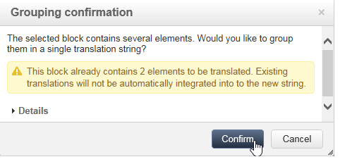

# 解释 Web 应用程序{#translating-a-web-application}

您可以翻译使用Adobe Campaign数字内容编辑器(DCE)创建的Web应用程序页面。

如果您通过 **[!UICONTROL Localization]** 在中选项卡 **[!UICONTROL Properties]** 在用DCE编辑的页面中添加HTML内容块时，Web应用程序的新选项将变为可用。

利用此选项，可指示是否必须翻译块内容。

要翻译的字符串的收集方式与Web应用程序的其他字符串相同，方法是使用 **[!UICONTROL Translations]** 选项卡。 有关详细信息，请参见[此页面](translating-a-web-form.md)。

标记要翻译的字符串：

1. 在Web应用程序中打开使用DCE编辑的内容页面。

   

1. 选择HTML块。
1. 在右侧的参数块中， **[!UICONTROL Localization]** 选项可让您标记所选块的内容。 默认情况下，只翻译页面标题。

   

   >[!NOTE]
   >
   >字符串不能超过1023个字符。

   具体有三种情况：

   * 如果所选块包含多个字符串/块，则会将其标记为要翻译的单个字符串。 该字符串则包含此块中元素的HTML代码。
   * 如果要标记包含多个字符串的块，并且至少已标记其中一个字符串，则会显示警告。 然后，您可以从隔离字符串中删除标记并添加整个块。

      

   * 如果要从已标记的块中包含的字符串中删除标记，则无法直接修改字符串翻译选项。 但是，您可以访问包含字符串的块以对其进行更改。

      

1. 完成字符串的标记后，返回到Web应用程序并选择 **[!UICONTROL Translations]** 选项卡。
1. 选择 **[!UICONTROL Collect the strings to translate]**。在DCE中标记的字符串将添加到Web应用程序的字符串中。

   >[!NOTE]
   >
   >收集字符串后，如果您在DCE中删除翻译标记，则不会从列表中删除它们。 这允许将它们保存在翻译记忆库中。

1. 翻译并批准字符串。

   然后，您可以通过从中选择所需的语言来预览翻译 **[!UICONTROL Preview]** 选项卡。
