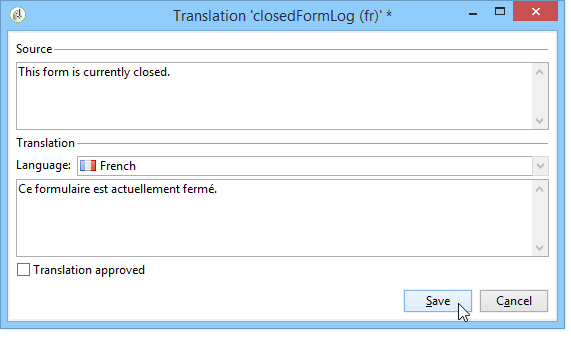

# 翻译 Web 窗体{#translating-a-web-form}

可以将Web 应用程序本地化为多种语言。

您可以直接在Adobe Campaign控制台中执行翻译(请参 [阅在编辑器中管理翻译](#managing-translations-in-the-editor))，或导出和导入字符串以将翻译外 [部化(请参阅Externalizing](#externalizing-translation)translation)。

默认情况下提供的翻译语言列表在更改表 [单显示语言中有详细说明](#changing-forms-display-language)。

Web 应用程序是使用编辑语言设计的：这是用于输入标签和其他要翻译的内容的参考语言。

默认语言是Web 应用程序在访问URL中未添加任何语言设置时将显示的语言。

>[!NOTE]
>
>默认情况下，编辑语言和默认语言与控制台语言相同。

## 选择语言 {#choosing-languages}

要定义一种或多种翻译语言，请单 **[!UICONTROL Properties]** 击Web 应用程序的按钮，然后单击选 **[!UICONTROL Localization]** 项卡。 单击按 **[!UICONTROL Add]** 钮以定义Web 应用程序的新翻译语言。

>[!NOTE]
>
>此窗口还允许您更改默认语言和编辑语言。


当您为Web 应用程序添加翻译语言（或当默认语言和编辑语言不同时）时，会向该选项卡中添加 **[!UICONTROL Translation]** 一个子选项卡， **[!UICONTROL Edit]** 以管理翻译。

Adobe Campaign包括用于翻译和管理多语言翻译的工具。 通过此编辑器，您可以视图要翻译或批准的字符串，直接在界面中输入翻译，或导入／导出字符串以将翻译外部化。

## 在编辑器中管理翻译 {#managing-translations-in-the-editor}

### 收集字符串 {#collecting-strings}

使用 **[!UICONTROL Translations]** 该选项卡，您可以为构成Web 应用程序的字符串输入译文。

第一次打开此选项卡时，它不包含任何数据。 单击链 **[!UICONTROL Collect the strings to translate]** 接以更新Web 应用程序中的字符串。

Adobe Campaign会收集所有静态元素标签中定义的字 **[!UICONTROL Texts]** 段和字符串的标签：HTML块、Javascript等 静态元素在Web表 [单的静态元素中详细介绍](../../web/using/static-elements-in-a-web-form.md)。


>[!CAUTION]
>
>此过程可能需要几分钟时间，具体取决于要处理的数据量。
> 
>如果出现警告，指出系统词典中缺少某些翻译，请参阅 [翻译系统字符串](#translating-the-system-strings)。

每次翻译字符串时，其翻译都会添加到翻译词典中。

当集合进程检测到已存在转换时，此转换将显示在字 **[!UICONTROL Text]** 符串的列中。 字符串的状态将转换为 **[!UICONTROL Translated]**。

对于从未翻译过的字符串， **[!UICONTROL Text]** 字段为空，状态为 **[!UICONTROL To translate]**。

### 筛选字符串 {#filtering-strings}

默认情况下，显示Web 应用程序的每种翻译语言。 有两种默认过滤器:语言和状态。 单击 **[!UICONTROL Filters]** 按钮，然 **[!UICONTROL By language or status]** 后单击以显示匹配的下拉框。 您还可以创建高级过滤器。 有关详细信息，请参见[此页面](../../platform/using/creating-filters.md#creating-an-advanced-filter)。


转到下 **[!UICONTROL Language]** 拉框以选择翻译语言。

要仅显示未翻译的字符串， **[!UICONTROL To translate]** 请在下 **[!UICONTROL Status]** 拉框中选择。 您还可以仅显示已翻译或已批准的字符串。

### 转换字符串 {#translating-strings}

1. 要翻译单词，请多次单击字符串列表上的其行。

   

   源字符串显示在窗口的上半部分。

1. 在下部输入其翻译。 要批准它，请选中该 **[!UICONTROL Translation approved]** 选项。

   >[!NOTE]
   >
   >翻译批准是可选的，不会阻止该过程。

   未批准的翻译显示为 **[!UICONTROL Translated]**。 批准的翻译显示为 **[!UICONTROL Approved]**。

## 外部翻译 {#externalizing-translation}

可以导出和导入字符串，以便使用Adobe Campaign以外的工具翻译字符串。

>[!CAUTION]
>
>导出字符串后，不要使用集成工具执行任何翻译。 当您重新导入翻译时，这会导致冲突，并且这些翻译将丢失。

### 导出文件 {#exporting-files}

1. 选择要导出其字符串的Web 应用程序，右键单击，然后选择 **[!UICONTROL Actions > Export strings for translation...]**

   

1. 选择 **[!UICONTROL Export strategy]** :

   * **[!UICONTROL One file per language]**:导出将为每个翻译语言生成一个文件。 每个文件对所有选定的Web 应用程序都是通用的。
   * **[!UICONTROL One file per Web application]**:导出将为每个选定Web 应用程序生成一个文件。 每个文件将包含所有翻译语言。

      >[!NOTE]
      >
      >此类导出不适用于XLIFF导出。

   * **[!UICONTROL One file per language and per Web application]**:导出将生成多个文件。 每个文件将包含一个每个Web 应用程序的翻译语言。
   * **[!UICONTROL One file for all]**:导出将为所有Web 应用程序生成单个多语言文件。 它将包含所有选定Web 应用程序的所有翻译语言。

      >[!NOTE]
      >
      >此类导出不适用于XLIFF导出。

1. 然后，选 **[!UICONTROL Target folder]** 择文件的录制位置。
1. 选择文件格式( **[!UICONTROL CSV]** 或 **[!UICONTROL XLIFF]** )，然后单击 **[!UICONTROL Start]**。


>[!NOTE]
>
>导出文件的名称将自动生成。 如果多次执行相同的导出，您将用新文件替换现有文件。 如果需要保留以前的文件，请更改 **[!UICONTROL Target folder]** ，然后再 **[!UICONTROL Start]** 次单击以运行导出。

以CSV格式导出文 **件时**，每种语言都会链接到状态和批准状态。 批 **准？** 列允许您批准翻译。 此列可能包含 **值** Yes **或No**。 对于集成编辑器(请参 [阅在编辑器中管理翻译](#managing-translations-in-the-editor))，批准翻译是可选的，不会阻止该过程。

### 导入文件 {#importing-files}

完成外部翻译后，即可导入译文文件。

1. 转到Web 应用程序列表，右键单击，然后选择 **[!UICONTROL Actions > Import translated strings...]**

   >[!NOTE]
   >
   >无需选择译文所涉及的Web 应用程序。 将光标放在列表上的任意位置。

   

1. 选择要导入的文件，然后单击 **[!UICONTROL Upload]**。

   

>[!NOTE]
>
>外部翻译始终优先于内部翻译。 如果发生冲突，内部翻译将被外部翻译覆盖。

## 更改表单显示语言 {#changing-forms-display-language}

Web 窗体以在Web 应用程序属性的选项卡中指 **[!UICONTROL Localization]** 定的默认语言显示。 要更改语言，必须在URL的末尾添加以下字符( **其中** xx是语言的符号):

```
?lang=xx
```

如果语言是URL的第一个或唯一参数。 例如： **https://myserver/webApp/APP34?lang=en**

```
&lang=xx
```

如果URL中的语言前面有其他参数。 例如： **https://myserver/webApp/APP34?status=1&amp;lang=en**

默认情况下可用的翻译语言和词典列在下面。

**默认系统词典**:某些语言包括默认词典，其中包含系统字符串的翻译。 有关此的详细信息，请参 [阅转换系统字符串](#translating-the-system-strings)。

**日历管理**:web 应用程序的页面可以包含用于输入日期的日历。 默认情况下，此日历提供多种语言版本（天数转换、日期格式）。

<table> 
 <tbody> 
  <tr> 
   <td> <strong>语言（符号）</strong><br /> </td> 
   <td> <strong>默认系统词典</strong><br /> </td> 
   <td> <strong>日历管理</strong><br /> </td> 
  </tr> 
  <tr> 
   <td> 德语(de)<br /> </td> 
   <td> 是<br /> </td> 
   <td> 是<br /> </td> 
  </tr> 
  <tr> 
   <td> English (en)<br /> </td> 
   <td> 是<br /> </td> 
   <td> 是<br /> </td> 
  </tr> 
  <tr> 
   <td> 英语（美国）(zh_CN)<br /> </td> 
   <td> </td> 
   <td> </td> 
  </tr> 
  <tr> 
   <td> 英语（英国）(en_GB)<br /> </td> 
   <td> </td> 
   <td> </td> 
  </tr> 
  <tr> 
   <td> 阿拉伯语(ar)<br /> </td> 
   <td> </td> 
   <td> </td> 
  </tr> 
  <tr> 
   <td> 中文(zh)<br /> </td> 
   <td> </td> 
   <td> </td> 
  </tr> 
  <tr> 
   <td> 朝鲜语(ko)<br /> </td> 
   <td> </td> 
   <td> </td> 
  </tr> 
  <tr> 
   <td> 丹麦语(da)<br /> </td> 
   <td> 是<br /> </td> 
   <td> 是<br /> </td> 
  </tr> 
  <tr> 
   <td> 西班牙语(es)<br /> </td> 
   <td> 是<br /> </td> 
   <td> 是<br /> </td> 
  </tr> 
  <tr> 
   <td> 爱沙尼亚语（等）<br /> </td> 
   <td> </td> 
   <td> </td> 
  </tr> 
  <tr> 
   <td> 芬兰语(fi)<br /> </td> 
   <td> </td> 
   <td> 是<br /> </td> 
  </tr> 
  <tr> 
   <td> 法语(fr)<br /> </td> 
   <td> 是<br /> </td> 
   <td> 是<br /> </td> 
  </tr> 
  <tr> 
   <td> 法语（比利时）(fr_BE)<br /> </td> 
   <td> </td> 
   <td> </td> 
  </tr> 
  <tr> 
   <td> 法语（法国）(fr_FR)<br /> </td> 
   <td> </td> 
   <td> </td> 
  </tr> 
  <tr> 
   <td> 希腊语(el)<br /> </td> 
   <td> </td> 
   <td> 是<br /> </td> 
  </tr> 
  <tr> 
   <td> 希伯来语(he)<br /> </td> 
   <td> </td> 
   <td> </td> 
  </tr> 
  <tr> 
   <td> 匈牙利语(hu)<br /> </td> 
   <td> </td> 
   <td> 是<br /> </td> 
  </tr> 
  <tr> 
   <td> 印度尼西亚语(id)<br /> </td> 
   <td> </td> 
   <td> </td> 
  </tr> 
  <tr> 
   <td> 爱尔兰语(ga)<br /> </td> 
   <td> </td> 
   <td> </td> 
  </tr> 
  <tr> 
   <td> 意大利语(it)<br /> </td> 
   <td> 是<br /> </td> 
   <td> 是<br /> </td> 
  </tr> 
  <tr> 
   <td> 意大利语（意大利）(it_IT)<br /> </td> 
   <td> </td> 
   <td> </td> 
  </tr> 
  <tr> 
   <td> 意大利语（瑞士）(it_CH)<br /> </td> 
   <td> </td> 
   <td> </td> 
  </tr> 
  <tr> 
   <td> 日语(ja)<br /> </td> 
   <td> </td> 
   <td> </td> 
  </tr> 
  <tr> 
   <td> 拉脱维亚语(lv)<br /> </td> 
   <td> </td> 
   <td> 是<br /> </td> 
  </tr> 
  <tr> 
   <td> 立陶宛语(lt)<br /> </td> 
   <td> </td> 
   <td> </td> 
  </tr> 
  <tr> 
   <td> 马耳他语(mt)<br /> </td> 
   <td> </td> 
   <td> </td> 
  </tr> 
  <tr> 
   <td> 荷兰语(nl)<br /> </td> 
   <td> </td> 
   <td> 是<br /> </td> 
  </tr> 
  <tr> 
   <td> 荷兰语（比利时）(nl_BE)<br /> </td> 
   <td> </td> 
   <td> </td> 
  </tr> 
  <tr> 
   <td> 荷兰语（荷兰）(nl_NL)<br /> </td> 
   <td> </td> 
   <td> </td> 
  </tr> 
  <tr> 
   <td> 挪威语（挪威）(no_NO)<br /> </td> 
   <td> </td> 
   <td> 是<br /> </td> 
  </tr> 
  <tr> 
   <td> 波兰语(pl)<br /> </td> 
   <td> </td> 
   <td> 是<br /> </td> 
  </tr> 
  <tr> 
   <td> 葡萄牙语(pt)<br /> </td> 
   <td> </td> 
   <td> 是<br /> </td> 
  </tr> 
  <tr> 
   <td> 葡萄牙语（巴西）(pt_BR)<br /> </td> 
   <td> </td> 
   <td> </td> 
  </tr> 
  <tr> 
   <td> 葡萄牙语（葡萄牙）(pt_PT)<br /> </td> 
   <td> </td> 
   <td> </td> 
  </tr> 
  <tr> 
   <td> 俄语(ru)<br /> </td> 
   <td> </td> 
   <td> 是<br /> </td> 
  </tr> 
  <tr> 
   <td> Slovene(sl)<br /> </td> 
   <td> </td> 
   <td> </td> 
  </tr> 
  <tr> 
   <td> 斯洛伐克语(sk)<br /> </td> 
   <td> </td> 
   <td> </td> 
  </tr> 
  <tr> 
   <td> 瑞典语(sv)<br /> </td> 
   <td> 是<br /> </td> 
   <td> 是<br /> </td> 
  </tr> 
  <tr> 
   <td> 瑞典语（芬兰）(sv_FI)<br /> </td> 
   <td> </td> 
   <td> </td> 
  </tr> 
  <tr> 
   <td> 瑞典语（瑞典）(sv_SE)<br /> </td> 
   <td> </td> 
   <td> </td> 
  </tr> 
  <tr> 
   <td> 捷克语(cs)<br /> </td> 
   <td> </td> 
   <td> </td> 
  </tr> 
  <tr> 
   <td> 泰语(th)<br /> </td> 
   <td> </td> 
   <td> </td> 
  </tr> 
  <tr> 
   <td> 越南语(6)<br /> </td> 
   <td> </td> 
   <td> </td> 
  </tr> 
  <tr> 
   <td> Walon(wa)<br /> </td> 
   <td> </td> 
   <td> </td> 
  </tr> 
 </tbody> 
</table>

>[!NOTE]
>
>要添加默认提供的语言以外的其他语言，请参 [阅添加翻译语言](#adding-a-translation-language)

## 示例：以多种语言显示Web 应用程序 {#example--displaying-a-web-application-in-several-languages}

以下Web表单有四种语言版本：英语、法语、德语和西班牙语。 字符串都已通过Web表单的 **[!UICONTROL Translation]** 选项卡进行翻译。 由于默认语言是英语，因此在发布调查时，请使用标准URL以英语显示它。


在 **URL末尾添加** ?lang=fr以用法语显示它：

>[!NOTE]
>
>每种语言的符号列表在更改表 [单显示语言中有详细说明](#changing-forms-display-language)。


您可以添 **加？lang=es****或？lang=de** ，以西班牙语或德语显示它。

>[!NOTE]
>
>如果此Web 应用程序已使用其他参数，则添 **加&amp;lang=**。\
>例如： **https://myserver/webApp/APP34?status=1&amp;lang=en**

## 高级转换配置 {#advanced-translation-configuration}

>[!CAUTION]
>
>此部分仅面向专家用户。

### 转换系统字符串 {#translating-the-system-strings}

系统字符串是所有Web 应用程序使用的现成字符串。 例如： **[!UICONTROL Next]** 、 **[!UICONTROL Previous]**&#x200B;按钮 **[!UICONTROL Approve]** 、消息 **[!UICONTROL Loading]** 等。 默认情况下，某些语言包含包含这些字符串翻译的词典。 语言列表在更改表单显 [示语言中有详细介绍](#changing-forms-display-language)。

如果将Web 应用程序翻译成系统词典未翻译的语言，将显示一条警告消息，告知您某些翻译缺失。


要添加语言，请应用以下步骤：

1. 转到Adobe Campaign树并单击 **[!UICONTROL Administration > Configuration > Global dictionary > System dictionary]** 。
1. 在窗口的上半部分，选择要翻译的系统字符串，然后 **[!UICONTROL Add]** 在下半部分单击。

   

1. 选择翻译语言并输入字符串的翻译。 您可以通过选中该选项来批准转 **[!UICONTROL Translation approved]** 换。

   

   >[!NOTE]
   >
   >翻译批准是可选的，不会阻止该过程。

>[!CAUTION]
>
>请勿删除现成的系统字符串。

### 添加翻译语言 {#adding-a-translation-language}

要将Web 应用程序翻译为默认语言以外的语言(请参 [阅更改表单显示语言](#changing-forms-display-language))，您需要添加新的翻译语言。

1. 单击Adobe Campaign **[!UICONTROL Administration > Platform > Enumerations]** 树的节点，然后从列表中进行 **[!UICONTROL Languages available for translation]** 选择。 可用翻译的列表显示在窗口的下半部分。

   

1. 单击按 **[!UICONTROL Add]** 钮，然后输 **[!UICONTROL Internal name]**&#x200B;入图 **[!UICONTROL Label]** 像的、和标识符（标志）。 要添加新映像，请与管理员联系。

   

